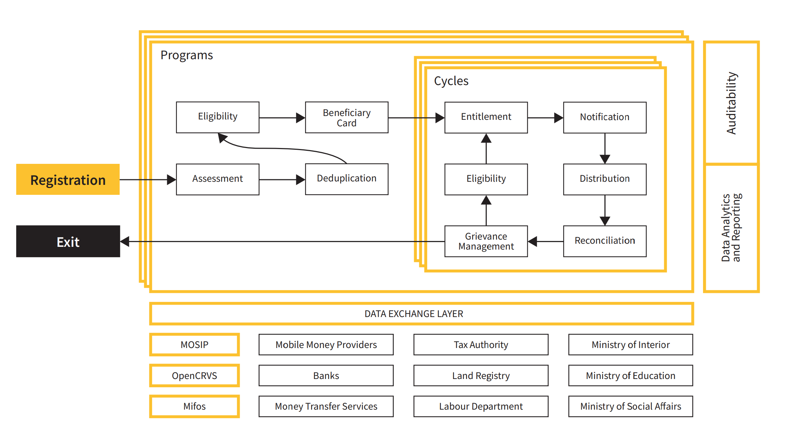

OpenSPP - Social Protection Platform
====================================

`OpenSPP` is an open-source project that aims to streamline the management of social protection programs.
It can be used on its own or in conjunction with other services.

`OpenSPP` is based on an open-source ERP called `Odoo 15.0 <https://odoo.com/documentation/15.0/>`_. It allows
the project to take advantage of a vast ecosystem of existing integrations and modules.

`OpenSPP` is currently in development, and everything is evolving rapidly as a result of our users' comments.
If you have any questions or needs, please do not hesitate to contact the team through Github
issues or our `Website <https://openspp.org/>`_.

Building the documentation
==========================

::

  cd docs
  pip install -r requirements.txt
  make html

