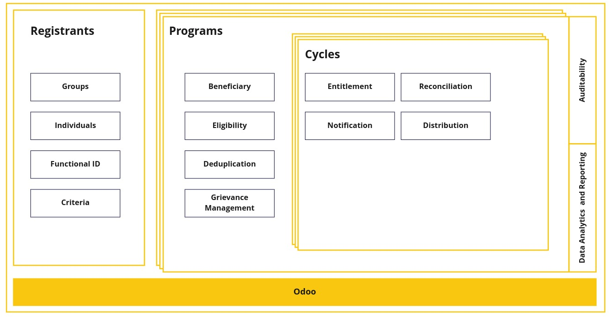
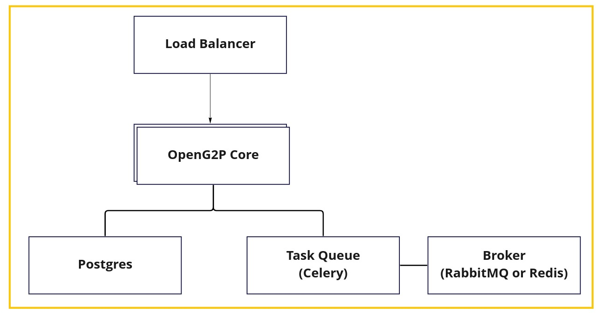

# Architecture

## Principles

- OpenSPP must follow **platform based approach** so that all common features can be configured or the
  functionality can be extended by other parties.
- OpenSPP must **not use proprietary** or commercial license frameworks. Where deemed essential, such
  components must be encapsulated to enable their replacement if necessary (to avoid vendor lock-in)
- OpenSPP must use **open standards** whenever possible to expose its functionality (to avoid technology
  lock-in)
- OpenSPP must use **commodity computing** hardware & software to build the platform
- OpenSPP must be **simple to deploy and use**
- OpenSPP must be able to **work for small projects** with few thousand beneficiaries up to large ones with
  tens of millions of beneficiaries
- Data must be **encrypted** in-flight and at-rest. All requests must be authenticated and authorized. Privacy
  of Identity Data is an absolute must in OpenSPP
- OpenSPP must follow the following manageability principles:
  - **Auditability & monitor ability** of every action in the system
  - **Testability** of every feature of the platform
  - **Easy upgrade** ability of the platform
- OpenSPP should **work with different locales** so that that Social Protection systems can be localized for
  languages and cultures easily
- The key sub-systems of OpenSPP should be designed for **extensibility**. For example, if an external system
  has to be integrated for entitlement determination, it should be easy to do so

### Ecosystem approach

The OpenSPP platform can work as a standalone system or as a part of a larger ecosystem. It needs to be
interoperable with other government systems.

Every piece of information stored in the platform must have a corresponding API to access it, so that it can
be used by other systems. For example, if you want to integrate OpenSPP with mobile money, you can leverage
[Payment Hub EE](https://mifos.gitbook.io/docs/payment-hub-ee/business-overview). Through a well-defined set
of standard interfaces OpenSPP allows for integration of such components and offers choice of providers for
the same.

So, key parameters are:

- All public/external facing interfaces of OpenSPP must be standards-based for interoperability whenever
  possible.
- 3rd party components should be integrated via well-defined interfaces and be easily installable.

### Configurability

OpenSPP should be flexible for countries/organizations to configure the base platform according to their
specific requirements. Some of the examples of configurability are:

- Be able to choose the features required.
- Be able to configure the attributes of the beneficiaries.
- Be able to define the criteria used to determine the beneficiaries.
- Be able to define how entitlement is calculated

### Extensibility

OpenSPP should be flexible to extend functionality on top of the basic platform. Some of the examples of
extensibility are:

- Ability to add a grievance system
- Ability to use third party solutions such as [MOSIP](https://mosip.io/) to store part of the information of
  registrants
- Ability to Integrate data from other systems

### Modularity

All components of OpenSPP should be extensible and their features exposed via interfaces such that the
implementation behind the interface can be changed without affecting other modules. Some examples of
modularity are:

- Determination of eligibility to a program
- Calculation of entitlement
- Deduplication of beneficiaries

## Modular architecture

OpenSPP is designed to be used standalone with just the core functionalities or with other components.

The previous diagram shows the core components of OpenSPP. Those components provide APIs that allow you to
replace the default implementation with your own.

For example, the eligibility calculation can be delegated to a third-party service that has access to other
data and just return the eligibility result to OpenSPP.

- [Eligibility Manager](programs/eligibility_manager.rst)
- [Entitlement Manager](programs/entitlement_manager.rst)
- [Deduplication Manager](programs/deduplication_manager.md)
- [Notification Manager](programs/notification_manager.rst)
- [Program Manager](programs/program_manager.rst)
- [Cycle Manager](programs/cycle_manager.rst)

Furthermore, as OpenSPP is based on the ERP Odoo and use the standard models provided by Odoo, you have access
to the thousands of applications available in the [Odoo App Store](https://apps.odoo.com/apps) or build your
[own](https://www.odoo.com/documentation/15.0/developer.html).

### Example components for a mid-size project

### Example components for a large project

### Hosting

> Principles are inspired by
> [MOSIP's principles](https://docs.mosip.io/1.1.5/architecture/architecture-principles)
