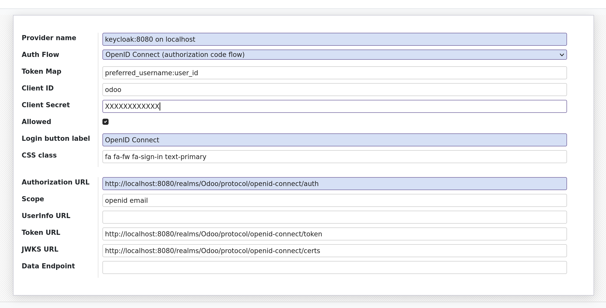

# Configuring Keycloak for OAuth

We recommend using Keycloak as the authentication provider for OpenSPP. This allows for a single sign-on
experience for users and ensures that the authentication mechanism can evolve independently of the systems
using it, thus ensuring that the authentication mechanism can be secured and act as a shield in front of the
systems.

Although other OIDC-compliant providers can be used, we have only tested Keycloak.

## Configuration

If you are using OpenSPP's [docker-compose setup](https://github.com/openspp/openspp-docker), you already have
the `auth_oidc` from [OCA](https://github.com/OCA/server-auth) installed, otherwise you will need to install
it.

### Configure Keycloak

1. Go to the admin console of your keycloak instance
2. Create a new realm (if needed), in our example we use `odoo`.
3. Create a new client, in our example we use `odoo`.
4. Enable `standard flow` and save.
5. Set the `Valid redirect URIs` to be "&lt;url of your server&gt;/auth_oauth/signin".
6. Enable `Client authentication`.
7. Go to the "Credentials" tab and copy the `Client secret` to be used later.

### Configure Odoo

1. Install `Authentication OpenID Connect` from the Apps menu.
2. Go to `Settings > General Settings > Integrations > oAuth Authentication > oAuth Providers` and configure
   it as following:

   - **Provider name**: Keycloak (or any name you like that identify your keycloak provider)
   - **Auth Flow**: OpenID Connect (authorization code flow)
   - **Client ID**: the same Client ID you entered when configuring the client in Keycloak
   - **Client Secret**: found in keycloak on the client Credentials tab
   - **Allowed**: yes
   - **Body**: the link text to appear on the login page, such as Login with Keycloak
   - **Scope**: openid email
   - **Authentication URL**: The "authorization_endpoint" URL found in the OpenID Endpoint Configuration of
     your Keycloak realm
   - **Token URL**: The "token_endpoint" URL found in the OpenID Endpoint Configuration of your Keycloak realm
   - **JWKS URL**: The "jwks_uri" URL found in the OpenID Endpoint Configuration of your Keycloak realm

**For example:**

### Customizing the login page (Optional)

To align with corporate branding, you can customize the login page by adding a custom logo and a custom
background image.

- **Enable Developer Settings**: "Settings" > "Activate The Developer Mode"

- **Edit The Login Template**: "Settings" > "Technical" > "User Interface > Views" > Search for "Login"

## Using

### Existing users

For users that already existed before the OIDC-integration was configured, there is a need for them to go
through the reset password process. This is because the password is not stored in Odoo, but in Keycloak.
Depending on the configuration, the user may have to perform 2FA setup.

### New users

For new users, create their user account in OpenSPP/Odoo with the same email address used in `Keycloak` and
they will be able to login. Note that in order to be able to get past the self-service user management page,
permissions need to be set for the user.
