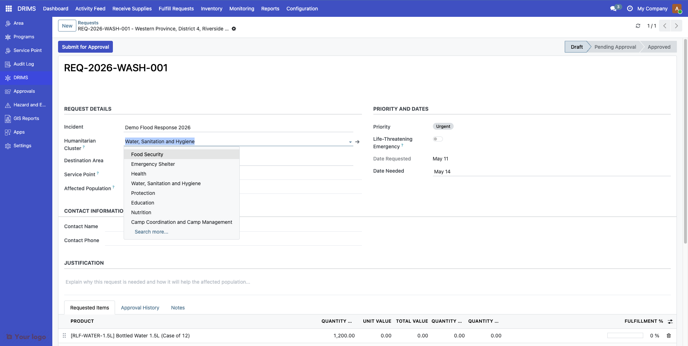
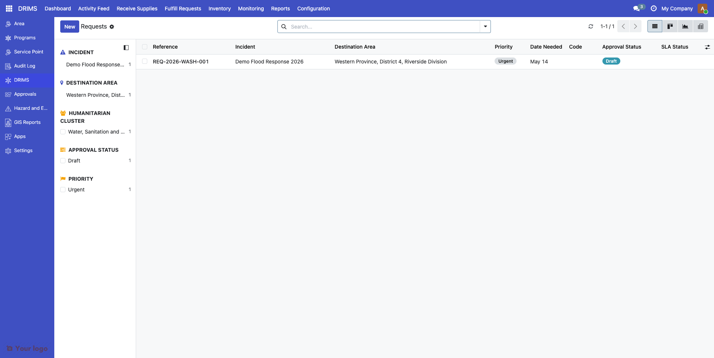
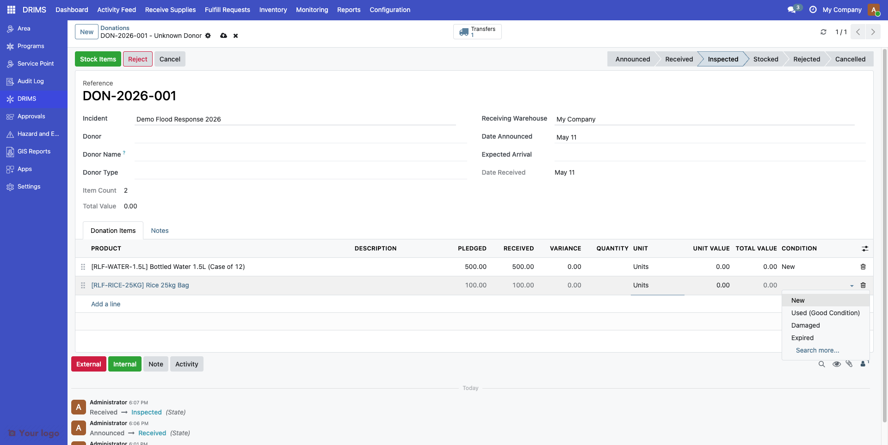
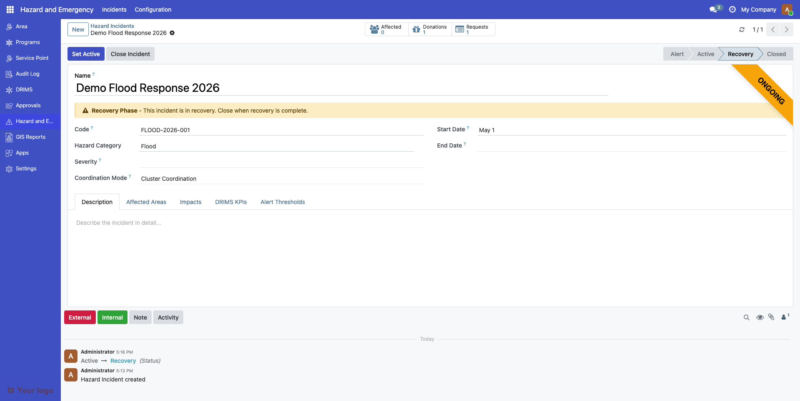
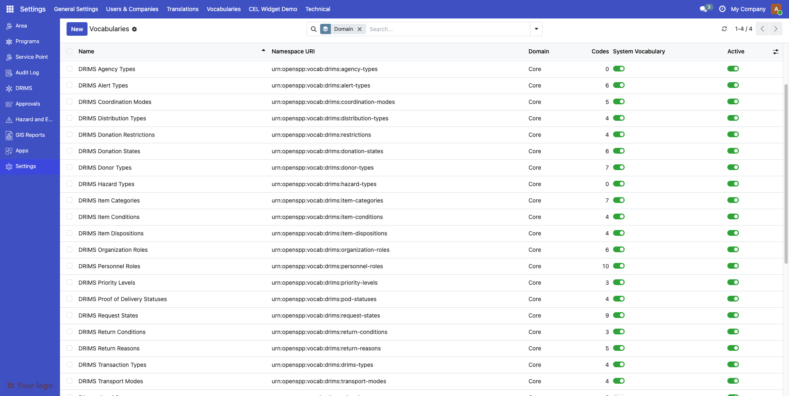

---
openspp:
  doc_status: draft
  products: [drims]
---

# Configuring Vocabularies

This guide is for **implementers** customizing DRIMS controlled vocabularies. If you configure logic in tools like Kobo or CommCare, you have the skills to manage DRIMS vocabularies. You don't need Python knowledge.

## Mental Model

**Vocabularies** in DRIMS are controlled lists of standardized codes that ensure consistency across the system. Think of them like dropdown lists, but managed centrally and reusable across different forms and reports.

Each vocabulary has:

1. **Namespace URI** - A unique identifier (e.g., `urn:openspp:vocab:drims:priority-levels`)
2. **Codes** - Individual values within the vocabulary (e.g., `critical`, `high`, `medium`, `low`)
3. **Display Names** - Human-readable labels that can be translated
4. **System Flag** - Whether the vocabulary is protected from deletion

### Why Vocabularies Matter

Vocabularies prevent data quality issues:

- **Consistency** - Everyone uses the same codes for "high priority"
- **Reporting** - You can aggregate data reliably across incidents
- **Integration** - External systems can reference standard codes
- **Validation** - Invalid values are rejected automatically

```{note}
DRIMS uses international standards where possible. For example, the humanitarian {term}`Cluster` codes come directly from UN {term}`OCHA` guidelines.
```

## DRIMS Vocabularies

DRIMS defines 15+ vocabularies for different classification needs:

| Namespace URI | Purpose | Used In |
|---------------|---------|---------|
| `urn:openspp:vocab:drims:priority-levels` | Request urgency levels | Requests |
| `urn:openspp:vocab:drims:donor-types` | Donor classification | Donations |
| `urn:openspp:vocab:drims:item-conditions` | Item quality states | Donation inspection |
| `urn:openspp:vocab:drims:transport-modes` | Shipping methods | Dispatches |
| `urn:openspp:vocab:drims:request-states` | Request fulfillment status | Requests |
| `urn:openspp:vocab:drims:donation-states` | Donation processing status | Donations |
| `urn:openspp:vocab:drims:drims-types` | Transaction types | Stock movements |
| `urn:openspp:vocab:drims:alert-types` | Alert classifications | Alerts |
| `urn:openspp:vocab:drims:coordination-modes` | Multi-agency coordination models | Incidents |
| `urn:ocha:iasc:clusters` | UN humanitarian sectors | Requests, Personnel |
| `urn:openspp:vocab:drims:personnel-roles` | Staff role types | Personnel |
| `urn:openspp:vocab:drims:return-reasons` | Why items are returned | Returns |
| `urn:openspp:vocab:drims:organization-roles` | Partner agency roles | Organizations |

```{important}
System vocabularies (marked with the system flag) include codes required by DRIMS workflows. You can add custom codes to these vocabularies, but you cannot delete the predefined codes.
```

## OCHA Humanitarian Clusters

The **humanitarian {term}`Cluster` system** is a standardized UN framework for coordinating disaster response by sector. DRIMS implements the official {term}`OCHA`/{term}`IASC` definitions.

### Cluster Reference

| Code | Cluster Name | Lead Agency | Focus Area |
|------|--------------|-------------|------------|
| `food_security` | Food Security | WFP / FAO | Food distribution, agricultural inputs, livelihood support |
| `health` | Health | WHO | Medical services, disease surveillance, health facility support |
| `nutrition` | Nutrition | UNICEF | Treatment of malnutrition, supplementary feeding, infant care |
| `wash` | WASH | UNICEF | Water supply, sanitation facilities, hygiene promotion |
| `shelter` | Shelter | UNHCR / IFRC | Emergency shelter, non-food items, housing reconstruction |
| `protection` | Protection | UNHCR | Safety, human rights, GBV prevention, child protection |
| `education` | Education | UNICEF / Save the Children | Learning continuity, temporary schools, supplies |
| `early_recovery` | Early Recovery | UNDP | Livelihoods restoration, debris removal, infrastructure |
| `logistics` | Logistics | WFP | Supply chain, warehousing, transport coordination |
| `emergency_telecom` | Emergency Telecommunications | WFP | Communications infrastructure, connectivity |
| `camp_coordination` | Camp Coordination & Management | UNHCR / IOM | Displaced persons camps, site management |

### How Clusters Are Used

**In Requests:**
Tag relief requests with the appropriate humanitarian sector to enable:
- Filtering requests by sector
- Reporting to cluster leads
- Identifying sector-specific gaps

**Example:**
```
Request: REQ-2025-0042
Cluster: WASH
Items: Water purification tablets (5000), Jerry cans (200)
```

**In Personnel Records:**
Assign deployed staff to clusters for coordination and {term}`4W Report`ing ("Who does What, Where, When").

**Example:**
```
Personnel: Dilani Perera
Role: Field Coordinator
Cluster: Health
Incident: 2025 Southwest Monsoon Floods
```



```{note}
The cluster codes follow UN OCHA standards and should not be modified. If your country uses different sector names, create custom translations in **Settings → Translations** rather than changing the codes.
```

## Priority Levels

Priority levels classify the urgency of relief requests. DRIMS includes three standard levels:

| Code | Display Name | Use Case |
|------|--------------|----------|
| `critical` | Critical | Life-threatening situations requiring immediate response (< 24 hours) |
| `urgent` | Urgent | Urgent needs requiring response within 2-3 days |
| `routine` | Routine | Standard needs that can be scheduled normally |

### Priority in Workflows

Priority affects:
- **Dashboard sorting** - Critical requests appear first
- **Alert generation** - Overdue critical requests trigger automatic alerts
- **Approval routing** - Critical requests may bypass certain approval steps



```{tip}
You can add custom priority levels by adding vocabulary codes. See "Adding Custom Vocabulary Codes" below.
```

## Item Conditions

Item condition codes track the quality state of donated goods during inspection:

| Code | Display Name | Description |
|------|--------------|-------------|
| `new` | New | Brand new, unopened items |
| `used_good` | Used - Good Condition | Used but fully functional, clean, no damage |
| `damaged` | Damaged | Non-functional, broken, or unusable |
| `expired` | Expired | Past expiration or best-before date |

### Condition Tracking

Condition is recorded:
- **On donation receipt** - During warehouse inspection
- **On distribution** - When dispatching to beneficiaries
- **On return** - When items come back from field



```{warning}
Items marked `damaged` or `expired` should not be distributed. DRIMS can generate alerts when such items remain in inventory beyond a threshold period.
```

## Coordination Modes

Coordination modes define how multi-agency disaster response is organized:

| Code | Mode | Description |
|------|------|-------------|
| `lead_agency` | {term}`Lead Agency` Model | Single agency (usually government) coordinates all partners |
| `cluster` | Cluster Coordination | UN-led sector coordination with designated cluster leads |
| `consortium` | Consortium Model | NGO-led coordination among partner organizations |
| `bilateral` | Bilateral Coordination | Direct government-to-government or agency-to-agency |
| `decentralized` | Decentralized Response | Local actors coordinate independently without a central lead |

### Using Coordination Modes

Set the coordination mode on each **incident record** to indicate how the response is managed:

| Field | Value |
|-------|-------|
| Incident | 2025 Southwest Monsoon Floods |
| Coordination Mode | Cluster System |

This helps DRIMS:
- Generate appropriate reports (e.g., {term}`4W Report`s for cluster coordination)
- Route information to the right stakeholders
- Track agency roles correctly



## Organization Roles

Partner agencies can be assigned roles in disaster response:

| Code | Role | Description |
|------|------|-------------|
| `lead_agency` | {term}`Lead Agency` | Primary coordinating organization |
| `implementing_partner` | {term}`Implementing Partner` | Delivers services on the ground |
| `donor` | Donor | Provides financial resources |
| `coordinator` | Coordinator | Facilitates inter-agency coordination |
| `technical_support` | Technical Support | Provides expertise and guidance |
| `observer` | Observer | Monitors the response without operational responsibility |

### Example

```
Organization: UNICEF
Role: Implementing Partner
Incident: 2025 Southwest Monsoon Floods
Cluster: WASH
```

## Adding Custom Vocabulary Codes

Every vocabulary listed above is a **system vocabulary** — its canonical codes are owned by the DRIMS module and the management UI locks the codes list (`Add a line` is hidden when `is_system = True`). You can browse the codes in **Settings → Vocabularies → Manage Vocabularies → [vocabulary name] → Codes**, but you cannot extend them through that screen.

To add a country-specific or program-specific code, the new row must be flagged as **Local Code** (`is_local = True`), which the system-vocabulary form does not expose. There are two supported paths:

1. **Developer-managed (recommended)** — A developer ships an XML data file in your custom module that creates the extension code. This keeps the extension version-controlled and reproducible across environments. Example record:

   ```xml
   <record id="priority_routine_local" model="spp.vocabulary.code">
       <field name="vocabulary_id" ref="spp_drims.vocab_priority_levels"/>
       <field name="code">routine</field>
       <field name="display">Routine</field>
       <field name="is_local" eval="True"/>
   </record>
   ```

2. **API-managed** — A privileged integration writes the row through XML-RPC / JSON-RPC with `is_local=True`. Without that flag the server rejects the request with *"Cannot add codes to system vocabulary"*.

```{important}
Plain UI edits to system vocabularies are not supported. If your only need is to **deprecate** an existing canonical code, that toggle is editable from the vocabulary form even when `is_system = True`. For anything else (new codes, renames, reorders) coordinate with your developer.
```

### Translating Vocabulary Codes

To add translations for vocabulary display names:

1. Go to **Settings → Translations → Translated Terms**
2. Search for your vocabulary code's display name
3. Add translations for each language

| Language | Translation |
|----------|-------------|
| English | Routine |
| French | De routine |
| Spanish | Rutina |

## Transport Modes

Transport modes classify how relief items are shipped:

| Code | Display Name | Typical Use |
|------|--------------|-------------|
| `road` | Road Transport | Trucks, vans for accessible areas |
| `air` | Air Transport | Helicopters, planes for remote or emergency deliveries |
| `sea` | Sea Transport | Boats for island or coastal areas |
| `foot` | On Foot | Walking delivery for very remote locations |

Set transport mode on **dispatch records** for tracking and reporting.

## Alert Types

Alert types classify automated monitoring alerts:

| Code | Display Name | Triggers When |
|------|--------------|---------------|
| `low_stock` | Low Stock | Available stock falls below a percentage of pending request quantity |
| `expiry` | Expiring Items | Stock with an expiration date within the configured warning window |
| `sla_warning` | SLA Warning | A request is approaching its due date without being fulfilled |
| `sla_breach` | SLA Breach | A request has passed its due date without being fulfilled |
| `critical_shortage` | Critical Shortage | Stock for an essential item is critically depleted |
| `quality_issue` | Quality Issue | Items flagged as damaged or expired during inspection |

```{note}
Alert thresholds are configured per incident on the **Alert Thresholds** tab of the hazard incident form. See {doc}`/config_guide/drims/alerts` for details.
```

## Transaction Types

Transaction types classify stock movements:

| Code | Display Name | Description |
|------|--------------|-------------|
| `donation_receipt` | Donation Receipt | Incoming donation to warehouse |
| `request_dispatch` | Request Dispatch | Outgoing shipment to fulfill request |
| `internal_transfer` | Internal Transfer | Movement between warehouses |
| `return` | Return | Items returned from distribution point |

## Viewing All Vocabularies

To see all vocabularies and their codes:

1. Go to **Settings → Vocabularies → Manage Vocabularies**
2. Use the search and filters to find specific vocabularies
3. Click any vocabulary to view and edit its codes



## Are You Stuck?

### Can't find the Vocabularies menu?

You need **DRIMS Manager** or **Administrator** permissions. Contact your system administrator.

### New local code not appearing in dropdowns?

1. Confirm the new code was created with `is_local = True`; without it the server rejects the row on a system vocabulary
2. Refresh your browser (Ctrl+F5 or Cmd+Shift+R)
3. Verify the code is not marked **Deprecated** or inactive
4. Verify the code's `vocabulary_id` matches the vocabulary you expected

### "Cannot add codes to system vocabulary" error?

You tried to add a code to a system vocabulary without the **Local Code** flag set. The UI does not expose this flag — coordinate with your developer to add the code as XML module data, or use the API path described in "Adding Custom Vocabulary Codes" above.

### Want to remove a vocabulary code?

Don't delete it (deletion can break historical records that reference the code). Instead, mark the code as **Deprecated** on its form. This hides it from new dropdowns but preserves existing data.

### Need to change a code value?

Changing the `code` value breaks historical data. Instead:
1. Mark the old code as **Deprecated**
2. Create a new code with the correct value (developer or API path)
3. Migrate active records to use the new code

### Cluster codes don't match our country's terminology?

Don't change the cluster codes (they follow UN OCHA standards). Instead, add translations in **Settings → Translations** to use your preferred display terms.

### Want to add a completely new vocabulary?

New vocabularies require module development. Contact your developer or OpenSPP support — for most extensions, adding a local code to an existing vocabulary is enough.

## Related Documentation

- {doc}`/config_guide/drims/alerts` - Alert threshold configuration
- {doc}`/config_guide/drims/warehouses` - Warehouse configuration
- {doc}`/user_guide/drims/requests` - Creating relief requests
- {doc}`/user_guide/drims/donations` - Recording donations

## References

- [UN OCHA Cluster Coordination](https://www.humanitarianresponse.info/en/coordination/clusters)
- [IASC Cluster Reference Module](https://interagencystandingcommittee.org/iasc-transformative-agenda/iasc-reference-module-cluster-coordination-country-level-revised-july-2015)
