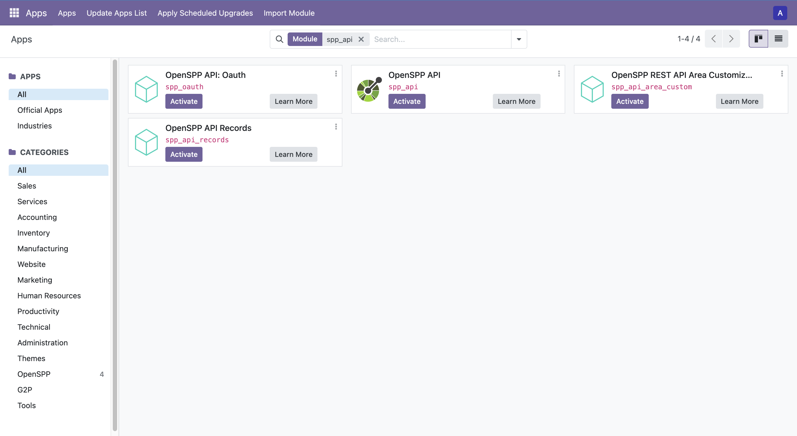

# Customizing the REST API

This article guides you through understanding and customizing the REST API module in OpenSPP, using a practical example: adding a new GET endpoint to retrieve Area data.

## Prerequisites

- Familiarity with Python, Odoo, XML, and XPath.
- OpenSPP development environment set up ([Developer Guide](https://docs.openspp.org/howto/developer_guides/development_setup.html)).

## Installing the REST API Module

1. Log into OpenSPP with administrative rights.
2. Go to the **Apps** menu.
3. Click **Update Apps List** to refresh available modules.
4. Search for **OpenSPP API** or `spp_api` and install it. This will also install required dependencies.



## Understanding the REST API Module Structure

The `spp_api` module provides the foundation for exposing Odoo models and data via RESTful endpoints. Key components include:

- **`spp_api.path`**: Defines API endpoints (paths), HTTP methods, and associated models.
- **`spp_api.namespace`**: Groups endpoints under logical namespaces.
- **`spp_api.field`**: Specifies which model fields are exposed via the API.

## Customizing the REST API: Example Scenario

Suppose you want to expose Area data through a new GET endpoint under a custom namespace. This example demonstrates how to create a custom module that adds both a namespace and an endpoint.

A working sample module is available at: [GitHub Example](https://github.com/OpenSPP/documentation_code/tree/main/howto/developer_guides/customizations/spp_api_area_custom).

### 1. Create Module Structure

Create a new module following the OpenSPP structure:

```
spp_api_area_custom/
├── __init__.py
├── __manifest__.py
├── data/
│   ├── spp_api_namespace_data.xml
│   └── spp_api_path_data.xml
└── README.md
```

### 2. Define Module Manifest

Create `__manifest__.py` with the correct dependency on `spp_api`:

```python
{
    "name": "OpenSPP REST API Area Customization",
    "summary": "Adds custom Area endpoint to OpenSPP REST API",
    "category": "OpenSPP",
    "version": "17.0.1.0.0",
    "author": "Your Organization",
    "website": "https://your-website.com",
    "license": "LGPL-3",
    "depends": [
        "spp_api",
        "spp_area_base",
    ],
    "data": [
        "data/spp_api_namespace_data.xml",
        "data/spp_api_path_data.xml",
    ],
    "application": False,
    "installable": True,
    "auto_install": False,
}
```

### 3. Create a Custom API Namespace

Create `data/spp_api_namespace_data.xml` to define your namespace:

```xml
<odoo>
    <record id="api_namespace_area" model="spp_api.namespace">
        <field name="name">area_api</field>
        <field name="version_name">1</field>
        <field name="description">Namespace for Area-related API endpoints</field>
        <field name="log_request">debug</field>
        <field name="log_response">debug</field>
        <field name="user_ids" eval="[(4, ref('base.user_admin'))]" />
    </record>
</odoo>
```

### 4. Add the API Endpoint

Create `data/spp_api_path_data.xml` to define the new endpoint under your custom namespace:

```xml
<odoo>
    <record id="api_path_area_get" model="spp_api.path">
        <field name="name">Area</field>
        <field name="model_id" ref="spp_area_base.model_spp_area" />
        <field name="namespace_id" ref="api_namespace_area" />
        <field name="description">GET Area</field>
        <field name="method">get</field>
        <field name="field_ids" eval="[(
            6, 0, [
                ref('spp_area_base.field_spp_area__parent_id'),
                ref('spp_area_base.field_spp_area__name'),
                ref('spp_area_base.field_spp_area__draft_name'),
                ref('spp_area_base.field_spp_area__code'),
            ]
        )]" />
    </record>
</odoo>
```

**Notes:**
- The `namespace_id` now references your custom namespace.
- Add or remove fields as needed for your use case.

### 5. Generate Public and Private Keys

To secure your API endpoints, generate a 4096-bit RSA key pair using OpenSSL. These keys can be used for authentication or encryption as required by your implementation.

Open your terminal and run:

```sh
# Generate a 4096-bit private key
openssl genpkey -algorithm RSA -out private_key.pem -pkeyopt rsa_keygen_bits:4096

# Extract the public key
openssl rsa -pubout -in private_key.pem -out public_key.pub
```

- Place `private_key.pem` and `public_key.pub` in `etc/secrets`.
- chmod if needed.
- **Never share your private key.** Only the public key should be distributed if required.

---

### 6. Install and Test

1. Install your new module via the Apps menu.

2. **Get your Bearer Token:**
    - Go to **Settings** > **Users & Companies** > **Users**.
    - Open your user record.
    - In the **Allowed APIs** section, click the **View Bearer Token** button to create a new token.
    - Copy the generated token.
    - In Postman (or your REST client), set the **Authorization** Header and paste your token (e.g., `Bearer <your_token>`).
    
3. Use a REST client (e.g., Postman) to test the endpoint.  
   Example URL:  
   `http://localhost:8069/api/area_api/1/Area?request_id={{$randomUUID}}`
4. The `request_id` parameter is required and must be unique for each request, you can use a random 36-character UUID.

#### Example: Successful Response


#### Example: Error Response


## Best Practices

1. **Use Proper Dependencies**: Always depend on `spp_api` for API customizations.
2. **Create Namespaces**: Group related endpoints for clarity and maintainability.
3. **Follow Naming Conventions**: Use clear, descriptive names for endpoints and fields.
4. **Document Your Module**: Include a README with usage instructions.
5. **Test Thoroughly**: Validate endpoints with various data and error scenarios.
6. **Security**: Ensure only authorized users can access sensitive endpoints.

## References

- [Odoo 17 Developer Documentation](https://www.odoo.com/documentation/17.0/developer/)
- [OpenSPP Development Guidelines](https://docs.openspp.org/)
