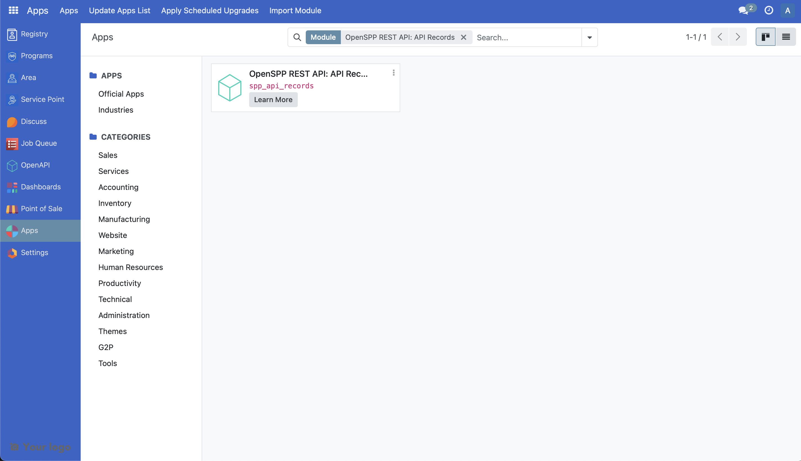
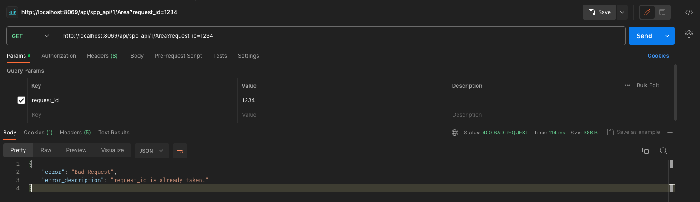

# Customize REST API

The following article guides the reader to understand how the REST API module will work in OpenSPP and how it can be customized by providing a sample scenario and a working example.

## Prerequisites

- Knowledge of Python, Odoo, XML, Xpaths.
- To set up OpenSPP for development, please refer to the [Developer Guide](https://docs.openspp.org/howto/developer_guides/development_setup.html)

## If the REST API module is not installed

1. Log into OpenSPP with administrative rights.

2. Access the “Apps” menu from the dashboard to manage OpenSPP modules.

3. Choose “Update Apps List” to refresh the module list.

4. Search for “OpenSPP REST API: API Records” and initiate installation. This will also install the other modules required.



## Customize REST API

In this hypothetical scenario, the REST API will be customized to add an GET endpoint to respond with Area data.

A working sample module for the described scenario can be accessed at the provided [link](https://github.com/OpenSPP/documentation_code/tree/main/howto/developer_guides/customizations/spp_api_records_custom).

The key steps in module development are as follows:

1. To customize REST API, a new module can be developed.
2. To initiate the development of a custom module for REST API customization, begin by creating a manifest file. This file should include fields like name, category, and version. Additionally, it's crucial to define the dependencies of the new module as outlined below.

```python
   "depends": [
       "spp_api_records",
   ],
```

3. To integrate new endpoint and the response data needed into the system, the following steps should be followed. Create a new file called `data/spp_api_path_data.xml` in the module and add the below code to the manifest file.

```python
   "data": [
       "data/spp_api_path_data.xml",
   ],
```

The following code can be added to the `spp_api_path_data.xml` file to create a new endpoint.

```xml
   <record id="area_path" model="spp_api.path">
       <field name="name">Area</field>
       <field name="model_id" ref="spp_area.model_spp_area" />
       <field name="namespace_id" ref="spp_api_records.spp_api_namespace" />
       <field name="description">GET Area</field>
       <field name="method">get</field>
       <field
           name="field_ids"
           eval="[(
           6, 0, [
               ref('spp_area.field_spp_area__parent_id'),
               ref('spp_area.field_spp_area__name'),
               ref('spp_area.field_spp_area__draft_name'),
               ref('spp_area.field_spp_area__code'),
           ]
       )]"
       />
   </record>
```

The above code will create a new record for the model `spp_api.path` with the information about the endpoint’s model, fields, and HTTP method.

4. Now install the new module.

The following screenshot shows the response data after sending the request using Postman. The URL used here is `http://localhost:8069/api/spp_api/1/Area?request_id=12345` but it may differ based on your configuration in your local development environment.

NOTE: `request_id` parameter is required and should be unique. Else the response will return an error.

Successful Response


Error Response


