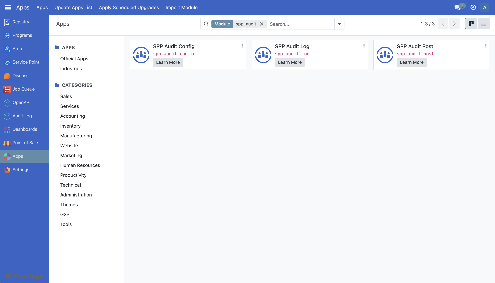
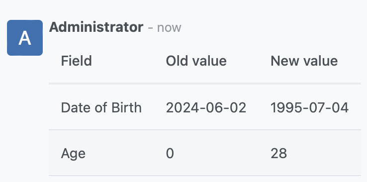
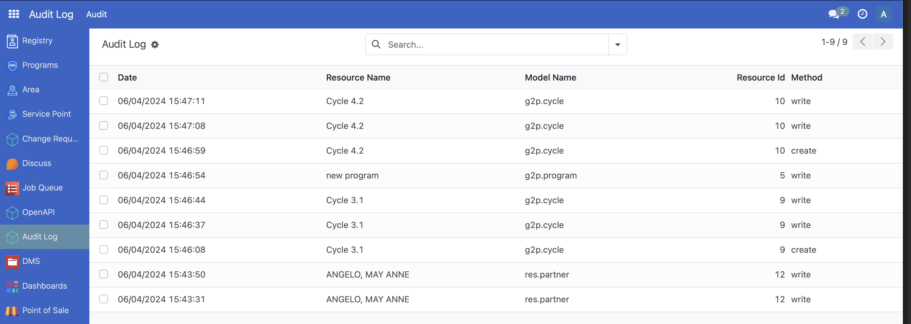
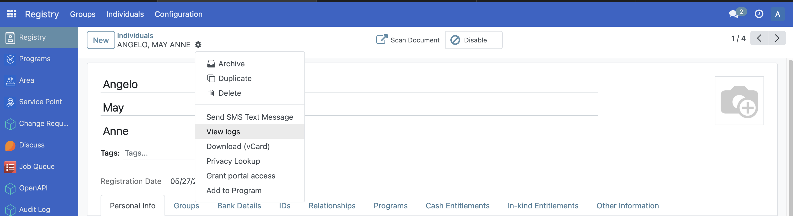
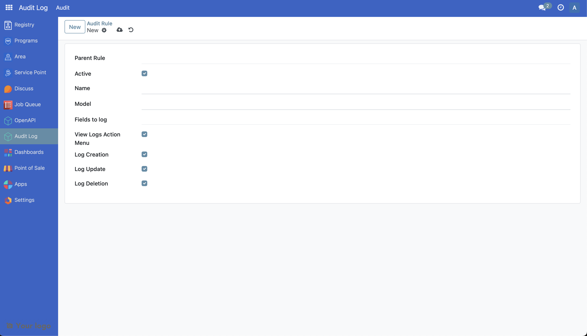

# Customize Audit Logs

The following article guides the reader in understanding how the audit modules work in OpenSPP and how they can be customized by providing a sample scenario and a working example. The audit stack consists of `spp_audit_log` (core models and UI), `spp_audit_post` (optional chatter posting), and `spp_audit_config` (preconfigured rules).

## Prerequisites

- Knowledge of Python, Odoo, XML, Xpaths.
- To set up OpenSPP for development, please refer to the [Developer Guide](https://docs.openspp.org/howto/developer_guides/development_setup.html).

## If the Audit module is not installed

1. Log into OpenSPP with administrative rights.

2. Access the "Apps" menu from the dashboard to manage OpenSPP modules.

3. Choose "Update Apps List" to refresh the module list.

4. Search and initiate installation of the following modules, this will also install the other required modules:

   - SPP Audit Config
   - SPP Audit Log
   - SPP Audit Post



## Understanding the Audit Module Structure

The audit stack provides core logging and optional posting with the following key components:

### Core Models
- `spp.audit.rule`: Configures what to log per model. Fields include `model_id`, `field_to_log_ids`, and toggles for `log_create`, `log_write`, `log_unlink`, plus `view_logs` to add a context action.
- `spp.audit.log`: Stores individual change entries including `audit_rule_id`, `user_id`, `model_id`, `res_id`, `method`, and formatted `data_html`.
- (From `spp_audit_post`) `spp.audit.rule` adds parent linking (`parent_id`, `child_ids`, `field_id`) and `spp.audit.log` adds `parent_model_id`, `parent_res_ids_str`, and `parent_data_html` for posting to parent records.

### Key Features
- Dynamic method decoration on target models (`create`, `write`, `_write`, `unlink`) when a rule is created or updated
- Field-level selection via `field_to_log_ids` and automatic formatting for selections, relational fields, and datetime values
- Optional action menu "View logs" bound to the target model when `view_logs` is enabled
- Optional posting of audit messages to the target record or its parent model chatter (`spp_audit_post`)
- Preconfigured default rules installed via `spp_audit_config` (`data/audit_rule_data.xml`)

## Customizing the Audit Module

In a hypothetical scenario, customizing the audit rule to include an `active` flag serves as a practical example. This allows enabling/disabling rules without deletion.

A working sample module for the described scenario can be accessed at the provided [link](https://github.com/OpenSPP/documentation_code/tree/main/howto/developer_guides/customizations/spp_audit_log_custom).

The key steps in module development are as follows:

### 1. Create Module Structure

To customize audit logs, create a new module following the OpenSPP module structure:

```
spp_audit_log_custom/
├── __init__.py
├── __manifest__.py
├── models/
│   ├── __init__.py
│   └── spp_audit_rule.py
├── views/
│   └── spp_audit_rule_views.xml
├── security/
│   └── ir.model.access.csv
└── data/
    └── audit_rule_data.xml
```

### 2. Define Module Manifest

Create a manifest file that includes the proper dependencies and data files:

```python
{
    "name": "OpenSPP Audit Customizations",
    "summary": "Custom extensions for OpenSPP Audit",
    "category": "OpenSPP",
    "version": "17.0.1.0.0",
    "author": "Your Organization",
    "website": "https://your-website.com",
    "license": "LGPL-3",
    "depends": [
        "spp_audit_log",
        # "spp_audit_post",  # include if you extend or rely on chatter posting
    ],
    "data": [
        "views/spp_audit_rule_views.xml",
        # "security/ir.model.access.csv",  # not needed if you do not add new models
        # "data/audit_rule_data.xml",      # optional preconfigured rules
    ],
    "application": False,
    "installable": True,
    "auto_install": False,
}
```

### 3. Extend the Audit Rule Model

Create a Python file named `spp_audit_rule.py` that extends the `spp.audit.rule` model and add it to `models/__init__.py`:

```python
from odoo import fields, models

class CustomAuditRule(models.Model):
    _inherit = "spp.audit.rule"

    active = fields.Boolean(
        default=True,
        help="If unchecked, the rule can be treated as inactive in your custom logic",
    )
```

### 4. Create View Extensions

Create a new file called `views/spp_audit_rule_views.xml` in the module and add it to the manifest file:

```xml
<odoo>
    <record id="view_custom_audit_log_form" model="ir.ui.view">
        <field name="name">view_custom_audit_log_form</field>
        <field name="model">spp.audit.rule</field>
        <field name="inherit_id" ref="spp_audit_log.spp_audit_rule_form" />
        <field name="arch" type="xml">
            <xpath expr="//field[@name='name']" position="before">
                <field name="active" />
            </xpath>
        </field>
    </record>
</odoo>
```

### 5. Add Security Access (Optional)

If you introduce new models, include access rights. For simple field additions to existing models this is not required. A minimal example (optional):

```csv
id,name,model_id:id,group_id:id,perm_read,perm_write,perm_create,perm_unlink
access_custom_spp_audit_rule,custom.spp.audit.rule,spp_audit_log.model_spp_audit_rule,base.group_system,1,1,1,0
```

### 6. Add Preconfigured Rules (Optional)

You can seed rules using `data` with the `spp.audit.rule.create_rules` helper provided by `spp_audit_config`:

```xml
<odoo>
    <data noupdate="1">
        <function model="spp.audit.rule" name="create_rules">
            <value name="rule_name">My Registry Rule</value>
            <value name="model">res.partner</value>
            <value name="fields_to_log" eval="['name', 'gender', 'birthdate']" />
            <value name="view_logs" eval="True" />
        </function>
    </data>
</odoo>
```

For parent/child rules (requires `spp_audit_post`), also pass `parent_rule_name` and `connecting_field_name` to tie child rules to a parent model.

### 7. Install and Test

1. Install the module through the Apps menu
2. Create or update records in the configured models (e.g., Individual or Group Registry)
3. Open Audit Log → Audit → Log to review entries
4. On a specific record, use Action → View logs (if enabled) to see related entries

The following screenshots show logs and the added field in the UI:









## Best Practices

1. **Extend Existing Views**: Always inherit from existing views (`spp_audit_log.spp_audit_rule_form`) rather than creating new ones
2. **Use Targeted Field Lists**: Keep `field_to_log_ids` focused on business-critical fields
3. **Control Visibility**: Use `view_logs` when you want a context action; avoid clutter otherwise
4. **Test Thoroughly**: Verify create/write/unlink scenarios and method coverage
5. **Document Changes**: Update your module's README with usage instructions

## References

For more information on extending Odoo models and views, refer to:
- [Odoo 17 Developer Documentation](https://www.odoo.com/documentation/17.0/developer/)
- [OpenSPP Development Guidelines](https://docs.openspp.org/)
- Audit modules source:
  - `spp_audit_log`: `https://github.com/OpenSPP/openspp-modules/tree/17.0/spp_audit_log`
  - `spp_audit_post`: `https://github.com/OpenSPP/openspp-modules/tree/17.0/spp_audit_post`
  - `spp_audit_config`: `https://github.com/OpenSPP/openspp-modules/tree/17.0/spp_audit_config`
