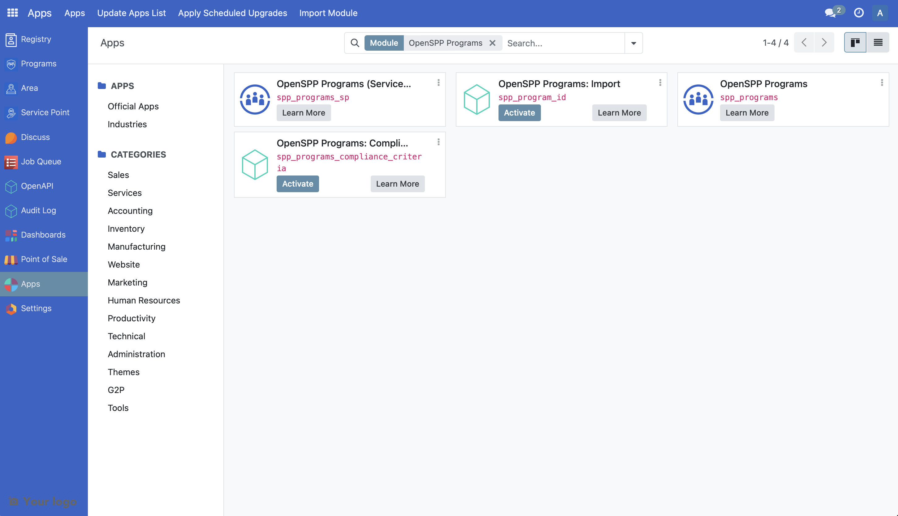
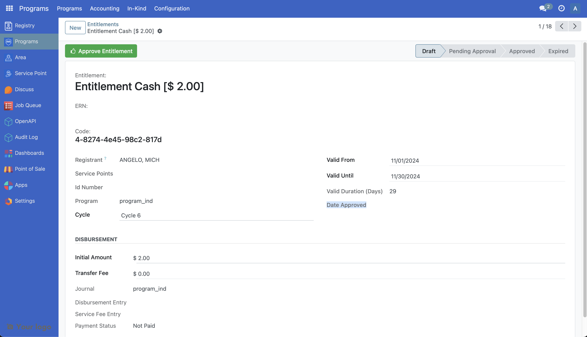

# Customize Entitlement

The following article guides the reader in understanding how the entitlement can be customized by providing a sample scenario and a working example.

## Prerequisites

- Knowledge of Python, Odoo, XML, Xpaths.
- To set up OpenSPP for development, please refer to the [Developer Guide](https://docs.openspp.org/howto/developer_guides/development_setup.html).

## If the Programs module is not installed

1. Log into OpenSPP with administrative rights.

2. Access the “Apps” menu from the dashboard to manage OpenSPP modules.

3. Choose “Update Apps List” to refresh the module list.

4. Search for “Programs” and initiate installation. This will also install the other modules required.



## Utilising the Entitlement

For more detailed guidance on utilizing the Entitlement module in OpenSPP, please refer to the information available at the provided link which will be published soon.

## Customize Entitlement

The duration of the validity of the entitlement is not shown currently in OpenSPP. Let’s look at a step by step guide on how the duration can be shown within an entitlement.

A working sample module for the described scenario can be accessed at the provided [link](https://github.com/OpenSPP/documentation_code/tree/main/howto/developer_guides/customizations/spp_entitlement_custom).

The key steps in module development are as follows:

1. To customize entitlement, a new module can be developed.
2. To initiate the development of a custom module for entitlement customization, begin by creating a manifest file. This file should include fields like name, category, and version. Additionally, it's crucial to define the dependencies of the new module as outlined below.

```python
 "depends": [
       "spp_programs",
   ],
```

3. To add the new field in the new module, develop a Python file named `entitlement.py` that extends `g2p.entitlement` and incorporate this file into `models/init.py`. The definition of the fields should be implemented as demonstrated below.

```python
from odoo import api, fields, models

class G2PEntitlementCustom(models.Model):
   _inherit = "g2p.entitlement"

   day_duration = fields.Integer("Valid Duration (Days)", compute="_compute_day_duration")

   @api.depends("valid_from", "valid_until")
   def _compute_day_duration(self):
       for rec in self:
           valid_from = rec.valid_from or fields.Date.today()
           delta = rec.valid_until - valid_from
           rec.day_duration = delta.days
```

The code mentioned above will introduce a new field to the `g2p_entitlement` table for storing the duration of an entitlement. To understand further, refer to the following documentation [Link 1](https://www.odoo.com/documentation/17.0/developer/tutorials/server_framework_101/03_basicmodel.html), [Link 2](https://www.odoo.com/documentation/17.0/developer/tutorials/server_framework_101/13_other_module.html), [Link 3](https://www.odoo.com/documentation/17.0/developer/tutorials/server_framework_101/12_inheritance.html)

Here the values of `valid_until`, `valid_from` fields are derived from the values of cycle’s start date and end date fields. The mentioned fields are from the table `g2p.cycle`.

4. To integrate new fields into the UI, the following steps should be followed. Create a new file called `views/entitlement_view.xml` in the module. Add the below code to the manifest file.

```python
"data": [
    "views/entitlement_view.xml",
],
```

5. The following code can be added to the `entitlement_view.xml` file to show the duration in the UI.

```xml
 <record id="view_custom_entitlement_form" model="ir.ui.view">
   <field name="name">view_custom_entitlement_form</field>
   <field name="model">g2p.entitlement</field>
   <field name="inherit_id" ref="g2p_programs.view_entitlement_form" />
   <field name="priority">1000</field>
   <field name="arch" type="xml">
     <xpath expr="//field[@name='valid_until']" position="after">
       <field name="day_duration" />
     </xpath>
   </field>
 </record>
```

6. Install the module to include the new changes. The following screenshot shows the added field duration in the newly developed module.


