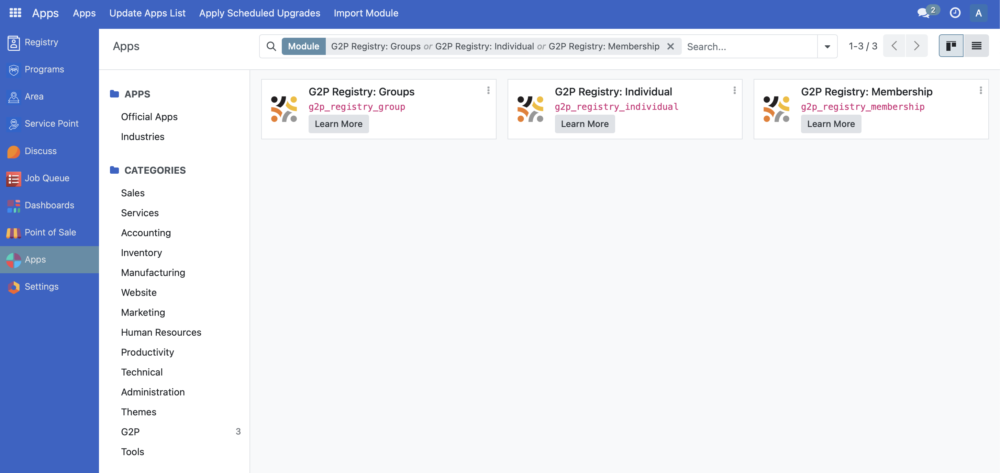
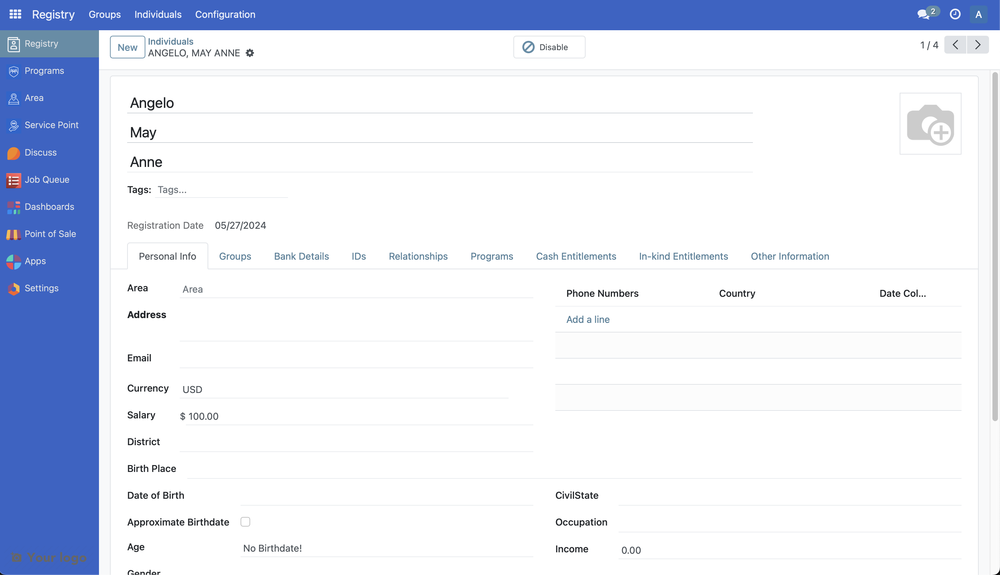
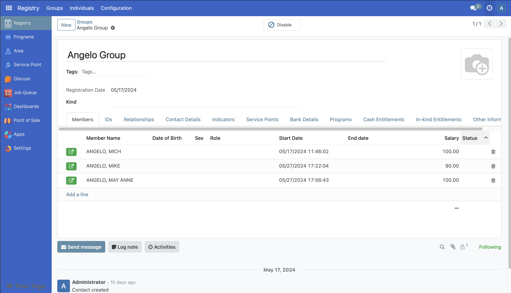
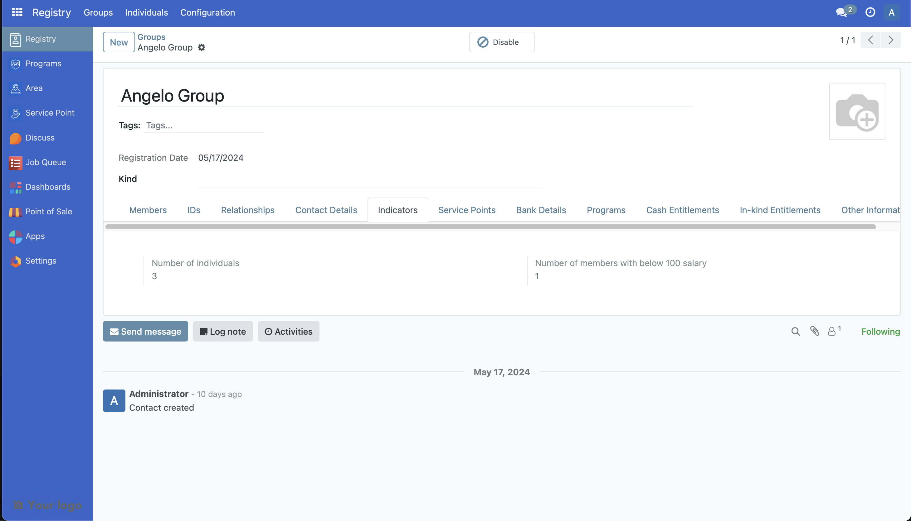

# Customize Registry

The following article guides the reader in understanding how the registry module will work in OpenSPP and how it can be customized by providing a sample scenario and a working example.

## Prerequisites

- Knowledge of Python, Odoo, XML, Xpaths.
- To set up OpenSPP for development, please refer to the [Developer Guide](https://docs.openspp.org/howto/developer_guides/development_setup.html)

## If the Registry module is not installed

1. Log into OpenSPP with administrative rights.

2. Access the “Apps” menu from the dashboard to manage OpenSPP modules.

3. Choose “Update Apps List” to refresh the module list.

4. Search for the following modules that are required to be installed such as G2P Registry: Groups, G2P Registry: Individual and G2P Registry: Membership.



## Utilizing the Registry Module

For more detailed guidance on utilizing the Registry module in OpenSPP, please refer to the information available at the provided link, which will be published soon.

## Customise Registry

In this hypothetical scenario, we will look at the following customizations

- Storing a new field salary of an individual to be used as a indicator
- Adding an indicator in the group of the registry
- To show the salary of every individual in the group member view.

A working sample module for the described scenario can be accessed at the provided [link](https://github.com/OpenSPP/documentation_code/tree/main/howto/developer_guides/customizations/spp_registry_custom).

The key steps in module development are as follows:

1. To do the above customizations, a new module can be developed.

2. To initiate the development of the custom module for registry customization, begin by creating a manifest file. This file should include fields like name, category, and version. Additionally, it's important to define the dependencies of the new module as outlined below.

```python
  "depends": [
       "g2p_registry_group",
       "g2p_registry_individual",
       "g2p_registry_membership",
   ],
```

3. To add the new field for salary in the registry, develop a Python file named `individual.py` that extends `res.partner` and incorporate this file into `models/init.py`. The definition of the salary and currency fields should be implemented as demonstrated below.

```python
from odoo import fields, models

class OpenSPPIndividualCustom(models.Model):
   _inherit = "res.partner"

   ind_currency_id = fields.Many2one(
       "res.currency",
       "Currency",
       default=lambda self: self.env.user.company_id.currency_id or None,
   )
   ind_salary = fields.Monetary("Salary", currency_field="ind_currency_id", default=0.0)
```

Note that when adding fields that are specific for individual It should have the prefix `ind_`

4. To add the new column in the Members table in the groups, develop a Python file named `group_membership.py` that extends `g2p.group.membership` and incorporate this file into `models/__init__.py`. The definition of the salary and currency fields should be implemented as demonstrated below.

```python
from odoo import fields, models

class OpenSPPMembershipCustom(models.Model):
   _inherit = "g2p.group.membership"

   currency_id = fields.Many2one(
       "res.currency",
       related="individual.ind_currency_id",
   )

   salary = fields.Monetary(
       "Salary",
       currency_field="currency_id",
       related="individual.ind_salary",
   )

```

5. To add the salary as an indicator in the group-level, develop a Python file named `group.py` that extends `res.partner` and incorporate this file into `models/init.py`. The definition of the number of individuals with a salary below 100 USD should be implemented as demonstrated below.

```python
from odoo import api, fields, models

class OpenSPPGroupCustom(models.Model):
   _inherit = "res.partner"

   z_ind_grp_count_below_salary = fields.Integer(
       "Number of members with below 100 salary",
       compute="_compute_count_below_salary",
   )

   @api.depends("group_membership_ids", "group_membership_ids.salary")
   def _compute_count_below_salary(self):
       for rec in self:
           below_salary_count = 0
           for membership in rec.group_membership_ids:
               if membership.salary < 100:
                   below_salary_count += 1


           rec.z_ind_grp_count_below_salary = below_salary_count

```

To understand further, refer to the following documentation [Link 1](https://www.odoo.com/documentation/17.0/developer/tutorials/server_framework_101/03_basicmodel.html), [Link 2](https://www.odoo.com/documentation/17.0/developer/tutorials/server_framework_101/13_other_module.html), [Link 3](https://www.odoo.com/documentation/17.0/developer/tutorials/server_framework_101/12_inheritance.html)

6. The following steps should be followed to integrate the new fields into the UI. Create new files named `views/individual_views.xml` and `views/group_membership_views.xml` in the module. Add the below code to the manifest file.

```python
   "data": [
       "views/group_membership_views.xml",
       "views/individual_views.xml",
   ],

```

7. The following code can be added to the `individual_views.xml` file to show the currency and salary in the UI.

```xml
   <record id="view_individuals_salary_detail" model="ir.ui.view">
       <field name="name">view_individuals_salary_detail</field>
       <field name="model">res.partner</field>
       <field name="inherit_id" ref="g2p_registry_individual.view_individuals_form" />
       <field name="arch" type="xml">
           <xpath expr="//field[@name='email']" position="after">
               <field name="ind_currency_id" />
               <field name="ind_salary" />
           </xpath>
       </field>
   </record>
```

8. The following code can be added to the `group_membership_views.xml` to show the salary of every member of the group.

```xml
   <record id="view_group_membership_salary_indicator" model="ir.ui.view">
       <field name="name">view_group_membership_salary_indicator</field>
       <field name="model">res.partner</field>
       <field name="inherit_id" ref="g2p_registry_group.view_groups_form" />
       <field name="arch" type="xml">
           <xpath expr="//field[@name='group_membership_ids']/tree/field[@name='ended_date']" position="after">
               <field name="salary" />
           </xpath>
       </field>
   </record>
```

9. Install the module to include the new changes.

10. The following screenshot shows the added field in the newly developed module.

See the following for the Individual view.


See the following for the Members table in Groups.


See the following for the Indicators in Groups



---

## Merged Content


### Content from docs/howto/developer_guides/custom_registry_tab_fields.md

# Customize Registry's Tabs/Fields

The following article guides the reader in understanding how the registry’s tabs and fields can be customized. In this article, we will look at how to add and remove the tabs and fields in the registry module.

## Prerequisites

- Knowledge of Python, Odoo, XML, Xpaths.
- To set up OpenSPP for development, please refer to the [Developer Guide](https://docs.openspp.org/howto/developer_guides/development_setup.html)
- Refer [Customize Registry](https://docs.openspp.org/howto/developer_guides/custom_registry.html) for basic customizations of Registry module

## Adding a new tab and a field

To add a new tab and a new field in Group or/and in Individual Page, use xpath and view inheritance. Check the code samples below.

1. Example 1

The file name is `group_views.xml`.

```xml
<record id="view_custom_groups_form" model="ir.ui.view">
    <field name="name">view_custom_groups_form</field>
    <field name="model">res.partner</field>
    <field name="inherit_id" ref="g2p_registry_group.view_groups_form" />
    <field name="arch" type="xml">
        <xpath expr="//page[@name='basic_info']" position="after">
            <page string="Disability information" name="disability_info">
                <group col="4" colspan="4">
                    <field name="grp_with_disability_individual" />
                </group>
            </page>
        </xpath>
    </field>
</record>
```

This code snippet adds a new tab titled "Disability Information" to the Group form in OpenSPP, featuring a field for disability-related data.

2. Example 2

The file name is `individual_views.xml`.

```xml
<record id="view_individuals_salary_detail" model="ir.ui.view">
    <field name="name">view_individuals_salary_detail</field>
    <field name="model">res.partner</field>
    <field name="inherit_id" ref="g2p_registry_individual.view_individuals_form" />
    <field name="arch" type="xml">
        <!-- Adding a new tab and adding a new field in a tab -->
        <xpath expr="//page[@name='basic_info']" position="after">
            <page string="Disability information" name="disability_info">
                <group col="4" colspan="4">
                    <field name="ind_disability_type" />
                    <field name="ind_special_notes" />
                </group>
            </page>
        </xpath>
    </field>
</record>
```

This code introduces a new tab called "Disability Information" to the Individual form in OpenSPP, containing fields for the type of disability and special notes.

## Removing an existing tab and a field

In removing an existing tab or existing field, use xpath with a position `attributes` and add `invisible` attribute to the tab or field you want to remove. Check the code samples below.

1. Example 1

The file name is `group_views.xml`.

```xml
<record id="view_custom_groups_form" model="ir.ui.view">
    <field name="name">view_custom_groups_form</field>
    <field name="model">res.partner</field>
    <field name="inherit_id" ref="g2p_registry_group.view_groups_form" />
    <field name="arch" type="xml">
        <!-- removing a tab -->
        <xpath expr="//page[@name='other']" position="attributes">
            <attribute name="invisible">1</attribute>
        </xpath>

        <!-- removing a field -->
        <xpath expr="//field[@name='phone_number_ids']" position="attributes">
            <attribute name="invisible">1</attribute>
        </xpath>
    </field>
</record>
```

This code hides an existing tab named `other` and a field `phone_number_ids` in the Group form, making them invisible in the user interface.

2. Example 2

The file name is `individual_views.xml`.

```xml
<record id="view_individuals_salary_detail" model="ir.ui.view">
    <field name="name">view_individuals_salary_detail</field>
    <field name="model">res.partner</field>
    <field name="inherit_id" ref="g2p_registry_individual.view_individuals_form" />
    <field name="arch" type="xml">
        <!-- removing a tab -->
        <xpath expr="//page[@name='other']" position="attributes">
            <attribute name="invisible">1</attribute>
        </xpath>

        <!-- removing a field -->
        <xpath expr="//field[@name='birth_place']" position="attributes">
            <attribute name="invisible">1</attribute>
        </xpath>
    </field>
</record>
```

This snippet is used to make an existing tab named `other` and a field `birth_place` invisible in the Individual form interface.
