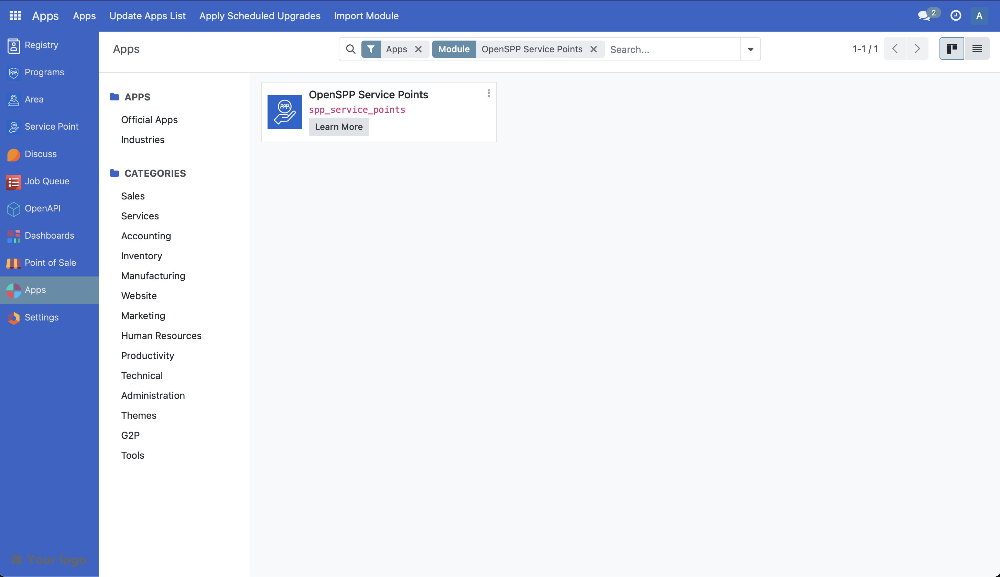
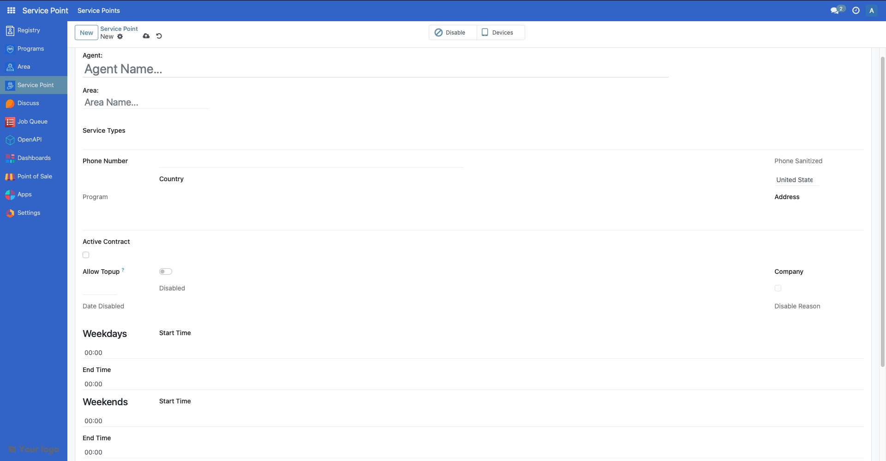

# Customize Service Points

The following article guides the reader in understanding how the service points module works in OpenSPP and how it can be customized by providing a sample scenario and a working example. The `spp_service_points` module provides the foundation for managing service delivery locations in OpenSPP, which can be used in programs and other modules.

## Prerequisites

- Knowledge of Python, Odoo, XML, Xpaths.
- To set up OpenSPP for development, please refer to the [Developer Guide](https://docs.openspp.org/howto/developer_guides/development_setup.html).

## If the Service Points module is not installed

1. Log into OpenSPP with administrative rights.

2. Access the "Apps" menu from the dashboard to manage OpenSPP modules.

3. Choose "Update Apps List" to refresh the module list.

4. Search for "OpenSPP Service Points Management" and initiate installation. This will also install the other modules required.



## Understanding the Service Points Module Structure

The `spp_service_points` module provides the core service point management functionality with the following key components:

### Core Models
- **`spp.service.point`**: The main service point model that manages service delivery locations
- **`spp.service.type`**: Defines different types of services offered at service points
- **`res.partner`**: Extended to include service point relationships for individuals and companies

### Key Features
- Service point management with geographical area linking
- Service type categorization and tagging
- Company and individual associations
- Phone number validation and sanitization
- Service point status management (active/disabled)
- User account creation for service point contacts
- Integration with area management system

### Core Fields
- `name`: Service point agent name
- `area_id`: Associated geographical area
- `service_type_ids`: Types of services offered
- `phone_no`: Contact phone number
- `shop_address`: Physical address
- `is_contract_active`: Contract status
- `is_disabled`: Disabled status
- `res_partner_company_id`: Associated company
- `individual_ids`: Associated individuals

## Customizing the Service Points Module

In this hypothetical scenario, we will add operating hours and additional service point information to help beneficiaries know when and where they can redeem their entitlements. This customization will include weekday and weekend operating hours, service point capacity, and additional contact information.

A working sample module for the described scenario can be accessed at the provided [link](https://github.com/OpenSPP/documentation_code/tree/main/howto/developer_guides/customizations/spp_service_point_custom).

The key steps in module development are as follows:

### 1. Create Module Structure

To customize service points, create a new module following the OpenSPP module structure:

```
spp_service_point_custom/
├── __init__.py
├── __manifest__.py
├── models/
│   ├── __init__.py
│   └── service_point.py
├── views/
│   └── service_point_views.xml
└── data/
    └── service_type_data.xml
```

### 2. Define Module Manifest

Create a manifest file that includes the proper dependencies and data files:

```python
{
    "name": "OpenSPP Service Point Custom Extensions",
    "summary": "Custom extensions for OpenSPP Service Point Management",
    "category": "OpenSPP",
    "version": "17.0.1.0.0",
    "author": "Your Organization",
    "website": "https://your-website.com",
    "license": "LGPL-3",
    "depends": [
        "spp_service_points",
    ],
    "data": [
        "views/service_point_views.xml",
        "data/service_type_data.xml",
    ],
    "application": False,
    "installable": True,
    "auto_install": False,
}
```

### 3. Extend the Service Point Model

Create a Python file named `service_point.py` that extends the `spp.service.point` model and add it to `models/__init__.py`:

```python
from odoo import fields, models, api
from odoo.exceptions import ValidationError

class OpenSPPServicePoint(models.Model):
    _inherit = "spp.service.point"

    # Operating hours fields
    weekday_start = fields.Float(
        string="Weekday Start Time",
        help="Start time for weekdays (Monday-Friday) in 24-hour format"
    )
    
    weekday_end = fields.Float(
        string="Weekday End Time",
        help="End time for weekdays (Monday-Friday) in 24-hour format"
    )
    
    weekend_start = fields.Float(
        string="Weekend Start Time",
        help="Start time for weekends (Saturday-Sunday) in 24-hour format"
    )
    
    weekend_end = fields.Float(
        string="Weekend End Time",
        help="End time for weekends (Saturday-Sunday) in 24-hour format"
    )
    
    # Additional service point information
    capacity = fields.Integer(
        string="Daily Capacity",
        help="Maximum number of beneficiaries that can be served per day"
    )
    
    contact_email = fields.Char(
        string="Contact Email",
        help="Primary contact email for the service point"
    )
    
    emergency_contact = fields.Char(
        string="Emergency Contact",
        help="Emergency contact number for the service point"
    )
    
    # Computed field for operating hours display
    operating_hours_display = fields.Char(
        string="Operating Hours",
        compute="_compute_operating_hours_display",
        store=True,
        help="Formatted display of operating hours"
    )
    
    @api.depends("weekday_start", "weekday_end", 
                "weekend_start", "weekend_end")
    def _compute_operating_hours_display(self):
        for record in self:
            hours_display = []
            
            if record.weekday_start and record.weekday_end:
                weekday_start = f"{int(record.weekday_start):02d}:{int((record.weekday_start % 1) * 60):02d}"
                weekday_end = f"{int(record.weekday_end):02d}:{int((record.weekday_end % 1) * 60):02d}"
                hours_display.append(f"Weekdays: {weekday_start}-{weekday_end}")
            
            if record.weekend_start and record.weekend_end:
                weekend_start = f"{int(record.weekend_start):02d}:{int((record.weekend_start % 1) * 60):02d}"
                weekend_end = f"{int(record.weekend_end):02d}:{int((record.weekend_end % 1) * 60):02d}"
                hours_display.append(f"Weekends: {weekend_start}-{weekend_end}")
            
            record.operating_hours_display = " | ".join(hours_display) if hours_display else "Not specified"
    
    @api.constrains("weekday_start", "weekday_end")
    def _check_weekday_hours(self):
        for record in self:
            if record.weekday_start and record.weekday_end:
                if record.weekday_start >= record.weekday_end:
                    raise ValidationError("Weekday start time must be before end time.")
    
    @api.constrains("weekend_start", "weekend_end")
    def _check_weekend_hours(self):
        for record in self:
            if record.weekend_start and record.weekend_end:
                if record.weekend_start >= record.weekend_end:
                    raise ValidationError("Weekend start time must be before end time.")
    
    @api.constrains("capacity")
    def _check_capacity_positive(self):
        for record in self:
            if record.capacity and record.capacity < 0:
                raise ValidationError("Daily capacity cannot be negative.")
```

### 4. Create View Extensions

Create a new file called `views/service_point_views.xml` in the module and add it to the manifest file:

```xml
<odoo>
    <!-- Extend service point form view -->
    <record id="view_service_points_form_custom" model="ir.ui.view">
        <field name="name">view_service_points_form_custom</field>
        <field name="model">spp.service.point</field>
        <field name="inherit_id" ref="spp_service_points.view_service_points_form" />
        <field name="arch" type="xml">
            <xpath expr="//field[@name='disabled_reason']" position="after">
                <group string="Operating Hours" name="operating_hours">
                                    <group string="Weekdays (Monday-Friday)">
                    <field name="weekday_start" widget="float_time" />
                    <field name="weekday_end" widget="float_time" />
                </group>
                <group string="Weekends (Saturday-Sunday)">
                    <field name="weekend_start" widget="float_time" />
                    <field name="weekend_end" widget="float_time" />
                </group>
            </group>
            <group string="Additional Information" name="additional_info">
                <field name="operating_hours_display" readonly="1" />
                <field name="capacity" />
                <field name="contact_email" />
                <field name="emergency_contact" />
                </group>
            </xpath>
        </field>
    </record>

    <!-- Extend service point tree view -->
    <record id="view_service_points_tree_custom" model="ir.ui.view">
        <field name="name">view_service_points_tree_custom</field>
        <field name="model">spp.service.point</field>
        <field name="inherit_id" ref="spp_service_points.view_service_points_tree" />
        <field name="arch" type="xml">
            <xpath expr="//field[@name='is_disabled']" position="after">
                <field name="operating_hours_display" string="Operating Hours" />
                <field name="capacity" string="Daily Capacity" />
            </xpath>
        </field>
    </record>
</odoo>
```

### 5. Add Custom Service Types

Create `data/service_type_data.xml` to add custom service types:

```xml
<odoo>
    <data noupdate="1">
        <record id="service_type_voucher_redemption" model="spp.service.type">
            <field name="name">Voucher Redemption Center</field>
        </record>

        <record id="service_type_in_kind_distribution" model="spp.service.type">
            <field name="name">In-Kind Goods Distribution</field>
        </record>

        <record id="service_type_information_desk" model="spp.service.type">
            <field name="name">Information Desk</field>
        </record>

        <record id="service_type_cash_payment" model="spp.service.type">
            <field name="name">Cash Payment Center</field>
        </record>

        <record id="service_type_health_services" model="spp.service.type">
            <field name="name">Health Services</field>
        </record>
    </data>
</odoo>
```

### 6. Install and Test

1. Install the module through the Apps menu
2. Update the Service Points module to apply changes
3. Test the new fields in the service point forms and lists

The following screenshot shows the newly added fields in the above developed module.



## Advanced Customization Examples

### Adding Computed Fields with Business Logic

You can add computed fields that calculate values based on service point data:

```python
from odoo import fields, models, api
from datetime import datetime, timedelta

class OpenSPPServicePoint(models.Model):
    _inherit = "spp.service.point"

    is_open_now = fields.Boolean(
        string="Currently Open",
        compute="_compute_is_open_now",
        store=True,
        help="Whether the service point is currently open based on operating hours"
    )
    
    next_opening = fields.Datetime(
        string="Next Opening",
        compute="_compute_next_opening",
        store=True,
        help="Next time the service point will open"
    )

    @api.depends("weekday_start", "weekday_end", 
                "weekend_start", "weekend_end")
    def _compute_is_open_now(self):
        for record in self:
            now = datetime.now()
            current_time = now.hour + now.minute / 60.0
            current_weekday = now.weekday()  # Monday=0, Sunday=6
            
            is_open = False
            
            # Check if it's a weekday (Monday=0 to Friday=4)
            if current_weekday < 5:  # Weekday
                if (record.weekday_start and record.weekday_end and
                    record.weekday_start <= current_time <= record.weekday_end):
                    is_open = True
            else:  # Weekend
                if (record.weekend_start and record.weekend_end and
                    record.weekend_start <= current_time <= record.weekend_end):
                    is_open = True
            
            record.is_open_now = is_open

    def _compute_next_opening(self):
        for record in self:
            now = datetime.now()
            current_time = now.hour + now.minute / 60.0
            current_weekday = now.weekday()
            
            next_opening = None
            
            # Calculate next opening time
            if current_weekday < 5:  # Weekday
                if record.weekday_start:
                    if current_time < record.weekday_start:
                        # Opens later today
                        next_opening = now.replace(
                            hour=int(record.weekday_start),
                            minute=int((record.weekday_start % 1) * 60)
                        )
                    else:
                        # Opens tomorrow
                        tomorrow = now + timedelta(days=1)
                        next_opening = tomorrow.replace(
                            hour=int(record.weekday_start),
                            minute=int((record.weekday_start % 1) * 60)
                        )
            else:  # Weekend
                if record.weekend_start:
                    if current_time < record.weekend_start:
                        # Opens later today
                        next_opening = now.replace(
                            hour=int(record.weekend_start),
                            minute=int((record.weekend_start % 1) * 60)
                        )
                    else:
                        # Opens next weekend
                        days_until_monday = 7 - current_weekday
                        next_monday = now + timedelta(days=days_until_monday)
                        next_opening = next_monday.replace(
                            hour=int(record.weekday_start or 9),
                            minute=int(((record.weekday_start or 9) % 1) * 60)
                        )
            
            record.next_opening = next_opening
```

### Adding Constraints and Validations

```python
from odoo import fields, models, api
from odoo.exceptions import ValidationError
import re

class OpenSPPServicePoint(models.Model):
    _inherit = "spp.service.point"

    @api.constrains("contact_email")
    def _check_contact_email_format(self):
        for record in self:
            if record.contact_email:
                email_pattern = r'^[a-zA-Z0-9._%+-]+@[a-zA-Z0-9.-]+\.[a-zA-Z]{2,}$'
                if not re.match(email_pattern, record.contact_email):
                    raise ValidationError("Please enter a valid email address.")

    @api.constrains("capacity")
    def _check_capacity_reasonable(self):
        for record in self:
            if record.capacity and record.capacity > 10000:
                raise ValidationError("Daily capacity seems unreasonably high. Please verify the value.")
```

### Adding Methods for Service Point Operations

```python
from odoo import fields, models, api
from odoo.exceptions import UserError

class OpenSPPServicePoint(models.Model):
    _inherit = "spp.service.point"

    def action_view_operating_hours(self):
        """Open a wizard to view and edit operating hours"""
        return {
            'type': 'ir.actions.act_window',
            'name': 'Operating Hours',
            'res_model': 'spp.service.point.operating.hours.wizard',
            'view_mode': 'form',
            'target': 'new',
            'context': {
                'default_service_point_id': self.id,
                'default_weekday_start': self.weekday_start,
                'default_weekday_end': self.weekday_end,
                'default_weekend_start': self.weekend_start,
                'default_weekend_end': self.weekend_end,
            }
        }

    def action_send_operating_hours_notification(self):
        """Send operating hours notification to associated individuals"""
        if not self.individual_ids:
            raise UserError("No individuals associated with this service point.")
        
        # Implementation for sending notifications
        # This would typically involve creating a notification record
        # or sending an email to the associated individuals
        
        return {
            'type': 'ir.actions.client',
            'tag': 'display_notification',
            'params': {
                'title': 'Notification Sent',
                'message': f'Operating hours notification sent to {len(self.individual_ids)} individuals.',
                'type': 'success',
            }
        }
```

## Best Practices

1. **Follow OpenSPP Naming Conventions**: Use appropriate prefixes for custom fields and computed indicators
2. **Extend Existing Views**: Always inherit from existing views rather than creating new ones
3. **Add Proper Validation**: Include constraints and validations for data integrity
4. **Test Thoroughly**: Verify that your customizations work with the existing service point functionality
5. **Document Changes**: Update your module's README with usage instructions
6. **Consider Performance**: Use `store=True` for frequently accessed computed fields
7. **Handle Edge Cases**: Consider scenarios like 24-hour operations, holidays, etc.

## Integration with Other Modules

Service points can be integrated with other OpenSPP modules:

- **Area Management**: Link service points to geographical areas for location-based services
- **Programs**: Associate service points with specific social protection programs
- **Entitlements**: Use service points for entitlement redemption and distribution
- **Beneficiary Management**: Connect service points to beneficiary groups and individuals

## References

For more information on extending Odoo models and views, refer to:
- [Odoo 17 Developer Documentation](https://www.odoo.com/documentation/17.0/developer/)
- [OpenSPP Development Guidelines](https://docs.openspp.org/)
- [Service Points Module Source](https://github.com/OpenSPP/openspp-modules/tree/17.0/spp_service_points)
