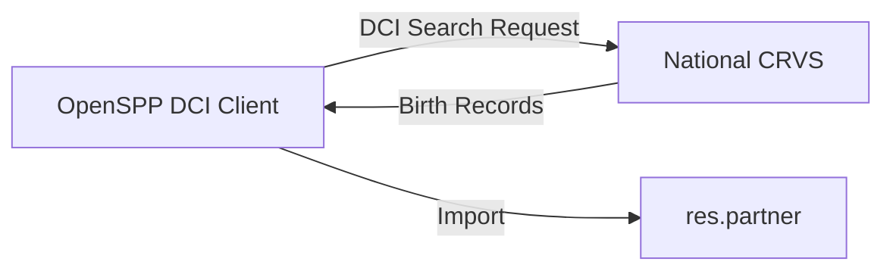

---
openspp:
  doc_status: draft
---

# DCI Integration

This guide is for **developers** integrating OpenSPP with Digital Convergence Initiative (DCI)-compliant social protection systems.

## What is DCI?

The Digital Convergence Initiative (DCI) provides API standards for interoperability between social protection systems, enabling seamless data exchange between registries, program management systems, and payment platforms.

OpenSPP implements DCI standards to enable:

- **Bidirectional Integration** - Act as both server (exposing data) and client (consuming data)
- **Government Interoperability** - Connect with CRVS, IBR, and other national registries
- **Standardized Data Exchange** - Use common schemas and protocols
- **Asynchronous Operations** - Handle high-volume data transfers efficiently

## Documentation Structure

```{toctree}
:maxdepth: 2
:hidden:

overview
server_role
client_role
protocol
```

### Getting Started

1. **{doc}`overview`** - Understand DCI architecture and use cases
2. **{doc}`server_role`** - Expose OpenSPP registry data to external systems
3. **{doc}`client_role`** - Consume data from external DCI-compliant registries
4. **{doc}`protocol`** - Deep dive into message structure, endpoints, and authentication

## OpenSPP DCI Modules

| Module | Purpose | Role |
|--------|---------|------|
| `spp_dci` | Core DCI infrastructure (message envelope, signing, JWKS) | Foundation |
| `spp_dci_server` | Base DCI server with search/subscribe endpoints | Server |
| `spp_dci_server_social` | Social Registry server implementation | Server |
| `spp_dci_client` | Base DCI client with authentication | Client |
| `spp_dci_client_crvs` | CRVS client for birth/death imports | Client |
| `spp_dci_client_ibr` | IBR client for enrollment duplication checks | Client |
| `spp_dci_client_dr` | Disability Registry client | Client |
| `spp_dci_indicators` | DCI data integration with eligibility system | Both |

## Common Integration Scenarios

### As a DCI Server

**Use Case:** National MIS needs to query beneficiary data from OpenSPP Social Registry.


See {doc}`server_role` for implementation details.

### As a DCI Client

**Use Case:** Import birth registrations from national CRVS to create new registrants.



See {doc}`client_role` for implementation details.

## Quick Examples

### Server: Sync Search Endpoint

```python
# spp_dci_server/routers/registry.py
from fastapi import APIRouter, Depends
from ..schemas.search import DCISearchRequest, DCISearchResponse
from ..services.search_service import SearchService

router = APIRouter(prefix="/registry", tags=["Registry"])

@router.post("/sync/search", response_model=DCISearchResponse)
async def sync_search(
    request: DCISearchRequest,
    token: dict = Depends(verify_token),
    env = Depends(get_env)
):
    """Synchronous registry search"""
    service = SearchService(env)
    response = await service.execute_search(request)
    return response
```

### Client: Search by Identifier

```python
# Using the DCI client
from odoo.addons.spp_dci_client.services.dci_client import DCIClient

# Configure data source
data_source = env['spp.dci.data.source'].browse(1)
client = DCIClient(data_source)

# Search by national ID
response = await client.search_by_identifier(
    identifier_type="urn:gov:national-id",
    identifier_value="12345678"
)

# Results in DCI Person format
persons = response.message.search_response[0].data['reg_records']
```

## Prerequisites

Before implementing DCI integration:

- Understanding of Odoo model patterns and FastAPI
- Familiarity with OAuth 2.0 and API authentication
- Knowledge of async operations with `queue_job`
- Understanding of OpenSPP registry structure (`res.partner`, `spp.registry.id`)

## References

- [DCI API Standards](https://github.com/spdci/api-standards) - Official DCI specifications
- [G2P Connect](https://g2pconnect.cdpi.dev) - Protocol documentation
- [ADR-015](https://github.com/OpenSPP/openspp-modules-v2/blob/main/docs/architecture/decisions/ADR-015-dci-api-integration.md) - OpenSPP DCI architecture decision

## See Also

- {doc}`/developer_guide/fastapi/index` - FastAPI integration in OpenSPP
- {doc}`/developer_guide/oauth/index` - OAuth2 authentication
- {doc}`/developer_guide/queue_job/index` - Background job processing
