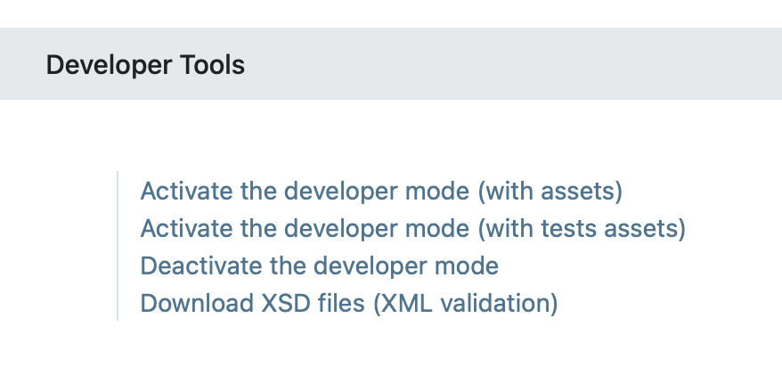
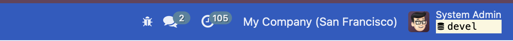

(developer-mode)=

# Developer mode (debug mode)

The developer mode (or debug mode) unlocks access to extra and advanced tools in OpenSPP. There are several ways to activate the developer mode: through the Settings or the URL.

## Activate through the settings

To activate the debug mode, open the OpenSPP database settings, go to **Settings → General Settings → Developer Tools** and click **Activate the developer mode**. Make sure that you have installed at least one app to see the **Developer Tools** section in the **Settings** module.



```{note}
*Activate the developer mode (with assets)* is used by developers; *Activate the developer mode (with tests assets)* is used by developers and testers.
```

Once activated, the _Deactivate the developer mode_ option becomes available.

## Activate through the URL

You can activate the debug mode by adding an extra query string to the database's URL. To activate, add `?debug=1` or `?debug=true` after `/web` in the URL. To deactivate, change the value to `?debug=0` instead.


```{tip}
Additional modes are available for developers: `?debug=assets` enables the [assets mode](#frontendframeworkassets_debug_mode), and `?debug=tests` enables the [tests mode](#frontendframeworktests_debug_mode).
```

## Locate the developer mode tools

The user can access the developer mode tools by clicking on the _Open Developer Tools_ button or the bug icon located in the OpenSPP header, after activating developer mode.



This menu has extra tools that are useful to understand or edit technical data, such as the views or actions of a page. On a page that has filters, actions, and view options, the developer mode tools contain some useful menu items such as:

- _Edit Action_
- _Manage Filters_
- Edit the current view (for example, Kanban, List, Graph, etc.)
- See the _Fields View Get_

```{note}
This page is adapted from the Odoo documentation on {ref}`odoo:developer-mode`.
```
