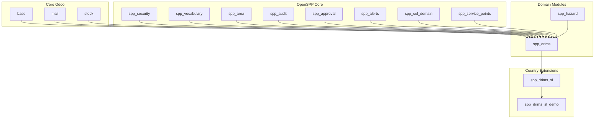
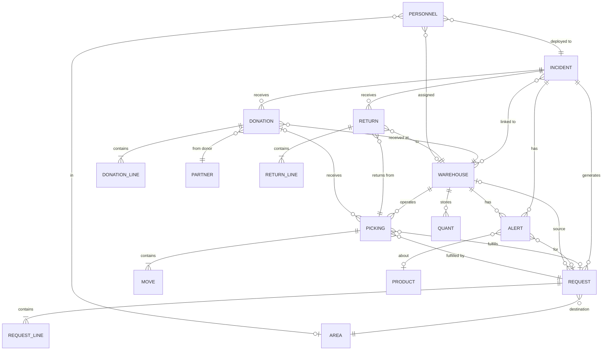
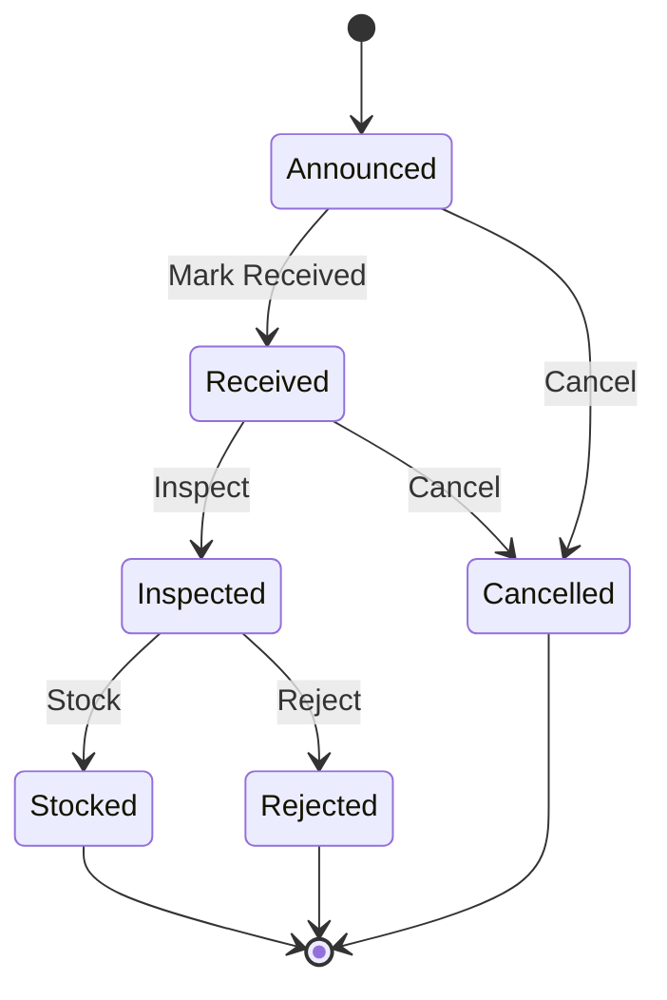
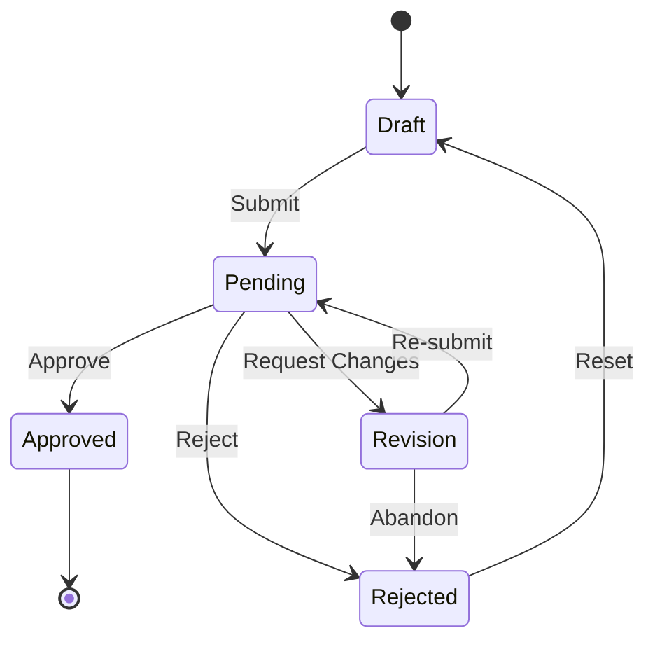
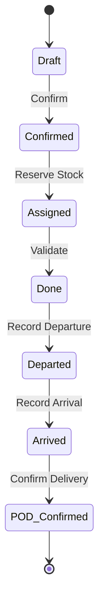
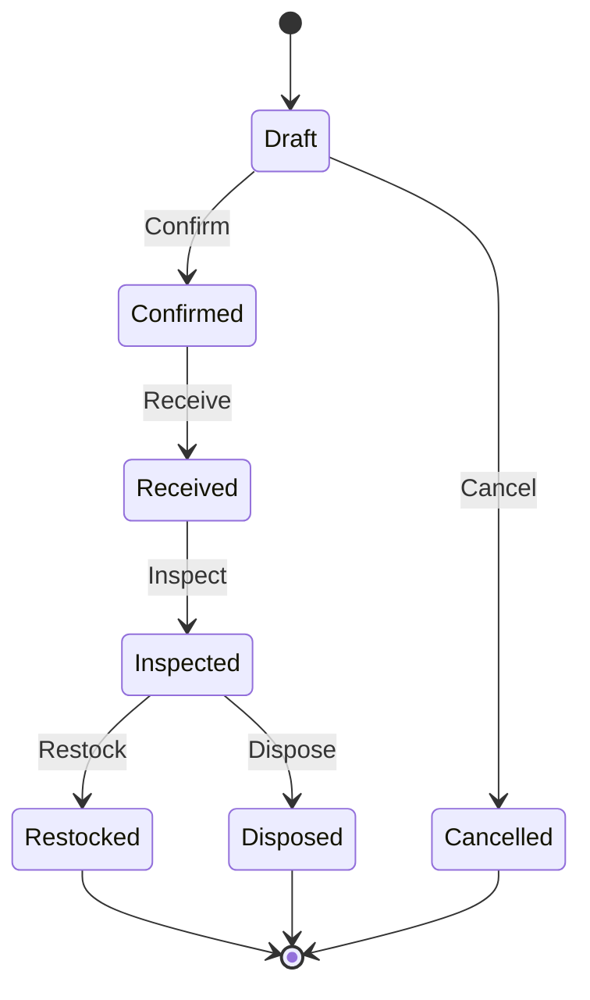
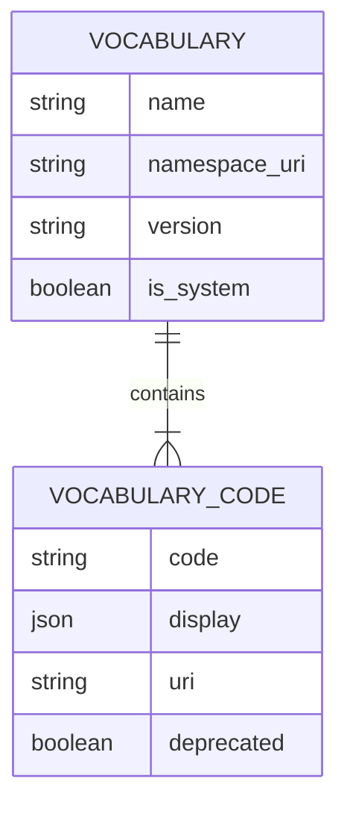
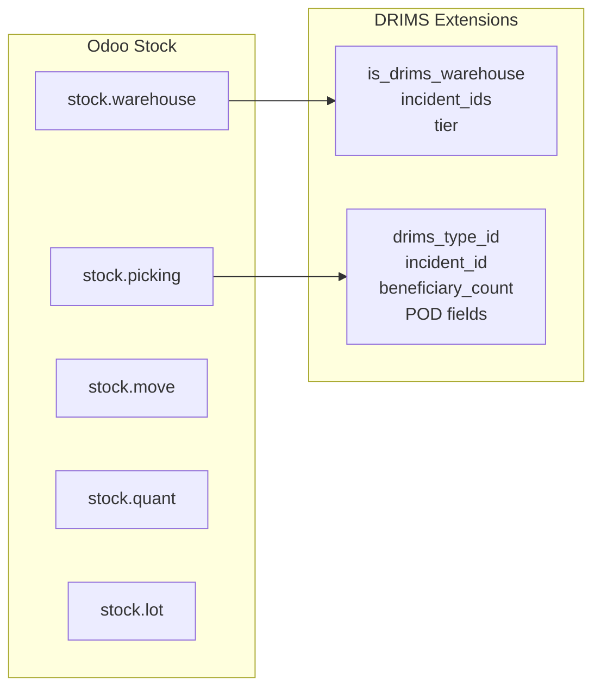

---
openspp:
  doc_status: draft
---

# DRIMS Architecture

This guide is for **developers** extending or maintaining the DRIMS (Disaster Relief Inventory Management System) module. It covers the internal data model, entity relationships, state machines, and performance considerations.

## Prerequisites

- Understanding of Odoo model inheritance
- Familiarity with OpenSPP core modules (`spp_security`, `spp_vocabulary`, `spp_area`)
- Knowledge of Odoo's stock/inventory system
- Read the [OpenSPP module architecture principles](https://github.com/openspp/openspp-modules-v2/blob/main/docs/principles/module-architecture.md)

## Module Dependencies

DRIMS integrates with multiple OpenSPP and Odoo core modules:



### Key Dependencies

| Module | Purpose in DRIMS |
|--------|------------------|
| `base` | Base models (res.partner, res.users) |
| `mail` | Chatter, activity tracking, notifications |
| `stock` | Warehouse, pickings, quants, lots |
| `spp_security` | Security groups and category |
| `spp_vocabulary` | Controlled vocabularies (donor types, priorities, etc.) |
| `spp_area` | Geographic hierarchy (provinces, districts) |
| `spp_hazard` | Disaster incident management |
| `spp_service_points` | Distribution points |
| `spp_approval` | Approval workflow mixin |
| `spp_audit` | Audit trail logging |
| `spp_alerts` | Base alert model |
| `spp_cel_domain` | CEL expression variables |
| `queue_job` | Background job processing |

## Entity Relationships

DRIMS manages disaster relief operations through interconnected entities:



## Core Models

### spp.drims.donation

Represents incoming relief supplies from donors.

| Field | Type | Description |
|-------|------|-------------|
| `reference` | Char | Auto-generated (DON-XXXX) |
| `incident_id` | Many2one | Linked incident |
| `donor_id` | Many2one | Donor partner |
| `donor_name` | Char | Donor name (if not in system) |
| `source_type_id` | Many2one | Donor type vocabulary |
| `warehouse_id` | Many2one | Receiving warehouse |
| `state` | Selection | announced/received/inspected/stocked |
| `date_announced` | Date | Pledge date |
| `date_received` | Date | Arrival date |
| `line_ids` | One2many | Donation items |
| `total_value` | Float | Computed total |
| `picking_ids` | One2many | Stock receipts |

**Key Methods:**
- `action_mark_received()` - Mark donation as physically received
- `action_inspect()` - Complete quality inspection
- `action_stock()` - Create and validate stock picking

### spp.drims.donation.line

Individual items within a donation.

| Field | Type | Description |
|-------|------|-------------|
| `donation_id` | Many2one | Parent donation |
| `product_id` | Many2one | Product |
| `quantity_pledged` | Float | Promised quantity |
| `quantity_received` | Float | Actual received |
| `uom_id` | Many2one | Unit of measure |
| `unit_value` | Float | Per-unit value |
| `condition_id` | Many2one | Item condition |

### spp.drims.request

Relief supply requests from field locations.

| Field | Type | Description |
|-------|------|-------------|
| `reference` | Char | Auto-generated (REQ-XXXX) |
| `incident_id` | Many2one | Linked incident |
| `destination_area_id` | Many2one | Delivery area |
| `cluster_id` | Many2one | OCHA humanitarian cluster |
| `priority_id` | Many2one | Priority level |
| `is_life_threatening` | Boolean | Emergency flag |
| `date_requested` | Date | Request date |
| `date_needed` | Date | Required by date |
| `approval_state` | Selection | draft/pending/approved/rejected |
| `state_id` | Many2one | Fulfillment state |
| `source_warehouse_id` | Many2one | Fulfilling warehouse |
| `requester_id` | Many2one | Requesting user |
| `affected_population` | Integer | People to serve |
| `line_ids` | One2many | Requested items |
| `picking_ids` | One2many | Dispatch pickings |

**Inherits From:**
- `mail.thread` - Chatter integration
- `mail.activity.mixin` - Activity scheduling
- `spp.approval.mixin` - Approval workflow

**Key Methods:**
- `action_submit()` - Submit for approval
- `action_approve()` - Approve request
- `action_reject()` - Reject request
- `action_request_revision()` - Request changes
- `action_allocate()` - Assign source warehouse
- `action_create_dispatch()` - Generate stock picking

### spp.drims.request.line

Individual items within a request.

| Field | Type | Description |
|-------|------|-------------|
| `request_id` | Many2one | Parent request |
| `product_id` | Many2one | Product |
| `quantity_requested` | Float | Requested qty |
| `quantity_delivered` | Float | Delivered qty |
| `uom_id` | Many2one | Unit of measure |

### spp.drims.return

Items returned from distribution points.

| Field | Type | Description |
|-------|------|-------------|
| `reference` | Char | Auto-generated (RET-XXXX) |
| `incident_id` | Many2one | Linked incident |
| `source_picking_id` | Many2one | Original dispatch |
| `warehouse_id` | Many2one | Receiving warehouse |
| `reason_id` | Many2one | Return reason |
| `state` | Selection | draft/confirmed/received/inspected/restocked |
| `line_ids` | One2many | Returned items |

**Key Methods:**
- `action_confirm()` - Authorize return
- `action_receive()` - Mark as physically received
- `action_inspect()` - Assess item condition
- `action_restock()` - Add good items back to inventory
- `action_dispose()` - Remove damaged items

### spp.drims.alert

Automated monitoring alerts.

| Field | Type | Description |
|-------|------|-------------|
| `reference` | Char | Auto-generated (ALT-XXXX) |
| `alert_type_id` | Many2one | Alert type vocabulary |
| `priority` | Selection | low/medium/high/critical |
| `title` | Char | Alert summary |
| `description` | Text | Details |
| `state` | Selection | active/acknowledged/resolved |
| `incident_id` | Many2one | Related incident |
| `warehouse_id` | Many2one | Related warehouse |
| `product_id` | Many2one | Related product |
| `request_id` | Many2one | Related request |
| `current_value` | Float | Measured value |
| `threshold_value` | Float | Trigger threshold |
| `days_until` | Integer | Days until/since event |

**Inherits From:**
- `spp.alert` - Base alert functionality

**Alert Types:**
- Low stock warnings
- Expiring items
- Overdue requests
- Stock imbalances
- Delivery delays

### spp.drims.personnel

Deployed staff tracking.

| Field | Type | Description |
|-------|------|-------------|
| `name` | Char | Person name |
| `incident_id` | Many2one | Deployment incident |
| `organization_id` | Many2one | Employing organization |
| `role_id` | Many2one | Personnel role |
| `cluster_id` | Many2one | OCHA cluster |
| `deployment_area_id` | Many2one | Location |
| `warehouse_id` | Many2one | Assigned warehouse |
| `phone` | Char | Contact phone |
| `email` | Char | Contact email |
| `deployment_date` | Date | Start date |
| `status` | Selection | deployed/standby/on_leave/returned |
| `days_deployed` | Integer | Computed days |

## Extended Models

DRIMS extends standard Odoo and OpenSPP models with disaster-specific fields.

### spp.hazard.incident (Extended)

DRIMS adds KPIs and relationship fields:

| Field | Type | Description |
|-------|------|-------------|
| `coordination_mode_id` | Many2one | Multi-agency mode |
| `drims_donation_count` | Integer | KPI: Donation count |
| `drims_donation_value` | Float | KPI: Total donation value |
| `drims_request_count` | Integer | KPI: Request count |
| `drims_request_pending` | Integer | KPI: Pending requests |
| `drims_stock_value` | Float | KPI: Stock value |
| `drims_distributed_value` | Float | KPI: Distributed value |
| `drims_beneficiaries_served` | Integer | KPI: People served |
| `drims_alert_count` | Integer | KPI: Active alerts |
| `drims_donation_ids` | One2many | Related donations |
| `drims_request_ids` | One2many | Related requests |
| `drims_alert_ids` | One2many | Related alerts |
| `drims_return_ids` | One2many | Related returns |

**Extension Pattern:**

```python
class HazardIncident(models.Model):
    _inherit = "spp.hazard.incident"

    drims_donation_count = fields.Integer(
        compute="_compute_drims_kpis",
        store=True,
    )

    @api.depends("drims_donation_ids")
    def _compute_drims_kpis(self):
        for rec in self:
            rec.drims_donation_count = len(rec.drims_donation_ids)
```

### stock.warehouse (Extended)

| Field | Type | Description |
|-------|------|-------------|
| `is_drims_warehouse` | Boolean | Enable for DRIMS |
| `tier` | Selection | central/regional/mobile |
| `incident_ids` | Many2many | Linked incidents |
| `area_id` | Many2one | Geographic location |
| `drims_stock_health` | Selection | good/warning/critical |
| `drims_active_alert_count` | Integer | Alert count |

**Use Case:** Only warehouses with `is_drims_warehouse=True` appear in DRIMS operations.

### stock.picking (Extended)

| Field | Type | Description |
|-------|------|-------------|
| `drims_type_id` | Many2one | Transaction type |
| `drims_type` | Char | Related code |
| `incident_id` | Many2one | Linked incident |
| `drims_request_id` | Many2one | Source request |
| `beneficiary_area_id` | Many2one | Delivery area |
| `beneficiary_count` | Integer | People served |
| `date_departed` | Datetime | Shipment departure |
| `date_arrived` | Datetime | Shipment arrival |
| `pod_received_by` | Char | Receiver name |
| `pod_receiver_title` | Char | Receiver title |
| `pod_signature` | Binary | Signature image |
| `pod_confirmed` | Boolean | POD complete |

**Transaction Types:**
- `donation_receipt` - Receiving donations
- `request_dispatch` - Fulfilling requests
- `warehouse_transfer` - Inter-warehouse movements
- `return_receipt` - Receiving returns

### res.users (Extended)

| Field | Type | Description |
|-------|------|-------------|
| `drims_area_ids` | Many2many | Assigned areas |
| `drims_warehouse_ids` | Many2many | Assigned warehouses |

**Security Impact:** Used in record rules to scope user access to their assigned areas/warehouses.

### res.partner (Extended)

| Field | Type | Description |
|-------|------|-------------|
| `is_drims_organization` | Boolean | Is DRIMS partner |
| `drims_organization_role_id` | Many2one | Organization role |

**Organization Roles:** UN Agency, NGO, Government, Private Sector, etc.

## Workflow State Machines

### Donation Workflow



| State | Description | Actions Available |
|-------|-------------|-------------------|
| `announced` | Donation pledged but not yet arrived | Mark Received, Cancel |
| `received` | Physical goods arrived at warehouse | Inspect, Cancel |
| `inspected` | Quality inspection completed | Stock, Reject |
| `stocked` | Items added to warehouse inventory | (Terminal) |
| `cancelled` | Donation cancelled before stocking | (Terminal) |
| `rejected` | Items rejected during inspection | (Terminal) |

### Request Approval Workflow



**Approval States** (from `spp.approval.mixin`):

| State | Description | Actions Available |
|-------|-------------|-------------------|
| `draft` | Being prepared by requester | Submit |
| `pending` | Awaiting approval decision | Approve, Reject, Request Revision |
| `approved` | Approved for fulfillment | Allocate, Create Dispatch |
| `rejected` | Denied with reason | Reset to Draft |
| `revision` | Returned for changes | Edit and Re-submit |

**Fulfillment States** (tracked separately):

| State | Description |
|-------|-------------|
| `pending` | Awaiting allocation/dispatch |
| `allocated` | Source warehouse assigned |
| `dispatched` | Items shipped from warehouse |
| `in_transit` | En route to destination |
| `delivered` | Proof of delivery confirmed |
| `partial` | Partially delivered |

### Dispatch Workflow



**DRIMS Extensions to Standard Stock Picking:**
- Adds `date_departed` and `date_arrived` tracking
- Proof of Delivery (POD) fields and confirmation
- Links to request and incident
- Beneficiary counting

### Return Workflow



| State | Description |
|-------|-------------|
| `draft` | Return being prepared |
| `confirmed` | Return authorized |
| `received` | Items arrived at warehouse |
| `inspected` | Condition assessed |
| `restocked` | Good items returned to inventory |
| `disposed` | Damaged items disposed |
| `cancelled` | Return cancelled |

## Vocabularies

DRIMS uses controlled vocabularies from `spp_vocabulary` for standardized coding:

### Vocabulary Namespaces

| Namespace URI | Purpose | Used In |
|---------------|---------|---------|
| `urn:openspp:vocab:drims:priority-levels` | Request priority | Request.priority_id |
| `urn:openspp:vocab:drims:donor-types` | Donor classification | Donation.source_type_id |
| `urn:openspp:vocab:drims:item-conditions` | Item quality | DonationLine.condition_id |
| `urn:openspp:vocab:drims:transport-modes` | Shipping methods | Picking.transport_mode_id |
| `urn:openspp:vocab:drims:request-states` | Request fulfillment states | Request.state_id |
| `urn:openspp:vocab:drims:donation-states` | Donation processing states | - |
| `urn:openspp:vocab:drims:drims-types` | Transaction types | Picking.drims_type_id |
| `urn:openspp:vocab:drims:alert-types` | Alert classifications | Alert.alert_type_id |
| `urn:openspp:vocab:drims:coordination-modes` | Multi-agency modes | Incident.coordination_mode_id |
| `urn:ocha:iasc:clusters` | OCHA humanitarian clusters | Request.cluster_id |
| `urn:openspp:vocab:drims:personnel-roles` | Staff roles | Personnel.role_id |

### Vocabulary Structure

Each vocabulary follows the standard pattern:



### Extending Vocabularies

Add new codes via XML data:

```xml
<record id="my_vocab_code" model="spp.vocabulary.code">
    <field name="code">my_code</field>
    <field name="display">{"en_US": "My Code"}</field>
    <field name="vocabulary_id" ref="spp_drims.vocab_drims_priority"/>
</record>
```

## Performance Considerations

### Indexing Strategy

Key indexed fields for query performance:

| Model | Indexed Fields | Purpose |
|-------|----------------|---------|
| `spp.drims.donation` | `incident_id`, `warehouse_id`, `state` | Filter by incident/warehouse |
| `spp.drims.request` | `incident_id`, `destination_area_id`, `cluster_id`, `approval_state` | Dashboard queries |
| `spp.drims.alert` | `incident_id`, `warehouse_id`, `product_id`, `state` | Active alert searches |
| `spp.drims.personnel` | `incident_id`, `status` | Deployment tracking |
| `stock.picking` | `incident_id`, `drims_type` | Transaction reporting |

### KPI Caching

Expensive KPIs use a hybrid approach with `spp.data.value`:

**Cached Values:**

| Variable | TTL | Description |
|----------|-----|-------------|
| `drims_donation_value` | 1 hour | Sum of donation values |
| `drims_stock_value` | 30 min | Aggregate warehouse stock value |
| `drims_distributed_value` | 30 min | Aggregate distributed value |
| `drims_return_value` | 1 hour | Sum of return values |

**Caching Pattern:**

```python
# Try cache first
cached_values = DataValue.read_values(
    "drims_stock_value",
    self.ids,
    period_key="current",
)

# Fallback to direct computation on cache miss
if rec.id in cached_values:
    rec.drims_stock_value = cached_values[rec.id]
else:
    rec.drims_stock_value = self._compute_stock_value_direct()
```

**Refresh Strategy:**

Cron job `DRIMS: Refresh KPI Cache` runs every 15 minutes:

```python
def _cron_refresh_drims_kpis(self):
    """Background refresh of expensive KPIs."""
    incidents = self.search([('state', '!=', 'closed')])
    incidents._refresh_incident_kpi_cache()
```

### Batch Processing

Use `queue_job` for long-running operations:

- Area imports from Excel
- Bulk stock operations
- Mass request creation
- KPI recalculation

**Example:**

```python
@job
def process_bulk_donations(self):
    """Process donations in background."""
    for donation in self:
        donation.action_stock()
```

### Avoiding N+1 Queries

Use `read_group()` for aggregations:

```python
# Bad - N+1 queries
for incident in incidents:
    count = len(incident.drims_donation_ids)

# Good - Single query
result = self.env['spp.drims.donation'].read_group(
    domain=[('incident_id', 'in', incidents.ids)],
    fields=['incident_id'],
    groupby=['incident_id'],
)
```

### Database Constraints

Key constraints for data integrity:

```python
_sql_constraints = [
    (
        'reference_unique',
        'UNIQUE(reference)',
        'Donation reference must be unique',
    ),
]
```

## Sequence Definitions

Auto-generated reference numbers:

| Model | Sequence Prefix | Example |
|-------|-----------------|---------|
| Donation | DON- | DON-00001 |
| Request | REQ- | REQ-00001 |
| Return | RET- | RET-00001 |
| Alert | ALT- | ALT-00001 |

**Sequence Configuration:**

```xml
<record id="seq_drims_donation" model="ir.sequence">
    <field name="name">DRIMS Donation</field>
    <field name="code">spp.drims.donation</field>
    <field name="prefix">DON-</field>
    <field name="padding">5</field>
</record>
```

## Integration Points

### Stock Integration

DRIMS extends stock operations:



### Approval Integration

Requests use `spp.approval.mixin`:

```python
class DrimsRequest(models.Model):
    _inherit = ["mail.thread", "mail.activity.mixin", "spp.approval.mixin"]

    approval_state = fields.Selection(...)  # From mixin
```

### CEL Integration

DRIMS registers CEL variables for dynamic domains:

| Variable | Type | Source |
|----------|------|--------|
| `request.total_value` | Float | Request total value |
| `request.priority` | String | Priority code |
| `request.is_life_threatening` | Boolean | Emergency flag |

Used in approval rules and conditional logic.

### Audit Integration

DRIMS configures audit rules in `data/audit_rules.xml`:

| Model | Tracked Fields |
|-------|----------------|
| `spp.drims.donation` | state, incident, warehouse, value |
| `spp.drims.request` | state, approval_state, priority, date_needed |
| `spp.drims.alert` | state, priority |
| `stock.picking` | state, drims_type, beneficiary_count |

View audit logs in **DRIMS > Activity Feed**.

## Extension Patterns

### Adding Custom Fields

Extend DRIMS models using inheritance:

```python
class DrimsRequestExtension(models.Model):
    _inherit = "spp.drims.request"

    custom_field = fields.Char(string="Custom")

    @api.depends('line_ids')
    def _compute_custom_kpi(self):
        for rec in self:
            rec.custom_kpi = sum(line.quantity for line in rec.line_ids)
```

### Custom Alert Types

1. Add vocabulary code:

```xml
<record id="alert_type_custom" model="spp.vocabulary.code">
    <field name="code">custom_alert</field>
    <field name="display">{"en_US": "Custom Alert"}</field>
    <field name="vocabulary_id" ref="spp_drims.vocab_alert_types"/>
</record>
```

2. Implement check method:

```python
def _check_custom_alerts(self):
    """Check for custom alert conditions."""
    for incident in self:
        if incident.custom_condition:
            self.env['spp.drims.alert'].create({
                'alert_type_id': ref('alert_type_custom'),
                'incident_id': incident.id,
                'title': 'Custom Alert Triggered',
            })
```

3. Add to cron:

```xml
<record id="cron_custom_alerts" model="ir.cron">
    <field name="name">DRIMS: Check Custom Alerts</field>
    <field name="model_id" ref="model_spp_hazard_incident"/>
    <field name="state">code</field>
    <field name="code">model._check_custom_alerts()</field>
    <field name="interval_number">1</field>
    <field name="interval_type">hours</field>
</record>
```

### Custom Approval Rules

Use CEL expressions in `spp_approval` to define workflows:

```python
# Example: Auto-approve small requests
approval_rule = {
    'name': 'Auto-approve under $1000',
    'model': 'spp.drims.request',
    'condition': 'request.total_value < 1000',
    'action': 'auto_approve',
}
```

## Related Documentation

- [WORKFLOWS.md](https://github.com/openspp/openspp-modules-v2/blob/main/spp_drims/docs/WORKFLOWS.md) - Detailed workflow documentation
- [INTEGRATION.md](https://github.com/openspp/openspp-modules-v2/blob/main/spp_drims/docs/INTEGRATION.md) - Integration details
- [SECURITY.md](https://github.com/openspp/openspp-modules-v2/blob/main/spp_drims/docs/SECURITY.md) - Access control and security
- [DASHBOARDS.md](https://github.com/openspp/openspp-modules-v2/blob/main/spp_drims/docs/DASHBOARDS.md) - KPI implementation details
- [Module Architecture Principles](https://github.com/openspp/openspp-modules-v2/blob/main/docs/principles/module-architecture.md) - General patterns
