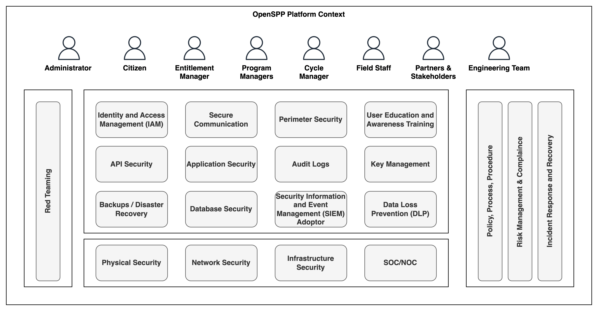

---
openspp:
  doc_status: unverified
---

# Security Architecture

The OpenSPP platform can operate in a cloud environment as well as an on-prem environment while ensuring security and management across several key security domains, as listed below,

1. Identity and Access Management (IAM): This involves managing user identities and controlling access to resources within the platform to prevent unauthorized access.

2. API Security: This domain focuses on securing APIs to ensure that interaction between different software applications remains secure.

3. Backups/Disaster Recovery: This area is dedicated to securing data by creating backups and planning for quick recovery in case of a disaster.

4. Physical Security: Measures are in place to protect the platform’s physical assets, including hardware and facilities.

5. Secure Communication: The platform enforces secure communication protocols to protect data in transit.

6. Application Security: This pertains to measures and protocols that are designed to protect the platform's applications from threats and vulnerabilities.

7. Database Security: Ensures the protection of databases against compromises of their integrity, confidentiality, and availability.

8. Network Security: Involves protecting the integrity and usability of network and data, both on-site and off-site.

9. Perimeter Security: A defense mechanism for the outermost boundaries of the platform to detect and prevent attacks.

10. Audit Logs: Keeping detailed logs to track user activities that can be reviewed during security audits.

11. Security Information and Event Management (SIEM) Adaptor: This adoptor feeds data into the SIEM.

12. Infrastructure Security: Measures to protect the platform’s infrastructure, including systems, networks, and data centers.

13. SOC/NOC: Continuous observation of the platform's systems and networks to quickly identify and address potential security issues.

14. User Education and Awareness Training: Equipping users with the knowledge and skills to protect the platform and its data.

15. Key Management: Handling cryptographic keys within a cryptosystem, including their generation, exchange, storage, use, destruction, and replacement.

16. Data Loss Prevention (DLP): Strategies to prevent sensitive data from being accessed, used, or disclosed by unauthorized users.

17. Policy/Process Procedure: Establishing and maintaining policies and procedures that govern the operation and use of the platform.

18. Risk Management & Compliance: Identifying, assessing, and controlling threats to the platform's operations.

19. Incident Response and Recovery: A dedicated framework for addressing security breaches effectively, ensuring swift action and restoration of normal operations following an incident.

20. Red Teaming: This critical security practice involves challenging the platform’s defenses by simulating sophisticated cyber-attacks, ensuring vulnerabilities are identified and mitigated proactively.

Each domain is interconnected and plays a crucial role in maintaining the integrity and resilience of the OpenSPP platform. At the foundational layer, these security domains are influenced by the specific country's context. The implementation of security measures varies, with some being fully realized and others partially, all driven by the unique requirements of each country.

The above can be taken as a framework for the implementer to understand the holistic picture but OpenSPP zeroes in on the product-centric aspects, catering to the immediate needs and applications of its users.
