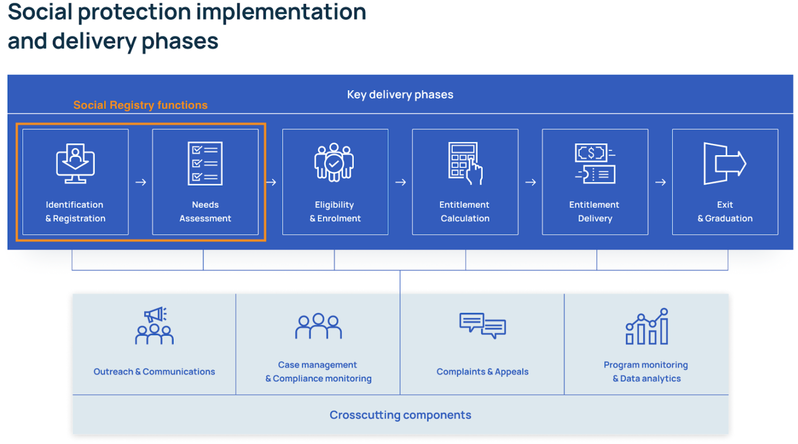

# Social Registry

## What is a Social Registry?

A social registry is a database or system that contains information about individuals or households within a specific population. Its purpose is to provide a centralized and up-to-date source of data that can be used for {term}`targeting`, planning, and implementing {term}`social protection` programs. Social registries are designed to enhance fairness and equity in the targeting of social protection programs by introducing systematic and transparent approaches to identify those in need. Social registries are most often used in household-based poverty-targeted social protection programs.

Social registries generally support the initial identification and registration, and needs assessment phases of social protection implementation and delivery, as illustrated below.

One of the first examples of a social registry was developed in the late 1990s for the Bolsa Familia social protection program in Brazil. The Cadastro Único collects and stores information about Brazil’s low-income and vulnerable populations. It is now used as a key tool by the Government, not only for identifying and selecting households for the Bolsa Familia, but also to identify and provide assistance to the most vulnerable Brazilians via 27 other social programs.

Social registries are now used in 50 countries across the world. Examples include Pakistan’s National Social Economic Registry (NSER), Indonesia’s Data Terpadu Kesejahteran Sosial (DTKS) and Colombia’s Sistema de Identificación de Potenciales Beneficiarios de Programas Sociales (Sisbén).

While earlier designs of social registries were static or ‘fixed’ due to the data being collected at a particular period in time through mass registrations, social registries are now increasingly designed to be **dynamic**, in recognition of the fluctuating nature of poverty and vulnerability. Social registries which use a dynamic approach to registration, through on-demand registration, periodic active outreach, registration at local government offices, integration with civil registries, national identification systems, and other registries are better able to adjust their social protection programs accordingly and meet the needs of vulnerable populations. Brazil’s Cadastro Único is considered an example of a dynamic registry, while Pakistan’s NSER is currently a static registry.

## Operational Functionality of Social Registries

The operational functions of social registries differ among the countries using them, depending on what is required of the system, and the existing broader systems of information management. In general, social registries have the following operational functions:

1. **Data Collection.** The most important part of a social registry is the standardized {term}`registration` questionnaire used to gather information on a given population’s demographic, socio-economic and {term}`household` information. {term}`identification` documents or certificates may also be checked and scanned at this stage. At this stage, individuals or households are referred to as registrants.

2. **Data Validation and verification.** Applicant data can be validated through checking official documents such as identification cards, cross-verification with records contained in other administrative systems, or through local community validation processes.

3. **Information Intermediation**: Bridging the gap between citizen-provided data and the requirements of social programs, integrating with systems like National IDs, {term}`CRVS` and disability registries.

4. **Inclusion and exclusion criteria.** Clear criteria, formats and indicators are defined to facilitate transparent and standardized {term}`eligibility` assessment for social programs. Specific criteria can be used to identify and target vulnerable groups, such as pregnant women, children, or individuals with disabilities. Households can be ranked based on assessment of their needs and conditions, such as with a proxy means test to the data contained in the registry.

5. **{term}`Decentralized` eligibility determination.** Lists of potentially eligible households or ranked lists of all households can be shared with individual program implementers or decentralized counterparts, and adapted to local contexts and needs.

6. **Ongoing registration and information updates.** Social registries are increasingly designed to be dynamic and allow for on-demand registration, periodic active outreach, registration at local government offices and integration with civil registries, national identification systems, and other registries.

7. **Reporting and analysis.** Social registries may have self-contained functions to generate reports and analyze registry data. Or they may be integrated with external data analysis tools and dashboards to inform policy decisions, program planning, and resource allocation.

8. **Architectural components.** Comprise of data intake and exchange, {term}`data protection and protection`, management interfaces, interoperability focus, and necessary ICT infrastructure.

**Privacy and confidentiality.** Social registries hold large amounts of sensitive {term}`personal data`. The privacy and confidentiality of individuals' data must be protected in accordance with a country’s legal and ethical standards. Social registries must also provide accessible feedback mechanisms (usually this is via the corresponding social protection program), or through integration with {term}`Grievance redress mechanisms` (GRM) so that registrants can appeal against eligibility decisions or report inaccuracies or errors.

## Integration and interoperability of social registries

Social registries can be used to identify beneficiaries for single or multiple social protection programs. They may also be designed to be interoperable and integrated with other critical systems as part of a broader {term}`information system`. Social registry data can be exchanged and coordinated with various government databases such as integrated beneficiary registries, farmer registries, disability registries, health records, education systems, and employment databases. This contributes to more precise targeting, reduces redundancy in data collection, and ensures a unified and efficient delivery of social protection and other public services. However, in certain situations, self-contained social registries may be preferred due to legal and ethical considerations where integration may raise concerns about {term}`information security` and {term}`data privacy`.

## Social Registry in the OpenSPP platform

The open-source Social Registry software developed by OpenSPP offers comprehensive identification, registration, and needs assessment functions with the following key features:

1. **Registration.** Our Social Registry supports initial en masse registration and surveys. Our data collection system is built on CommCare and can handle a wide range of data types. It can be customized to suit linguistic or cultural requirements, improving the cultural appropriateness, accessibility, and the quality of data collected.
2. **Data management and standardization.** It is equipped to efficiently manage diverse information, transforming it into standardized formats for integration into various social programs.
3. **Dynamic registration and updates.** Our Social Registry can support continuing data updates through continuous on-demand registration or periodic reassessments.
4. **Interoperability with other databases.** The OpenSPP platform is particularly strong in its interoperability capabilities. Our development focus is on integration with Civil Registration and Vital Statistics (CRVS) systems and National Identity systems to pull data, providing a foundational layer for efficient data management and verification in a Social Registry.
5. **Privacy and security.** The OpenSPP team rigorously upholds data privacy and security standards. Our products are designed to ensure that personal or sensitive data and transactions are protected.

For more information about OpenSPP’s Social Registry contact us through our [website](https://openspp.org/contact-us/).

## References

- [Barca V and Hebbar M (2020) On-Demand and Up-to-Date? Dynamic Inclusion and Data Updating for Social Assistance. GIZ](https://socialprotection.org/sites/default/files/publications_files/GIZ_DataUpdatingForSocialAssistance_3.pdf)
- [Chirchir R and Barca V (2020). Building an integrated and digital social protection information system. GIZ](https://socialprotection.org/sites/default/files/publications_files/GIZ_DFID_IIMS%20in%20social%20protection_long_02-2020.pdf)
- [Chirchir R and Farooq S (2016) Single Registries and Social Registries: clarifying the terminological confusion. Development Pathways](https://www.developmentpathways.co.uk/wp-content/uploads/2016/11/Single-and-Social-Registries-1.pdf)
- [Kidd S, Athias D and Mohamud I (2021) Social registries: a short history of abject failure. Development Pathways and Act Church of Sweden](https://www.developmentpathways.co.uk/wp-content/uploads/2021/06/Social-registries-a-short-history-of-abject-failure-June.pdf)
- [Digital Convergence Initiative (2023) Social protection management information system interacting with social registry. Social Protection Interoperability Series: Interoperability in Action #6.](https://spdci.org/resources/interoperability-in-action-6-social-registry-workshop-recording/)
- [Leite, P, Karippacheril, T and Lindert, K (2017). Social Registries for social assistance and Beyond: A Guidance Note & Assessment Tool. World Bank](https://www.researchgate.net/publication/340858942_Social_Registries_for_Social_Assistance_and_Beyond_A_Guidance_Note_and_Assessment_Tool)
- [World Bank Group. (2020). "The World Bank Sourcebook on the Foundations of Social Protection delivery systems."](https://openknowledge.worldbank.org/entities/publication/c44dc506-72dd-5428-a088-6fb7aea53095)
