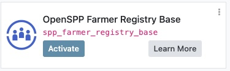

# OpenSPP Module Installation

OpenSPP is a modular platform built on top of Odoo. Its functionality is extended through a collection of modules, each providing specific features. This guide will walk you through the process of installing OpenSPP modules, covering two primary configurations: a general-purpose Social Protection Management Information System (SP-MIS) and a specialized Farmer Registry.

## Prerequisites

Before you begin, ensure you have the following:

- A running Odoo 17 instance.
- The OpenSPP modules source code, typically from the [OpenSPP repository](https://github.com/OpenSPP/openspp-modules/tree/17.0/).
- Your Odoo instance configured to recognize the `openspp-modules` directory as an addons path.
- To set up OpenSPP for development, please refer to the {doc}`Development Setup Guide <../developer_guide/setup>`.

For a detailed guide on setting up a development environment, please refer to the Developer Setup Guide.

## General Installation Process

Installing an Odoo module, including those for OpenSPP, follows a standard procedure:

1.  **Place Modules in Addons Path**: Ensure the `openspp-modules` directory is included in your Odoo configuration's `addons_path`.
2.  **Update Apps List**:
    -   Log in to your Odoo instance with administrator privileges.
    -   Activate the developer mode.
    -   Navigate to the **Apps** menu.
    -   Click on **Update Apps List** and confirm the update.
3.  **Install the Module**:
    -   In the **Apps** menu, clear the default "Apps" filter from the search bar.
    -   Search for the desired module by its technical name or title.
    -   Click the **Activate** button on the module's card to begin the installation.

---

## Installation Setups

OpenSPP can be configured in different ways depending on your project's needs. Below are the installation guides for two primary setups.

> [!IMPORTANT]
> The **SP-MIS** (`spp_base`) and **Farmer Registry** (`spp_farmer_registry_base`) modules are mutually exclusive. You can only have one of them installed in a single Odoo database. Attempting to install both will result in an error.

### 1. SP-MIS Installation (spp_base)

This is the standard setup for a Social Protection Management Information System, providing core functionalities for managing registrants, programs, and entitlements. The main module for this configuration is **OpenSPP Base** (`spp_base`).

**Steps:**

1.  Follow the General Installation Process to update your Apps list.
2.  In the Apps menu, search for `spp_base` or "OpenSPP Base".

3.  Click the **Activate** button to install the module. This will also install all its dependencies, providing a complete SP-MIS foundation.

Once installed, you will see the "Registry" application in your Odoo dashboard, which is the main entry point for the OpenSPP system.

### 2. Farmer Registry Installation (spp_farmer_registry_base)

This setup is tailored for managing farmer registries, including farm data, land records, and agricultural activities. The main module for this configuration is **OpenSPP Farmer Registry Base** (`spp_farmer_registry_base`).

**Steps:**

1.  Follow the General Installation Process to update your Apps list.
2.  In the Apps menu, search for `spp_farmer_registry_base` or "OpenSPP Farmer Registry Base".

3.  Click the **Activate** button to install the module and its dependencies.

---

## Installing Additional Modules

After setting up your base system (either SP-MIS or Farmer Registry), you can enhance its functionality by installing additional OpenSPP modules. The process is the same as the general installation.

### Example: Installing Change Request Module

The **OpenSPP Change Request** (`spp_change_request`) module provides a structured framework for submitting, reviewing, and applying modifications to registrant data.

**Steps:**

1.  Navigate to the **Apps** menu.
2.  Search for `spp_change_request` or "OpenSPP Change Request".

3.  Click the **Activate** button.

### Example: Installing Cash Entitlement Module

The **OpenSPP Entitlement: Cash** (`spp_entitlement_cash`) module adds functionality to manage cash-based entitlements for registrants.

**Steps:**

1.  Navigate to the **Apps** menu.
2.  Search for `spp_entitlement_cash` or "OpenSPP Entitlement: Cash".

3.  Click the **Activate** button.

<!-- Screenshot placeholder: Apps list showing the spp_entitlement_cash module -->

By following these steps, you can customize your OpenSPP instance with the specific modules required for your social protection program.