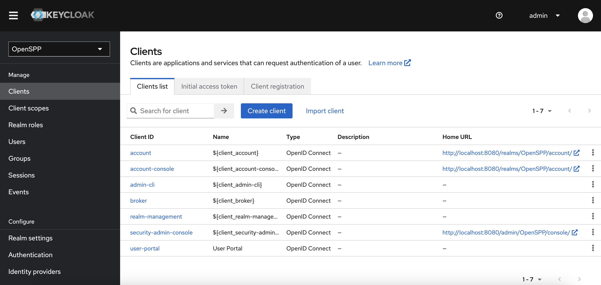
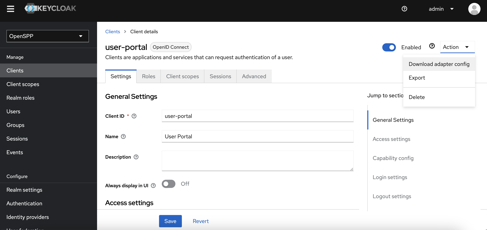
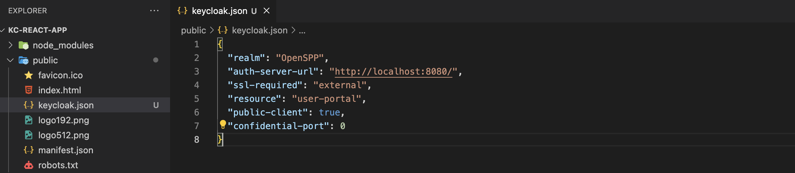
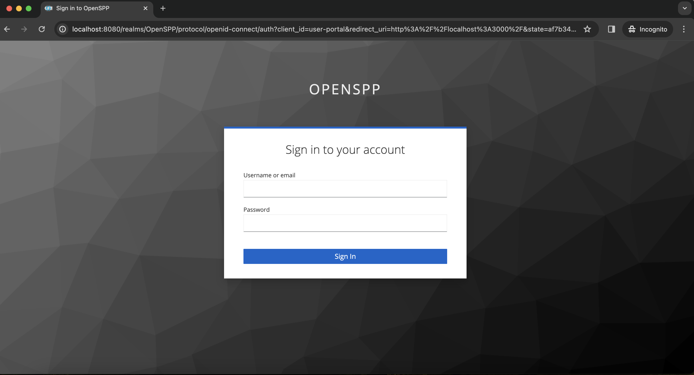

# Beneficiary portal authentication

In this article, the steps will be given on how to add a single sign-on to a beneficiary portal which improves user experience. This guide helps us to create a front-end application where a beneficiary registered in OpenSPP and can log in using Keycloak.

## Prerequisites

- There is an existing [Keycloak Server](https://docs.openspp.org/howto/developer_guides/oidc.html).
- A realm, client, users, groups, and client scope are available in Keycloak.
- Node.js (version 14 or higher) and npm (version 7 or higher) are available on your local machine.
- You are familiar with Javascript and React (version 17 or higher).
- Beneficiaries are in OpenSPP and Keycloak.

## Objective

After completing this guide, developer can create a front-end app using React and can log in to the front-end application using Keycloak.

## Terminology

`Adapters` are libraries that make it possible to use Keycloak in securing services and applications.

## Step-by-step

A working sample application can be accessed at the provided [link](https://github.com/OpenSPP/documentation_code/tree/main/howto/developer_guides/integrations/kc-react-application).

1. Create a new React application.

```bash
npx create-react-app kc-react-app
cd kc-react-app
```

2. Install the Keycloak adapter for React. Using `npm` as the package manager, we install the `keycloak-js`, the adapter for client-side applications.

```bash
npm install keycloak-js
```

3. Download client adapter settings from your Keycloak server. The JSON data contains the client settings we need to add to our application’s Keycloak configuration.

- Log in to your Keycloak server. Select the `realm` and click the `Client` in the side menu.
  
- Click the `client` you are using with your front-end application. You will be redirected to the `client` page.
- Click the `Actions` button on the upper right. Click the `Download adapter config`. A dialog will appear with the adapter configuration settings. Click the `Download` button. A file is downloaded to your Downloads folder.
  
- Copy the downloaded file to your `public` folder.
  

4. Integrate Keycloak with the front-end application.

- Create a new file, `keycloak.js` in your `src` folder with the following code. Substitute the values from the downloaded configuration settings. The `url` is the value of the `auth-server-url` key. The `clientId` is the resource.

```js
import Keycloak from "keycloak-js";

const keycloak = new Keycloak({
  url: "http://localhost:8080/", //auth-server-url
  realm: "OpenSPP", //realm
  clientId: "user-portal", // resource
  redirectUri: "http://localhost:3000", // local development redirect uri
});

export default keycloak;
```

- Go to your `index.js` file and initialize Keycloak.

```js
import React from "react";
import ReactDOM from "react-dom/client";
import "./index.css";
import App from "./App";
import reportWebVitals from "./reportWebVitals";
import keycloak from "./keycloak";
const root = ReactDOM.createRoot(document.getElementById("root"));

keycloak
  .init({
    onLoad: "check-sso",
  })
  .then((auth) => {
    if (auth) {
      console.log(auth);
      console.log("User is logged in");
    } else {
      console.log("User is not logged in");
    }
    root.render(
      <React.StrictMode>
        <App />
      </React.StrictMode>
    );
  })
  .catch((error) => {
    console.error("Keycloak failed:", error);
  });

reportWebVitals();
```

5. Update your components to use Keycloak.

- Update your `src/App.js` file and add the following code. If the user is successfully authenticated, a logout button is displayed otherwise the login button is visible. Clicking the login button redirects the user to the Keycloak login page.

```js
import "./App.css";
import keycloak from "./keycloak";
function App() {
  const login = () => {
    keycloak.login();
  };
  const logout = () => {
    keycloak.logout();
  };
  return (
    <div className="App">
      {keycloak.authenticated ? (
        <button onClick={logout}>Logout </button>
      ) : (
        <button onClick={login}>Login </button>
      )}
    </div>
  );
}

export default App;
```

6. Run your application

- Run the following in your command line or terminal.

```bash
npm start
```

- You will be redirected to the browser. Click the `login` button, and the Keycloak login page will appear.


