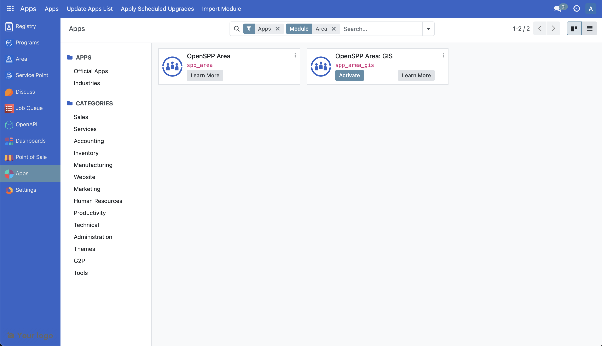
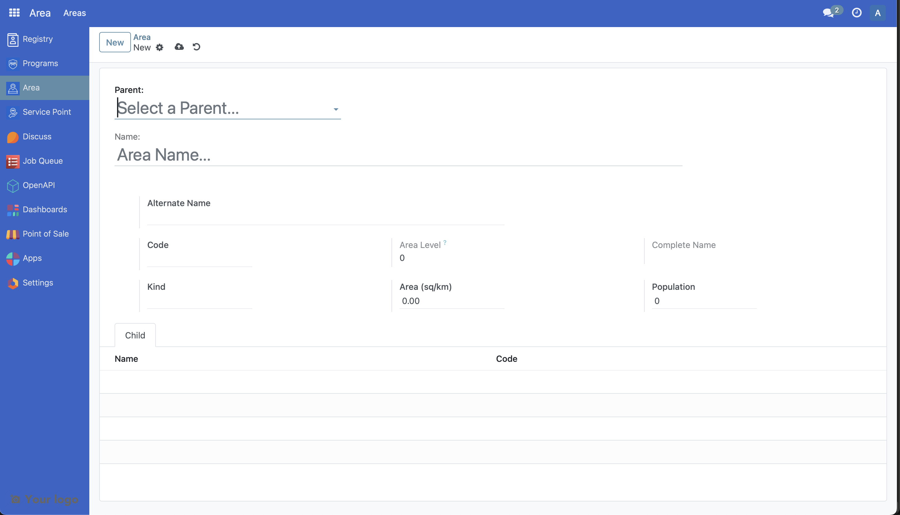

# Customize Areas

The following article guides the reader in understanding how the area module will work in OpenSPP and how it can be customized by providing a sample scenario and a working example. The area module is used to set up the administration areas in OpenSPP, which can be used in programs and other modules.

## Prerequisites

- Knowledge of Python, Odoo, XML, Xpaths.
- To set up OpenSPP for development, please refer to the [Developer Guide](https://docs.openspp.org/howto/developer_guides/development_setup.html).

## If the Area module is not installed

- Log into OpenSPP with administrative rights.
- Access the “Apps” menu from the dashboard to manage OpenSPP modules.
- Choose “Update Apps List” to refresh the module list.
- Search for “Area” and initiate installation. This will also install the other modules required.



## Utilizing the Area Module

For more detailed guidance on utilizing the Area module in OpenSPP, please refer to the information available at the provided link which will be publish soon.

## Customize Area

In a hypothetical scenario, customizing the areas module to include the population of the created areas serves as a practical example. This could involve recording the population of an area such as province or district, providing valuable insights for reporting and dashboard analysis.

A working sample module for the described scenario can be accessed at the provided [link](https://github.com/OpenSPP/documentation_code/tree/main/howto/developer_guides/customizations/spp_custom_area).

The key steps in module development are as follows:

1. To customize areas, a new module can be developed.
2. To initiate the development of a custom module for area customization, begin by creating a manifest file. This file should include fields like name, category, and version. Additionally, it's crucial to define the dependencies of the new module as outlined below.

```python
 "depends": [
       "spp_area",
   ],
")
```

3. To add the new field in the new module, develop a Python file named `area.py` that extends `spp.area` and incorporate this file into `models/init.py`. The definition of the population fields should be implemented as demonstrated below.

```python
class SPPArea(models.Model):
   _inherit = "spp.area"

   population = fields.Integer()

```

The code mentioned above will introduce a new field to the spp_area table for storing the province name of an area. To understand further, refer to the following documentation [Link 1](https://www.odoo.com/documentation/15.0/developer/tutorials/getting_started/04_basicmodel.html), [Link 2](https://www.odoo.com/documentation/15.0/developer/tutorials/getting_started/14_other_module.html), [Link 3](https://www.odoo.com/documentation/15.0/developer/tutorials/getting_started/13_inheritance.html)

4. To integrate new fields into the UI, the following steps should be followed.

   - Create a new file called `views/custom_area_view.xml` in the module
   - Add the below code to the manifest file.

   ```python
   "data": [
       "views/custom_area_view.xml",
   ],

   ```

   - The following code can be added to the custom_area_view.xml file to show the province name in the UI.

     ```xml
     <record id="spp_area_view_form_inherit" model="ir.ui.view">
       <field name="name">spp.area.view.form.inherit</field>
       <field name="model">spp.area</field>
       <field name="inherit_id" ref="spp_area.view_spparea_form" />
       <field name="arch" type="xml">
           <xpath expr="//field[@name='kind']" position="after">
               <field name="population" />
           </xpath>
       </field>
     </record>
     ```

   Further references [Link 1](https://www.odoo.com/documentation/17.0/developer/tutorials/getting_started/07_basicviews.html), [Link 2](https://www.odoo.com/documentation/15.0/developer/reference/backend/views.html)

5. Install the module to include the new changes, then apply these updates through the backend App by selecting 'Update' in the Area module.

The following screenshot shows the added field population in the newly developed module.


