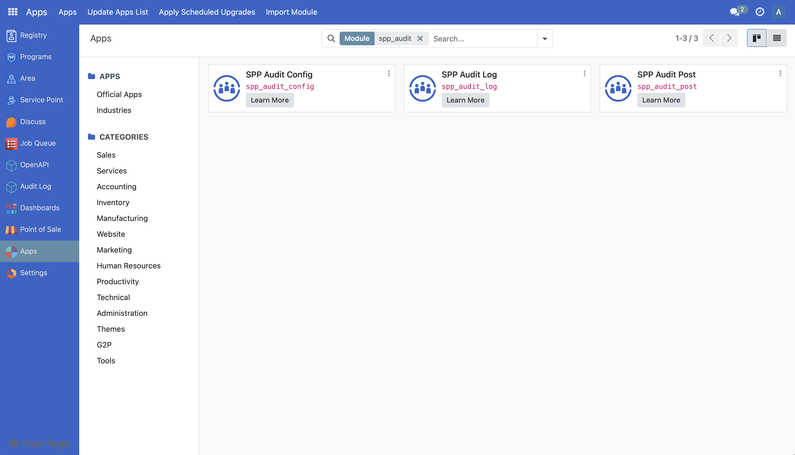

# Customize Audit Logs

The following article guides the reader in understanding how the existing audit module can be customized by providing a sample scenario and a working example.

## Prerequisites

- Knowledge of Python, Odoo, XML, Xpaths.
- To set up OpenSPP for development, please refer to the [Developer Guide](https://docs.openspp.org/howto/developer_guides/development_setup.html).

## If the Audit module is not installed

- Log into OpenSPP with administrative rights.
- Access the “Apps” menu from the dashboard to manage OpenSPP modules.
- Choose “Update Apps List” to refresh the module list.
- Search and initiate installation of the following modules, this process will also install all of their associated modules:

  - SPP Audit Config
  - SPP Audit Log
  - SPP Audit Post

  

## Utilising the Audit Log Module

1. Navigate to the “Rule” page inside the “Audit Log” main menu. You will see that the audit rules are already in place. They are created when installing or upgrading the module “SPP Audit Config”.

2. If you want to add a new rule, you can click the Create button to add new rules.

3. To test the Audit Rule, go to Individual or Group Registry.

4. Create or Update a record from the Registry.

5. You will see that an audit log will show in the bottom part of the page indicating the fields that were changed and their corresponding old and new values.

   

6. Further, all audit logs can be viewed by accessing the Audit Log main menu, followed by the Audit -> Log menu item. This page displays audit logs from every model indicated in the audit rules.

   

7. Audit logs for specific records can be accessed by selecting a record from the Individual or Group Registry, clicking "Action," and then choosing "View Logs."

   

Note that when you add an audit rule to a model, it effectively patches a specialized function into the model's key events - create, write, and unlink. This function operates as a gatekeeper, first verifying if an audit rule is set for the specific model, then determining which events to log and fields to display in the audit log.

## Customise Audit Log Module

In this hypothetical scenario, we are customizing the audit module to include the active field of a rule serves as a practical example.

A working sample module for the described scenario can be accessed at the provided [link](https://github.com/OpenSPP/documentation_code/tree/main/howto/developer_guides/customizations/spp_audit_log_custom).

The key steps in module development are as follows:

1. To customize audit module, a new module can be developed.

2. To initiate the development of a custom module for audit module customization, begin by creating a manifest file. This file should include fields like name, category, and version. Additionally, it's crucial to define the dependencies of the new module as outlined below.

```python
"depends": [
    "spp_audit_log",
],
```

3. To add the new field in the new module, develop a Python file named `spp_audit_rule.py` that extends `spp.audit.rule` and incorporate this file into `models/init.py`. The definition of the active field should be implemented as demonstrated below.

```python
from odoo import api, fields, models

class CustomAuditRule(models.Model):
   _inherit = "spp.audit.rule"

   active = fields.Boolean(default=True)
```

The code mentioned above will introduce a new field to the `spp_audit_rule` table for storing the state of a rule. To understand further, refer to the following documentation [Link 1](https://www.odoo.com/documentation/15.0/developer/tutorials/getting_started/04_basicmodel.html), [Link 2](https://www.odoo.com/documentation/15.0/developer/tutorials/getting_started/14_other_module.html), [Link 3](https://www.odoo.com/documentation/15.0/developer/tutorials/getting_started/13_inheritance.html)

4. To integrate new fields into the UI, the following steps should be followed. Create a new file called `views/spp_audit_rule_views.xml` in the module. Add the below code to the manifest file.

```python
"data": [
    "views/spp_audit_rule_views.xml",
],
```

5. The following code can be added to the `spp_audit_rule_views.xml` file to show the active checkbox in the UI.

```xml
 <record id="view_custom_audit_log_form" model="ir.ui.view">
   <field name="name">view_custom_audit_log_form</field>
   <field name="model">spp.audit.rule</field>
   <field name="inherit_id" ref="spp_audit_log.spp_audit_rule_form" />
   <field name="arch" type="xml">
     <xpath expr="//field[@name='name']" position="before">
       <field name="active" />
     </xpath>
   </field>
 </record>
```

6. Install the module to include the new changes.

The following screenshot shows the added field population in the newly developed module.


