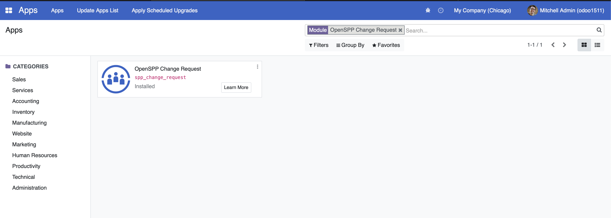
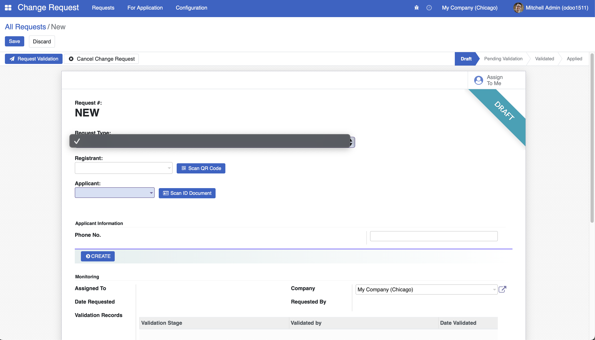
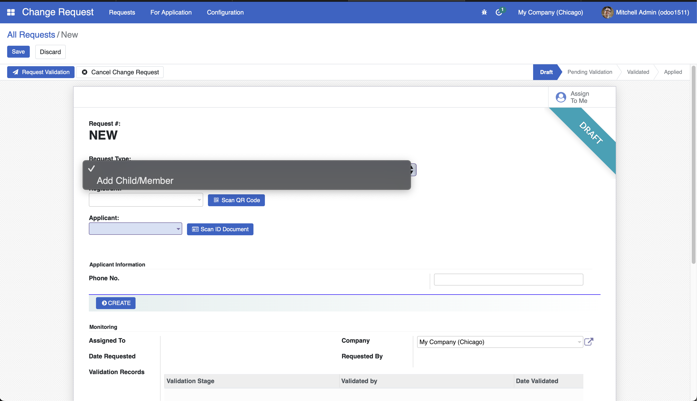
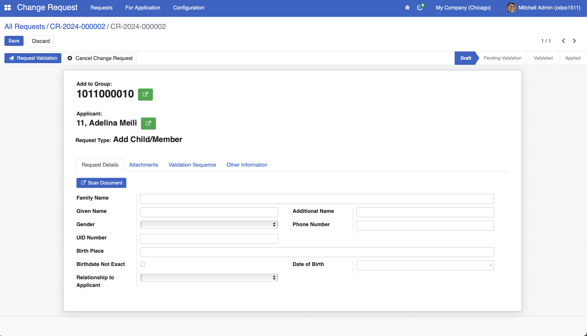

# Customize Change Request

The following article guides the reader in understanding how the change request module will work in OpenSPP and how it can be customized by providing a sample scenario and a working example.

## Prerequisites

- Knowledge of Python, Odoo, XML, Xpaths.
- To set up OpenSPP for development, please refer to the [Developer Guide](https://docs.openspp.org/howto/developer_guides/development_setup.html)

## If the Change Request module is not installed

- Log into OpenSPP with administrative rights.
- Access the “Apps” menu from the dashboard to manage OpenSPP modules.
- Choose “Update Apps List” to refresh the module list.
- Search for “OpenSPP Change Request” and initiate installation.

  

## Utilizing the Area Module

For more detailed guidance on utilizing the Change Request module in OpenSPP, please refer to the information available at the provided link which will be publish soon.

## Customise Change Request

1. If a new Change Request is required to be added, Select “Change Request” menu.
2. Click on the Create button to add a new Change Request, ensuring all required fields are completed.
3. At this point, the Request Type dropdown field does not have any values yet since there is still no new module for the request type.



4. To customize change requests, a new module can be developed.
5. To initiate the development of a custom module for change request customization, begin by creating a manifest file. This file should include fields like name, category, and version. Additionally, it's crucial to define the dependencies of the new module as outlined below.

```python
 "depends": [
       "spp_change_request",
   ],
")
```

6. To add a value to the Request Type dropdown field, create a new model with the file name `models/change_request_add_children.py` for the request type and inherit the mixins `spp.change.request.source.mixin` and `spp.change.request.validation.sequence.mixin`.

```python
class ChangeRequestAddChildren(models.Model):
   _name = "spp.change.request.add.children"
   _inherit = [
       "spp.change.request.source.mixin",
       "spp.change.request.validation.sequence.mixin",


   ]
   _description = "Add Child/Member Change Request Type"
   _order = "id desc"
```

7. This is an example of request type to add a child in a family
8. In the same model, the following code can be added to add fields and functions to the newly created model that corresponds to the requirements of that particular request type.

```python
  full_name = fields.Char(compute="_compute_full_name", readonly=True)
   family_name = fields.Char()
   given_name = fields.Char()
   addl_name = fields.Char("Additional Name")


   @api.depends("given_name", "addl_name", "family_name")
   def _compute_full_name(self):
       for rec in self:
           full_name = (
               f"{rec.family_name or ''}, {rec.given_name or ''}"
               f" {rec.addl_name or ''}"
           )
           rec.full_name = full_name.title()

```

9. In the same file, Inherit model `spp.change.request` then extend the function `_selection_request_type_ref_id` to add the newly created request type model to the Request Type dropdown field.

```python
class ChangeRequestTypeCustomAddChildren(models.Model):
   _inherit = "spp.change.request"


   @api.model
   def _selection_request_type_ref_id(self):
       selection = super()._selection_request_type_ref_id()
       new_request_type = ("spp.change.request.add.children", "Add Child/Member")
       if new_request_type not in selection:
           selection.append(new_request_type)
       return selection

```

10. Make sure that the python file where the newly created model and the inherited model is already added in the `models/__init__.py`. To understand more about these. Refer to the following links [1](https://www.odoo.com/documentation/15.0/developer/tutorials/getting_started/13_inheritance.html), [2](https://www.odoo.com/documentation/15.0/developer/tutorials/getting_started/04_basicmodel.html)

11. In the view, create a file `views/change_request_add_children_view.xml` and add the following views.

- Tree View - shows the list of change request records
- Form View - form view of a particular change request type record where information will be added
- Validation Form View - form view where the validator can see and validate the change request
- Pending Validation Tree View - shows the list of change request that is in pending validation state

Refer to the `change_request_add_children_view.xml` to understand how the views are created

- the record id “view_change_request_add_children_tree” is the Tree View
- the record id “view_change_request_add_children_form” is the Form View
- the record id “view_change_request_add_children_validation_form” is the Validation Form View
- the record id “action_change_request_add_children_pending” is the Pending Validation Tree View

12. Add the below code to the manifest file.

```python
   "data": [
       "views/change_request_add_children_view.xml",
   ],
```

13. Navigate to the “Apps” Menu from the dashboard to manage OpenSPP modules. Choose “Update Apps List” to refresh the module list. Search for the newly created module and initiate installation.

14. Navigate again to the Change Request page and a new value to the Request Type dropdown field is now added.



15. After filling-up the fields, click the Create button to create the change request record.



A working sample module for the described above can be accessed at the provided [link](https://github.com/OpenSPP/documentation_code/tree/main/howto/developer_guides/customizations/spp_change_request_add_children).
