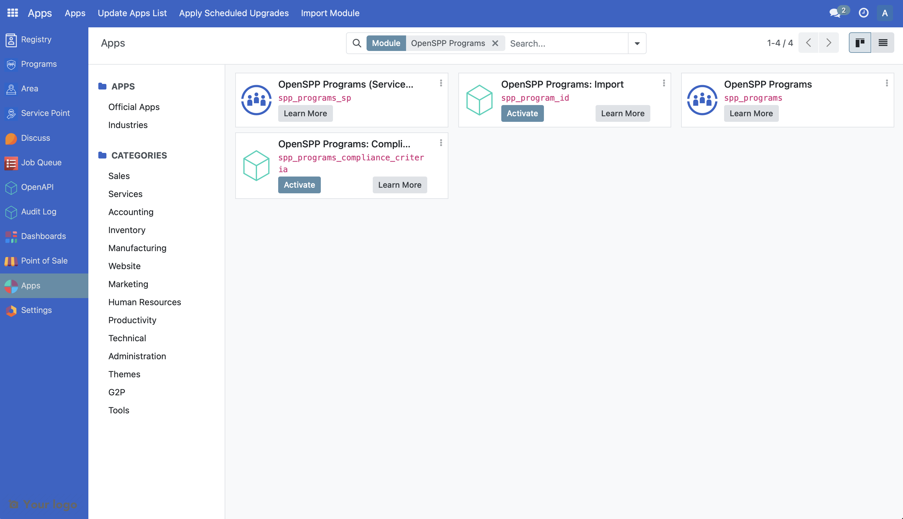
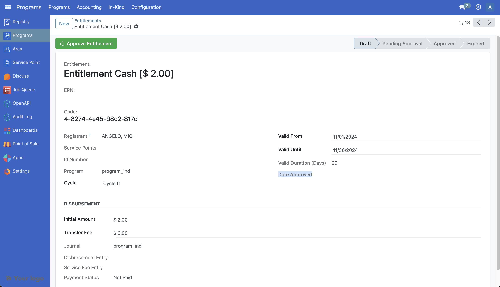

# Customize Entitlement

The following article guides the reader in understanding how the entitlement can be customized by providing a sample scenario and a working example.

## Prerequisites

- Knowledge of Python, Odoo, XML, Xpaths.
- To set up OpenSPP for development, please refer to the [Developer Guide](https://docs.openspp.org/howto/developer_guides/development_setup.html).

## If the Programs module is not installed

- Log into OpenSPP with administrative rights.
- Access the “Apps” menu from the dashboard to manage OpenSPP modules.
- Choose “Update Apps List” to refresh the module list.
- Search for “Programs” and initiate installation. This will also install the other modules required.



## Utilising the Entitlement

For more detailed guidance on utilizing the Entitlement module in OpenSPP, please refer to the information available at the provided link which will be published soon.

## Customize Entitlement

The duration of the validity of the entitlement is not shown currently in OpenSPP. Let’s look at a step by step guide on how the duration can be shown within an entitlement.

A working sample module for the described scenario can be accessed at the provided [link](https://github.com/OpenSPP/documentation_code/tree/main/howto/developer_guides/customizations/spp_entitlement_custom).

The key steps in module development are as follows:

1. To customize entitlement, a new module can be developed.
2. To initiate the development of a custom module for entitlement customization, begin by creating a manifest file. This file should include fields like name, category, and version. Additionally, it's crucial to define the dependencies of the new module as outlined below.

```python
 "depends": [
       "spp_programs",
   ],
```

3. To add the new field in the new module, develop a Python file named `entitlement.py` that extends `g2p.entitlement` and incorporate this file into `models/init.py`. The definition of the fields should be implemented as demonstrated below.

```python
from odoo import api, fields, models

class G2PEntitlementCustom(models.Model):
   _inherit = "g2p.entitlement"

   day_duration = fields.Integer("Valid Duration (Days)", compute="_compute_day_duration")

   @api.depends("valid_from", "valid_until")
   def _compute_day_duration(self):
       for rec in self:
           valid_from = rec.valid_from or fields.Date.today()
           delta = rec.valid_until - valid_from
           rec.day_duration = delta.days
```

The code mentioned above will introduce a new field to the `g2p_entitlement` table for storing the duration of an entitlement. To understand further, refer to the following documentation [Link 1](https://www.odoo.com/documentation/15.0/developer/tutorials/getting_started/04_basicmodel.html), [Link 2](https://www.odoo.com/documentation/15.0/developer/tutorials/getting_started/14_other_module.html), [Link 3](https://www.odoo.com/documentation/15.0/developer/tutorials/getting_started/13_inheritance.html)

4. To integrate new fields into the UI, the following steps should be followed. Create a new file called `views/entitlement_view.xml` in the module. Add the below code to the manifest file.

```python
"data": [
    "views/entitlement_view.xml",
],
```

5. The following code can be added to the `entitlement_view.xml` file to show the duration in the UI.

```xml
 <record id="view_custom_entitlement_form" model="ir.ui.view">
   <field name="name">view_custom_entitlement_form</field>
   <field name="model">g2p.entitlement</field>
   <field name="inherit_id" ref="g2p_programs.view_entitlement_form" />
   <field name="priority">1000</field>
   <field name="arch" type="xml">
     <xpath expr="//field[@name='valid_until']" position="after">
       <field name="day_duration" />
     </xpath>
   </field>
 </record>
```

6. Install the module to include the new changes. The following screenshot shows the added field duration in the newly developed module.


