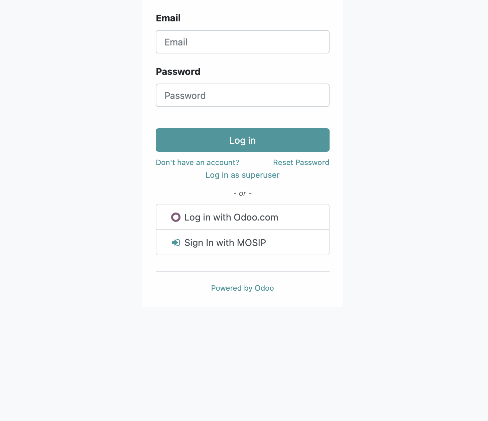

---
openspp:
  doc_status: unverified
---

# eSignate Integration

## Introduction

The integration of OpenSPP with eSignet aims to utilize [MOSIP eSignet](https://docs.mosip.io/1.2.0/integrations/e-signet) as the identity server for login into the OpenSPP platform. This provides a seamless user experience and enhances security by leveraging the OAuth protocol and allowing OpenSPP users to access the platform without the need for additional login credentials.

## Prerequisites

To be able to start the integration, ensure the following:

- The key exchange is completed as per the requirements of MOSIP.
- Access to the eSignet account (Client ID) and Authorization URL, UserInfo URL, Token URL, and JWKS URL is received from MOSIP.
- Need to have administrative privileges within OpenSPP to install modules.
- The developer mode is activated in OpenSPP.

## Objective

Upon completing this guide, the developer can successfully integrate eSignet with OpenSPP for login authentication.

## Step-by-step

1. Set up your development environment as per the given guide [here](https://docs.openspp.org/howto/developer_guides/development_setup.html).

2. Access the root folder of the OpenSPP project. Then, go to the `odoo/custom/src` directory.

3. Modify the repos.yaml file in this directory and add the following configuration for the openg2p-auth to setup eSignet.

```yaml
openg2p-auth:
  defaults:
    depth: $DEPTH_DEFAULT
  remotes:
    openg2p: https://github.com/OpenG2P/openg2p-auth.git
  target: openg2p 17.0-develop
  merges:
    - openg2p 17.0-develop
```

4. Make the following changes in the server-auth section of the `repos.yaml` file to support the eSignet module.

```yaml
server-auth:
  defaults:
    depth: $DEPTH_DEFAULT
  remotes:
    openg2p: https://github.com/OpenG2P/server-auth.git
  target: openg2p 17.0
  merges:
    - openg2p
```

5. In the `addons.yaml` file, include the following two lines to add the openg2p-auth.

```yaml
openg2p-auth:
  - "*"
```

6. Modify the server-auth also as below in the same file.

```yaml
server-auth:
  - "*"
```

7. Now restart your development server to make the above changes effective.

8. Log in to OpenSPP with an account that has admin rights and ensure developer mode is activated.

9. Click the four-square icon on the top-left corner to bring up the menu, then select **Apps**.

10. Search for OIDC and install the **G2P Auth: OIDC - Reg ID** module. After the successful installation, it should appear below.


11. Next, from the OpenSPP main menu, select **Settings**, then navigate to **Users & Companies**, and finally, choose **OAuth Providers** to proceed with the configuration.

12. Click **Create** to set up a new OAuth client to be used in eSignet, fill out the configurations as below, and **Save**.

- Provider name: eSignet
- Auth Flow: OpenID Connect (authorization code flow)
- Token Map: sub:user_id
- Client ID: ID given by MOSIP
- Client Authentication Method: Private Key JWT
- Private Key: Upload the private key
- Assertion Type: JWT Bearer
- Allowed: Checked
- Login button label: Sign in with MOSIP
- Authorization URL: `https://esignet.collab.mosip.net/authorize`
- Scope: openid profile email
- UserInfo URL: `https://esignet.collab.mosip.net/v1/esignet/oidc/userinfo`
- Token UR: `https://esignet.collab.mosip.net/v1/esignet/oauth/v2/token`
- JWKS URL: `https://esignet.collab.mosip.net/v1/esignet/oauth/.well-known/jwks.json`
- Extra Authorise Params:

```json
{
  "acr_values": "mosip:idp:acr:generated-code mosip:idp:acr:biometrics mosip:idp:acr:linked-wallet",
  "claims": "{\"userinfo\":{\"name\":{\"essential\":true},\"phone_number\":{\"essential\":false},\"email\":{\"essential\":true},\"gender\":{\"essential\":true},\"birthdate\":{\"essential\":true}},\"id_token\":{}}"
}
```

- Use G2P Reg ID: checked
- Partner Creation Call Validation Url: checked
- Default Group User Creation: User types / Internal User

After successful configuration, it should look like as below.


13. Once configured successfully, the eSignet login should appear on the login screen as below.


