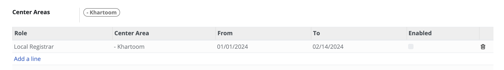

# Administrating role-based access

## Introduction

This guide details the process of administering role-based access in OpenSPP.

## Prerequisites

To grant access, you need a user account with the **System Admin** role given by the OpenSPP team.

## Objective

After completing this task, the assigned user account will be able to login and execute actions exclusive to the assigned role in openSPP.

## Step-by-step

### Creating user account

1. Login to OpenSPP as an admin user, then click on the four-square icon and click on **Settings**.

2. Click **Users & Companies** from the navigation bar, then choose **Users** from the list menu that appears.

3. Click the **Create** button. Set the values for **Name** and **Email address**, and click **Save**.

4. Once the account has been created, a password needs to be added to the user. Refer to the section **Change user password**.

### Change user password

1. Click on the four-square icon in the top-left corner, then select **Settings**. Click **Users & Companies** then select **Users** from the dropdown list.
2. Click on the user account that should be modified, and then click on the **Action** button.
3. Type in the password in the **New Password** field, then click the **Change Password** button from the popup modal.

### Enabling and disabling user account

1. Click on the four-square icon in the top-left corner. Click the **Action** icon, and from the drop-down list, you can choose the action you want to perform.
2. To delete the user account, click on **Delete** in the action list. A confirmation popup will appear. Click **OK** to proceed.
3. To temporarily delete the user account from OpenSPP, click on **Archive** in the action list. A confirmation popup will appear. Click **OK** to proceed.
4. To restore a temporarily deleted user account to OpenSPP, additional steps need to be performed to navigate to the user since the user account will no longer be displayed among the active users. Click on the four-square icon in the top-left corner then click on **Settings**. Click **Users & Companies** and select **Users**. Click on **Filters**, then select **Inactive Users**. Click on the name of the user account you wish to unarchive. Click on the **Action** button, and then click **Unarchive**.

### Editing user Information

1. Click on the four-square icon in the top-left corner, then click on **Settings**, navigate to **Users & Companies**, and select **Users**. Click on the name of the user you wish to edit. Click on **Edit** to modify the name and/or email address fields, then click **Save**.

### Assigning roles to a user

1. Click on the **Role** tab, then click **Add a line**. Use the drop-down arrow to choose the role you wish to assign to this specific user account. Select the **Center Area** for this user account by clicking the drop-down arrow under the **Center Area** column. This user account will only be able to access data related to the **Center Area** you select.

2. Set the start and end dates for the user account's validity by adjusting the **From-To** columns. These dates determine when the account will no longer be able to log in to openSPP.

3. After configuring the validity dates, click **Save**.

4. The user account setup is complete. Test the login with the email address and password you've set up for this user account.

5. The user account setup is complete. Test the login with the email address and password you've set up for this user account.

### Configuring roles

1. Click on the four-square icon in the top-left corner, then click on **Settings**, and click **Roles** under **Users & Companies**.

2. Click **Create**, set a name for the role, and select a **Role Type**.

### Configuring groups

1. Click on the four-square icon in the top-left corner, then click on **Settings**, and click **Roles** under **Users & Companies**.

2. Create new groups by clicking the **Create** button, or you can manage existing groups by clicking the checkbox beside each group and then clicking the **Action** button, or you can modify groups by clicking on a group’s name.

