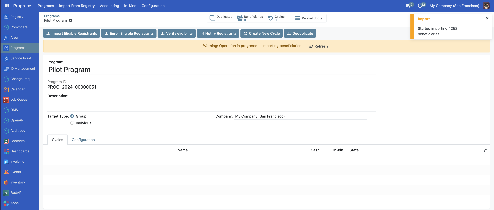

# Enroll beneficiaries

## Introduction

This guide provides step-by-step instructions for enrollment processes for individual and group beneficiaries.

## Prerequisites

In order to enroll beneficiaries in OpenSPP, you need an existing program. Learn more about how to configure a program in the documentation Create a social protection program.

## Objective

This how-to instructs users on how to enroll registrants in OpenSPP into a program. Upon completion, you will have successfully added eligible beneficiaries to a social protection program and can proceed by creating cycles and performing distributions.

## Step-by-step

Once the program has been configured according to How to-Create a social protection program, the next step is to enroll the beneficiaries who will benefit from the social protection program. Depending on the target type selected in the program creation, you can enroll either individuals or groups. The following two steps need to be taken as a part of the enrolment step:

**Importing Beneficiaries:** Importing beneficiaries into a program means that any beneficiaries in the system that match the eligibility criteria will be included in the program as potential beneficiaries.

**Enrolling Beneficiaries:** Enrolling beneficiaries into the program means beneficiaries are successfully imported and authorized to access the program's benefits or services.

Depending on the choices made in the program setup, there are two different ways to perform these steps, both of them are described below.

### Import and enrollment as part of program setup

If the checkbox Yes is selected in the final step of the program setup, the beneficiaries will already have been imported and enrolled as part of the program configuration, meaning that no additional step needs to be taken and it is possible to proceed to create a cycle. Learn more about how to create a cycle in the documentation Create a program cycle & prepare entitlements.

To verify that the beneficiaries have been enrolled, you can follow the steps below:

1. Navigate to the program. The **Beneficiaries** icon will display the number of beneficiaries imported and enrolled.

2. It is possible to click the **Beneficiaries** icon to view the imported and enrolled beneficiaries in the table view. The status column should say **Enrolled**.

### Import and enrolment after program creation

If the checkbox **No** has been selected in the final step of the program creation, the beneficiaries will not be imported and enrolled as part of the program creation, and this will need to be done as an additional step as described below:

1. Click **Import Eligible Registrants** in order to initiate the import. Before proceeding with the next step of enrolling the beneficiaries, it is important to allow the system to complete the import. The time it takes to import the beneficiaries will depend on the number of beneficiaries eligible for the program. Depending on the number of beneficiaries, the display for completion also varies. In cases of less than 1000 beneficiaries, a green popup will display when the import is completed.

In the case of more than 1000 beneficiaries, a yellow notification will display informing that the page needs to be refreshed to see the status of the import.

The import is completed when the yellow notification is no longer displayed when refreshing the page.

2. Once the import has been completed, click on the icon **Enroll Eligible Registrants**. This action will trigger a beige pop-up notification, indicating that the enrollment process has commenced. Following the completion of enrollment for all participants, refresh the page and if the warning message disappears, then it means that the import is already complete. You should also check the beneficiary page to see if the registrants are there.

3. The **Beneficiaries** icon will display the number of beneficiaries imported and enrolled. It is also possible to click the **Beneficiaries** icon to view the list of imported and enrolled beneficiaries in table format.

