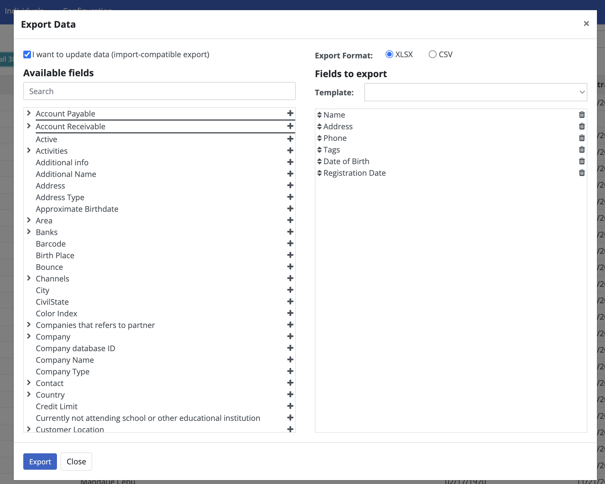

# Export Registrant Data

## Introduction

This guide details the process of exporting registrant data from OpenSPP. Exporting data is crucial for managing and analyzing the information of registrants effectively within the OpenSPP system.

## Prerequisites

In order to be able to export registrant data using OpenSPP, ensure the following:

- Have authorized access to the OpenSPP platform.
- Determine the specific fields relevant to the data you wish to export.

## Objective

Upon completing this guide, users will be able to successfully export data for individuals or groups from OpenSPP for multiple purposes, such as record keeping, importing to add new individuals or groups, or importing to update existing individuals or groups. Ensuring the data is in a usable format.

## Step-by-step

1. Log in to OpenSPP with an account that has admin rights. Learn how to set up roles and accounts here(yet to be published).

2. When logged in successfully, you will be redirected to the **Registry** page. If it does not take you directly to the **Registry**, click the four-square icon on the top-left corner to bring up the menu, and then select **Registry**.

3. It is possible to export either **Groups** or **Individuals** depending on the needs. Navigate to the wished export level by clicking either **Groups** or **Individuals** in the top navigation bar.

4. Select the checkboxes to the left of the entries you want to export.

- If your aim is to export for the purpose of record-keeping, click on the checkboxes you wish to export or click checkbox beside **Name** header to select all records on the current page, additionally, If there are more records than can be displayed on the page, they can be selected by clicking **Select all**.

- If your aim is to export for the purpose of obtaining necessary fields as headers to be able to import to add new individuals or groups, select and click on the checkbox for at least one of the records from the list. Your aim during export is to select headers that are relevant to your import and it is therefore only necessary to export one record from groups or individuals to obtain the fields as headers already configured into the exported excel file.
- If your aim is to export for the purpose of import to update existing individuals or groups, select and click on the checkbox on the records you wish you update.

5. Navigate to the **Action** menu and select **Export**. This will display a popup window titled **Export Data**, where the export should be configured.

- If your aim for the import is to update existing individuals or groups, select and click the checkbox **I want to update data (import-compatible export)**. This will disable all options in **Available fields** that cannot be used for updates and will automatically include an external Id column in the exported file. Otherwise, skip this step.
- Select **XSLX** or **CSV** as export format.
- In the **Available fields** section, choose the fields you want to export by clicking on the **+** icon. To remove selected fields, click the trash icon beside the field name under the **Fields to export** column.

6. Click **Export** to download the file.

- Perform the export process carefully to ensure the data is exported in a usable format and stored securely to prevent unauthorized access.
