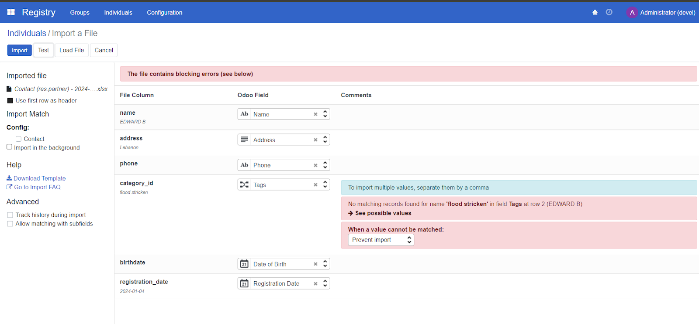
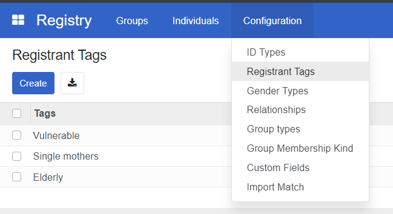
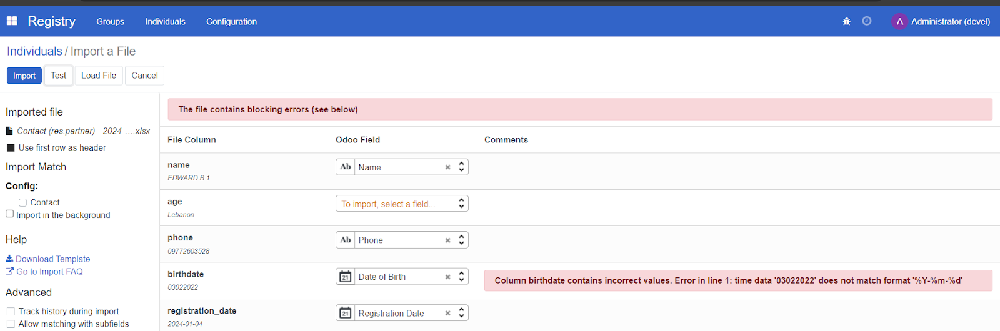
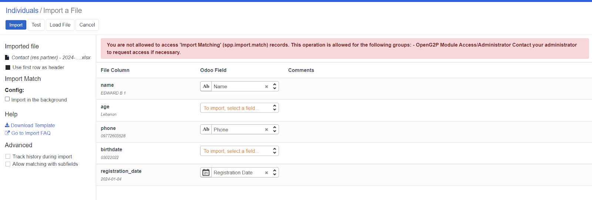

# Import registrant data

## Introduction

In this how-to guide, you will learn the process of importing registrant data in CSV or Excel format using the OpenSPP platform. The how-to guide covers the import of new data as well as the update of existing data.

## Prerequisites

To import registrant data into the OpenSPP, you need to:

- Ensure you have a user account with admin access to the OpenSPP platform. Learn more in this how-to: [How to-Administrating role-based access](https://docs.openspp.org/howto/user_guides/administrating_role_based_access.html)
- Prepare registrant data in CSV (Comma-Separated Values) or XLSX (Excel) format.
- Have access to spreadsheet software capable of editing and saving CSV or Excel files, such as Microsoft Excel.

## Objective

After performing this task, you will have successfully imported new or updated existing registrant data into OpenSPP, which will ensure an effective, efficient, and targeted delivery of social protection services. You will also gain proficiency in handling data imports, a crucial aspect of system administration in OpenSPP.

## Step-by-step

### Import to add new individual or group

In order to perform an import, the correct headers need to be used. The easiest way to correctly obtain this is to export a record from the system with the headers that should be used for the import.

1. To export an individual or group, follow the steps in [Export Registrant Data](https://docs.openspp.org/howto/user_guides/export_registrant_data.html).

2. Once you have successfully downloaded the exported file, it will have a format similar to the below screenshot. Which headers are included will depend on the fields selected in the export; this example displays one individual data exported. Keep only the headers in row 1, and delete all other rows.

3. Format to Text all empty fields for columns that contain numeric values

- To format cells to text, locate a field header with a numeric value, for instance, Columns **C**, **E**, and **F**, on the screenshot Excel document.
- Click on the column header. Once highlighted, right-click, select, and click **Format Cells**; then select **Text** and click **OK**.
- Repeat on columns with numbers as values.

4. Fill in the fields with values accordingly. Please take note of the following:

- Leaving a cell empty will overwrite the corresponding field with a blank value in OpenSPP once it is successfully imported.
- Date format accepted by OpenSPP is YYYY-MM-DD only.

5. Launch OpenSPP and navigate to **Registry**, then click **Individuals** or **Groups** depending on the type of data, and then click **Favorites**. Select **Import records** from the displayed dropdown.

6. Locate the file prepared for upload and click **Upload File**. You will then be redirected to the screen below.

Make sure to click the checkbox for **Import in the background** when importing large files.

7. Click **Test**; this will validate the file to ensure the import document data is valid. If the message **Everything seems valid** is displayed, it is possible to proceed with the import.

If there are any issues with the file, a message will instead be displayed giving directions on how to solve the issue. You may refer to the **Error handling** section of this document to learn more about common errors.

8. When you click **Import**, a notification will appear displaying the number of successfully imported records.

9. Verify uploaded records by clicking filter and select **Created on**, then click **Apply**. Newly created records should be displayed in the registry list.

### Import to update existing individual or Group

To update existing records, select the desired existing records from OpenSPP and export them. Edit the values you wish to update in the exported file, then import it back to OpenSPP. The reason for exporting is to obtain the **unique id** for each record that is needed to perform an update.

1. To export an individual or group, follow the steps in [Export Registrant Data](https://docs.openspp.org/howto/user_guides/export_registrant_data.html).

2. Once you have successfully downloaded the exported file, open it and keep the id column in place; this serves as the identifier of the record when imported back to OpenSPP.

3. Replace values in the other headers you wish to update, then save the file. Please take note of the following:

- Leaving a cell empty will overwrite the corresponding field in OpenSPP with a blank value once it is successfully imported.
- The date format accepted by OpenSPP is YYYY-MM-DD only.
- If you encounter formatting errors when inputting number values, format the whole column to text by clicking the column header; once highlighted, right-click, select, and click **Format Cells**; then select **Text** and click **OK**.
- You can now fill the cell with the desired numeric value.

4. Launch OpenSPP, navigate to **Registry**, and click either **Individuals** or **Groups**, depending on which type of data you wish to import. Click **Favorites** and select **Import records**.

5. Locate your file and click **Upload file**. You will then be redirected to the screen below. Make sure to click the checkbox for **Import in the background** when importing large files.

6. Click **Test**; this will validate the file to ensure the import document data is valid. If the message **Everything seems valid** is displayed it is possible to proceed with the import.

If there are any issues with the file, a message will instead be displayed giving directions on how to solve the issue. You may refer to the **Error handling** section of this document to learn more about common errors.

7. Click **Import**, a notification will appear displaying the number of successfully imported records.

8. Verify uploaded records by clicking **Filters** and selecting **Last updated on**, then click **Apply**. Newly created records should display in the registry list.

### Error handling

Several errors can occur during import, depending on the setup and the imported data. It is impossible to cover all possible errors here, but some of the more common ones are listed below.

### No matching records found

Some fields require values that are predefined in OpenSPP, such as the **category_id** field. Setting a value in this column that does not match the values found in OpenSPP will return an error message similar to the screenshot below.

To resolve this type of error, only type in values that are defined in OpenSPP, in this case for **category_id**, You can navigate to **Registry**, then click **Configuration**, and after that, select **Registrant Tags**. You should see the list of the defined **Tags**, Only use these values from the list for **category_id**.

### To import, select a field

If OpenSPP could not recognize your header, it will display To import, select a field beside the unrecognized header, similar to the screenshot below.

To resolve this error, if you are familiar with what field you want to associate with your header, you can click **To import, select a field,** and then select from the list of fields; otherwise, you can remove the whole column associated with the header from your excel file as the field you are trying to import is not available to be imported into OpenSPP.

### Column contains incorrect values

Another error is the date format. If the imported format for fields related to date is incorrect, OpenSPP will display an error message similar to the below screenshot.

To resolve this error, change the date format from your Excel file to this format YYYY-MM-DD, save the file, then import it to test again.

### You are not allowed to access ‘Import Matching’

An issue encountered when attempting to import using an account with wrong access rights permissions would look like the below screenshot.

To resolve the error, assign a **System Admin** in the **Role** column to the user account that will perform the import or export process.

Learn more about administering permissions here [Administrating role-based access](https://docs.openspp.org/howto/user_guides/administrating_role_based_access.html).
