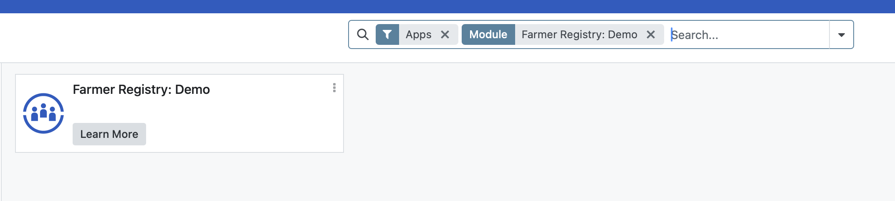
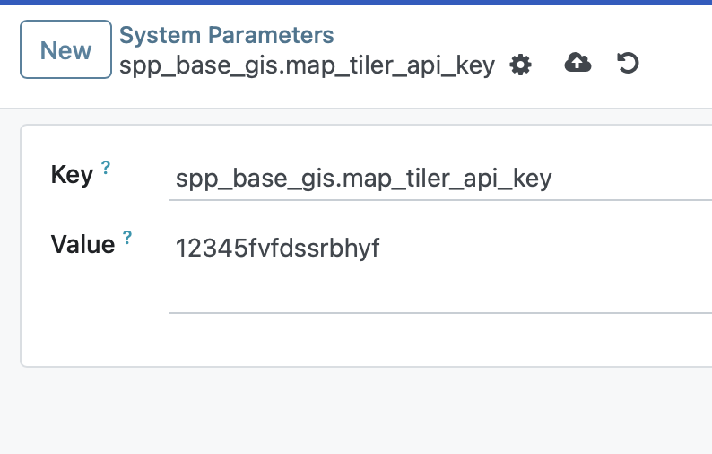
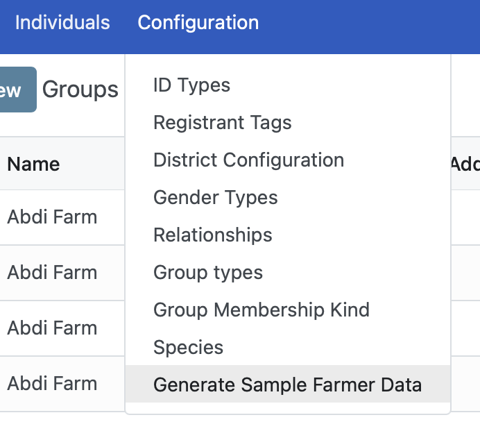
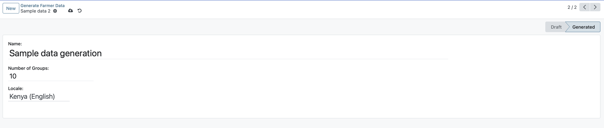

---
openspp:
  doc_status: unverified
---

# Setting up Farmer Registry

## Introduction

This guide will help you install the Farmer Registry module in OpenSPP and configure it to generate sample farmer data. This module enhances OpenSPP by providing functionalities related to farmer registration and management.

## Prerequisites

Before you begin, ensure you have the following:

- Administrative access to OpenSPP.
- An API Key for MapTiler to enable GIS functionality.
- Developer mode of OpenSPP should be enabled to set up the MapTiler key.

## Objective

By the end of this guide, you will be able to set up the farmer registry.

## Step-by-step

### Installing the Farmer Registry

1. Log in to OpenSPP, click on the nine-square icon, and then click Apps.

2. Search for Farmer **Registry: Demo** and click **Activate** to install it. This will also install the prerequisite modules.

3. Note that after installation the button Learn More will be displayed.

### Setting Up the API Key for MapTiler

1. Go to **Settings**, select **Technical** and click **System Parameters**.

2. Click the **New** button and set the Key field to **spp_base_gis.map_tiler_api_key** and enter the actual API Key for MapTiler in the **value** field.

3. Click **Save**.

### Generating Sample Farmer Data

1. Navigate to **Registry** from the top toolbar.

2. Select **Configuration** and click on **Generate Sample Farmer Data**.

3. Click **New**. On the displayed screen, add values for the **Name** field and enter the desired number of groups in the field **Number of Groups**.

4. Click the **Generate Sample Data** button located at the top-center of the page. This will populate the registry with sample farmer data.

