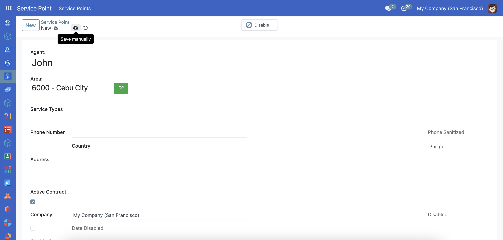
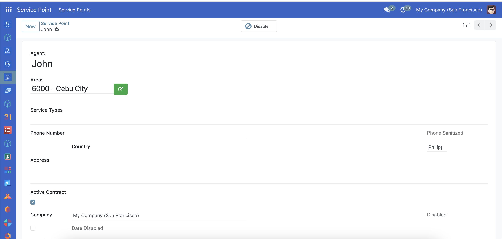
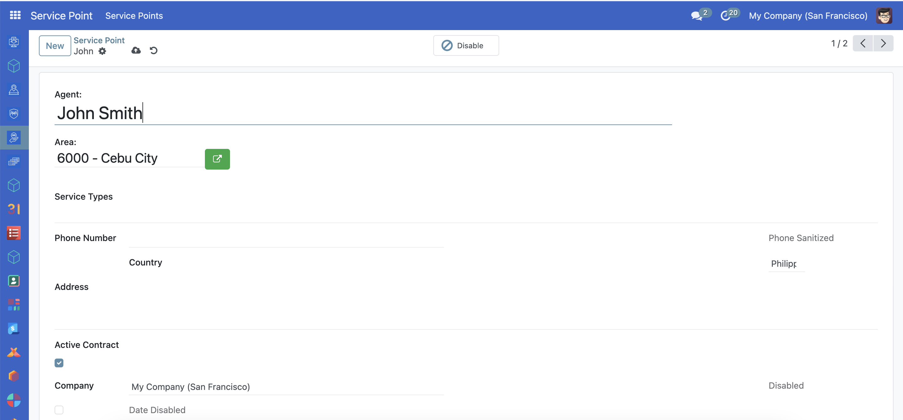
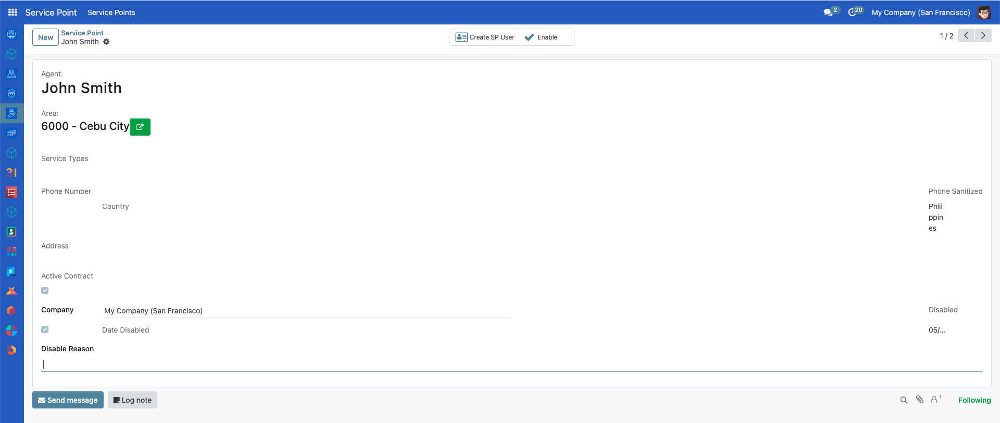

---
openspp:
  doc_status: unverified
  products: [core]
---

# Setting up service points

## Introduction

A service point is a virtual or physical location where individuals can receive or access their social protection services and benefits. Setting up service points is crucial for entitlement delivery to ensure that services and benefits are delivered to the recipients correctly. This guide teaches you how to set up a service point.

## Prerequisites

The logged-in user has permission to set up a service point.

## Objective

After completing this guide, the user should be able to set up a service point.

## Step-by-step

### Create a new service point

1. Click the menu icon from the header and select **Service Point**. You will be redirected to the **Service Point** page.

2. Click the button **New**.

3. A create service point form will be displayed.

4. Fill out the form and click the **Save** icon.

5. You will be redirected to the newly created service point.

### Update a service point.

1. On the service list page, click the service point you want to update. You will be redirected to the service point page.

2. Update the data and click the **Save** button. You will see the updated data.

### Disable a service point.

1. On the service list page, click the service point you want to update. You will be redirected to the service point page.

2. Click the **Disable** button.

### Enable a service point

1. On the service list page, click the service point you want to enable. You will be redirected to the service point page.

2. Fill in the **Disabled Reason** and click **Enable** The updated data will be displayed.

