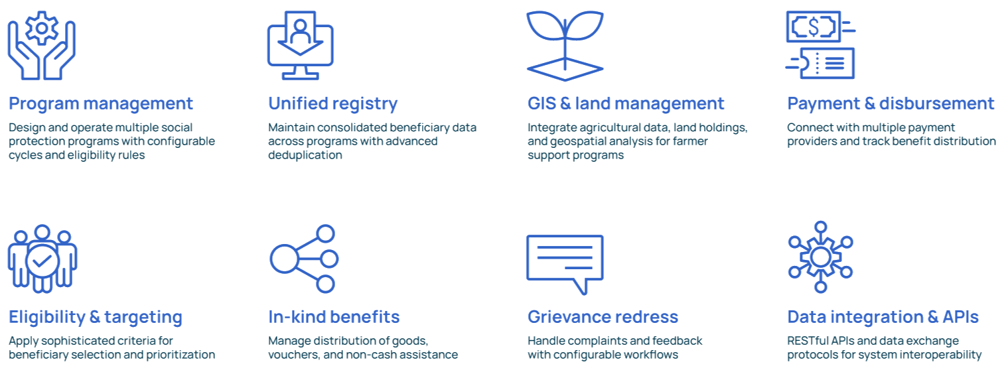
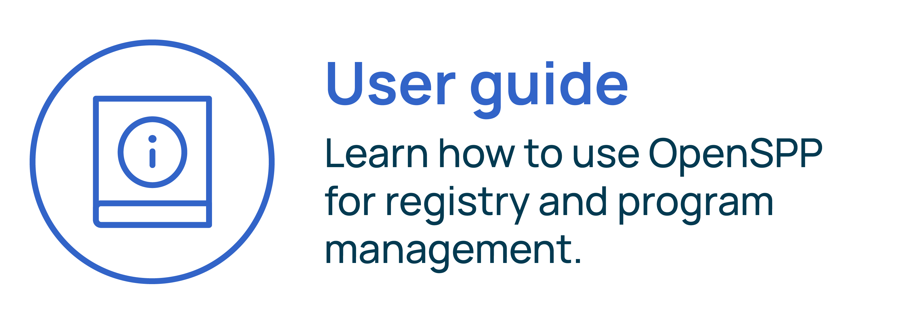

---
myst:
  html_meta:
    "description": "This website is the HTML documentation of OpenSPP, an open source social protection platform."
    "property=og:description": "This website is the HTML documentation of OpenSPP, an open source social protection platform."
    "property=og:title": "OpenSPP Documentation"
    "keywords": "OpenSPP, open source, Documentation"
---

(index-label)=

# Welcome to OpenSPP!

OpenSPP empowers governments and humanitarian organizations to deliver effective social protection and agricultural support programs through open-source digital infrastructure. By bridging social welfare with agricultural development, OpenSPP enables coordinated assistance to vulnerable populations, from urban cash transfers to rural farming subsidies.

The platform's modular architecture offers three integrated products: **SP-MIS** for comprehensive program management, **Social Registry** for beneficiary data coordination, and **Farmer Registry** for agricultural-social protection convergence. Organizations can deploy specific modules that match their needs while maintaining interoperability with existing systems.


## Key features



## Who uses OpenSPP

OpenSPP serves diverse organizations implementing social protection and agricultural support programs:

- **Government ministries** - Social welfare, agriculture, and disaster management agencies
- **Humanitarian organizations** - UN agencies and NGOs delivering emergency assistance
- **Agricultural development programs** - Supporting smallholder farmers with subsidies and climate adaptation
- **Cash transfer programs** - Conditional and unconditional cash assistance initiatives
- **Food security programs** - Coordinating nutrition support with agricultural production

## Quick start

:::::{grid} 2
:gutter: 2

::::{grid-item-card} 
:link: getting_started/index
:link-type: doc
::::

::::{grid-item-card} 
:link: user_guide/index
:link-type: doc
::::

::::{grid-item-card} 
:link: developer_guide/index
:link-type: doc
::::

::::{grid-item-card} 
:link: developer_guide/architecture
:link-type: doc
::::
:::::

## Products

Explore our complete product documentation to understand how each component addresses specific use cases.


### SP-MIS

OpenSPP's social protection management information system offers customizable building blocks for effective program implementation. Its modular design allows users to select only the components they need without an overhaul of existing systems. 

[Learn more →](overview/products/sp_mis.md)


### Social Registry

The Social Registry is a repository for the storage and management of data for planning and administering social protection. It supports intake, dynamic registration and needs assessment, and the efficient and secure sharing of data from the social registry with various social protection programs and services.

[Explore features →](overview/products/social_registry.md)

### Farmer Registry

The Farmer Registry bridges social protection with agricultural development, storing and managing comprehensive farm and farmer data. Key capabilities include:
- **Farm holding mapping** with GIS integration for land parcels and crop data
- **Agricultural subsidy management** for input distribution and support programs  
- **Climate resilience programs** targeting vulnerable farming communities
- **Integration with agricultural extension services** and market information systems
- **Seasonal support cycles** aligned with planting and harvest periods

This enables coordinated delivery of both social protection and agricultural support to rural communities. 

[View documentation →](overview/products/farmer_registry.md)

## Guiding principles

Our guiding principles are informed by the Digital Public Goods Standard and the Principles for Digital Development.

- **User-centricity**: Our products are designed to be intuitive and pragmatic, recognizing that social protection operates in complex, resource-constrained and rapidly changing contexts.
- **Modularity**: The platform is composed of independent modules which allow for flexibility, scalability, and the interchangeability of components.
- **Privacy and security**: We rigorously uphold privacy and security standards - essential prerequisites for safeguarding Digital Public Goods.
- **Interoperability**: The platform is designed to support system interoperability - critical for the creation of cohesive and efficient digital ecosystems.
- **Inclusivity**: Our products can be customized to suit linguistic and cultural requirements, accessibility, digital literacy, and deployment in remote and less-developed contexts.

## Common tasks

- **[Install OpenSPP](getting_started/installation_deb.md)** - Set up your development or production environment
- **[Create a program](user_guide/program_management/create_program.md)** - Design and launch social protection programs  
- **[Manage registrants](user_guide/registry_management/index.md)** - Add and manage beneficiary data
- **[Configure integrations](developer_guide/integrations/index.md)** - Connect with external systems

## Digital Public Good & Open Source Foundation

OpenSPP is recognized as a [Digital Public Good](https://digitalpublicgoods.net/), meeting the highest standards for open-source software that addresses the Sustainable Development Goals. Built on a foundation of **60+ modular components**, OpenSPP integrates with and contributes to a robust ecosystem of digital public infrastructure:

- **[OpenCRVS](https://www.opencrvs.org/)** for civil registration and vital statistics
- **[MOSIP](https://mosip.io/)** for digital ID integration  
- **[OpenFn](https://www.openfn.org/)** for workflow automation and integration
- **[DHIS2](https://dhis2.org/)** for health information management  
- **[Payment Hub EE](https://mifos.org/payment-hub/)** for financial services integration
- **[OpenG2P](https://openg2p.org/)** for government-to-person delivery systems
- **[Odoo](https://www.odoo.com/)** as the enterprise platform foundation


## Resources & Community

:::::{grid} 3
:gutter: 2

::::{grid-item}
**Get Help**
- [Documentation](https:/docs.openspp.org/)
- [GitHub Discussions](https://github.com/orgs/OpenSPP/discussions)
- [Report Issues](https://github.com/OpenSPP/openspp-modules/issues)
::::

::::{grid-item}
**Stay Connected**
- [OpenSPP Website](https://openspp.org/)
- [Release Notes](https://github.com/OpenSPP/openspp-modules/releases)
- [Contributing Guide](community/contributing.md)
::::

::::{grid-item}
**Learn More**
- [API Reference](developer_guide/api_usage/index.md)
- [Glossary](reference/glossary.md)
::::
:::::

OpenSPP is currently in development, and everything is evolving rapidly thanks to the input provided by our users. If you have any questions or needs, please do not hesitate to contact the team.

```{toctree}
:maxdepth: 3
:hidden: true

getting_started/index
overview/index
user_guide/index
developer_guide/index
reference/index
community/index
```

```{toctree}
:caption: Appendices
:maxdepth: 1
:hidden: true

reference/glossary
```
