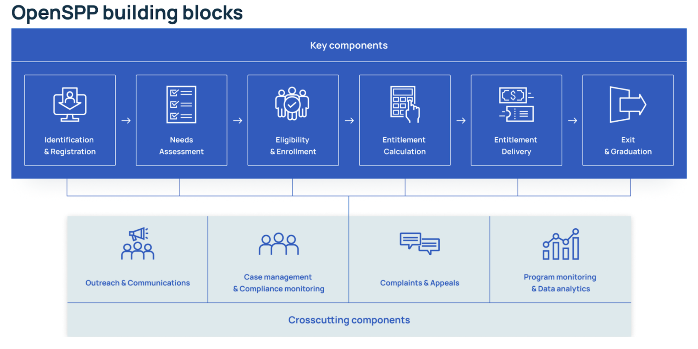

---
myst:
  html_meta:
    "description": "This website is the HTML documentation of OpenSPP, an open source social protection platform."
    "property=og:description": "This website is the HTML documentation of OpenSPP, an open source social protection platform."
    "property=og:title": "OpenSPP Documentation"
    "keywords": "OpenSPP, open source, Documentation"
---

(index-label)=

# Welcome to OpenSPP!

OpenSPP empowers governments and humanitarian organizations to deliver effective social protection and agricultural support programs through open-source digital infrastructure. By bridging social welfare with agricultural development, OpenSPP enables coordinated assistance to vulnerable populations, from urban cash transfers to rural farming subsidies.

The platform's modular architecture offers four integrated products: **SP-MIS** for comprehensive program management, **Social Registry** for beneficiary data coordination, **Farmer Registry** for agricultural–social protection convergence, and **DRIMS** for disaster response inventory management. Organizations can deploy specific modules that match their operational needs—whether for routine social protection delivery or emergency response—while maintaining interoperability with existing systems.


## Key features

::::{grid} 1 2 2 2
:gutter: 3

:::{grid-item-card}
:img-top: images/01-Program-management.png

**{doc}`Program management <products/features/program_management>`**
^^^
Design and operate multiple social protection programs with configurable cycles and eligibility rules.
:::

:::{grid-item-card}
:img-top: images/02-Unified-registry.png

**{doc}`Unified registry <products/features/unified_registry>`**
^^^
Maintain consolidated beneficiary data across programs with advanced deduplication.
:::

:::{grid-item-card}
:img-top: images/03-GIS-&-land-management.png

**{doc}`GIS & land management <products/features/gis_land_management>`**
^^^
Integrate agricultural data, land holdings, and geospatial analysis for farmer support programs.
:::

:::{grid-item-card}
:img-top: images/04-Payment-&-disbursement.png

**{doc}`Payment & disbursement <products/features/payment_disbursement>`**
^^^
Connect with multiple payment providers and track benefit distribution.
:::

:::{grid-item-card}
:img-top: images/05-Eligibility-&-targeting.png

**{doc}`Eligibility & targeting <products/features/eligibility_targeting>`**
^^^
Apply sophisticated criteria for beneficiary selection and prioritization.
:::

:::{grid-item-card}
:img-top: images/06-In-kind-benefits.png

**{doc}`In-kind benefits <products/features/in_kind_benefits>`**
^^^
Manage distribution of goods, vouchers, and non-cash assistance.
:::

:::{grid-item-card}
:img-top: images/07-Grievance-redress.png

**{doc}`Grievance redress <products/features/grievance_redress>`**
^^^
Handle complaints and feedback with configurable workflows.
:::

:::{grid-item-card}
:img-top: images/08-Data-integration-&-APIs.png

**{doc}`Data integration & APIs <products/features/data_integration_apis>`**
^^^
RESTful APIs and data exchange protocols for system interoperability.
:::
::::

## Who uses OpenSPP

OpenSPP serves diverse organizations implementing social protection and agricultural support programs:

- **Government ministries** - Social welfare, agriculture, and disaster management agencies
- **Humanitarian organizations** - UN agencies and NGOs delivering emergency assistance
- **Agricultural development programs** - Supporting smallholder farmers with subsidies and climate adaptation
- **Cash transfer programs** - Conditional and unconditional cash assistance initiatives
- **Food security programs** - Coordinating nutrition support with agricultural production

## Quick start

::::{grid} 1 2 2 2
:gutter: 3

:::{grid-item-card}
:img-top: images/01-Get_Started-Icon.png

**{doc}`Get started <get_started/index>`**
^^^
New to OpenSPP? Start with our installation guide and quickstart tutorial.
:::

:::{grid-item-card}
:img-top: images/02-User_guide-Icon.png

**{doc}`User guide <user_guide/index>`**
^^^
Learn how to use OpenSPP for registry and program management.
:::

:::{grid-item-card}
:img-top: images/03-Dev_Guide-Icon.png

**{doc}`Configuration guide <config_guide/index>`**
^^^
Configure and customize OpenSPP for your organization's needs.
:::

:::{grid-item-card}
:img-top: images/04-Architecture-Icon.png

**{doc}`Reference <reference/index>`**
^^^
Module documentation, vocabularies, and technical references.
:::
::::

## Products

Explore our complete product documentation to understand how each component addresses specific use cases.



### SP-MIS

OpenSPP's social protection management information system offers customizable building blocks for effective program implementation. Its modular design allows users to select only the components they need without an overhaul of existing systems. 

[Learn more →](products/sp_mis.md)


### Social Registry

The Social Registry is a repository for the storage and management of data for planning and administering social protection. It supports intake, dynamic registration and needs assessment, and the efficient and secure sharing of data from the social registry with various social protection programs and services.

[Learn more →](products/social_registry.md)

### Farmer Registry

The Farmer Registry connects social protection with agricultural development by storing and managing essential farm and farmer data. It supports farm holding mapping with GIS integration, agricultural subsidy management, and climate resilience initiatives for vulnerable farming communities, while enabling coordination with extension services and seasonal support cycles to ensure effective delivery of assistance to rural households.

[Learn more →](products/farmer_registry.md)

### DRIMS – Disaster Response Inventory Management

DRIMS manages the complete lifecycle of emergency supplies, from donation pledges and warehouse storage to dispatch, delivery, and returns. It provides real-time inventory visibility, multi-tier request approval, and coordinated distribution workflows to support humanitarian organizations and government agencies in responding effectively to disaster incidents.

[Learn more →](products/drims.md)

## Guiding principles

Our guiding principles are informed by the Digital Public Goods Standard and the Principles for Digital Development.

- **User-centricity**: Our products are designed to be intuitive and pragmatic, recognizing that social protection operates in complex, resource-constrained and rapidly changing contexts.
- **Modularity**: The platform is composed of independent modules which allow for flexibility, scalability, and the interchangeability of components.
- **Privacy and security**: We rigorously uphold privacy and security standards - essential prerequisites for safeguarding Digital Public Goods.
- **Interoperability**: The platform is designed to support system interoperability - critical for the creation of cohesive and efficient digital ecosystems.
- **Inclusivity**: Our products can be customized to suit linguistic and cultural requirements, accessibility, digital literacy, and deployment in remote and less-developed contexts.

## Common tasks

- **[Install OpenSPP](get_started/installation/docker.md)** - Set up your development or production environment
- **[Create a program](user_guide/programs/index.md)** - Design and launch social protection programs
- **[Manage registrants](user_guide/registry/index.md)** - Add and manage beneficiary data

## Digital Public Good & Open Source Foundation

OpenSPP is recognized as a [Digital Public Good](https://digitalpublicgoods.net/), meeting the highest standards for open-source software that addresses the Sustainable Development Goals. Built on a foundation of **60+ modular components**, OpenSPP integrates with and contributes to a robust ecosystem of digital public infrastructure:

- **[OpenCRVS](https://www.opencrvs.org/)** for civil registration and vital statistics
- **[MOSIP](https://mosip.io/)** for digital ID integration  
- **[OpenFn](https://www.openfn.org/)** for workflow automation and integration
- **[DHIS2](https://dhis2.org/)** for health information management  
- **[Payment Hub EE](https://mifos.org/)** for financial services integration
- **[OpenG2P](https://openg2p.org/)** for government-to-person delivery systems
- **[Odoo](https://www.odoo.com/)** as the enterprise platform foundation


## Resources & Community

:::::{grid} 1 1 1 3
:gutter: 2

::::{grid-item}
**Get Help**
- [Documentation](https://docs.openspp.org/)
- [GitHub Discussions](https://github.com/orgs/OpenSPP/discussions)
- [Report Issues](https://github.com/OpenSPP/openspp-modules/issues)
::::

::::{grid-item}
**Stay Connected**
- [OpenSPP Website](https://openspp.org/)
- [Release Notes](https://github.com/OpenSPP/openspp-modules/releases)
- [Contributing Guide](community_and_support/how_to_contribute_to_the_project.md)
::::

::::{grid-item}
**Learn More**
- [Glossary](glossary.md)
- [Module Reference](reference/modules/index.md)
::::
:::::

```{toctree}
:maxdepth: 3
:hidden: true

products/index
learn/index
get_started/index
user_guide/index
config_guide/index
developer_guide/index
ops_guide/index
reference/index
community_and_support/index

```
