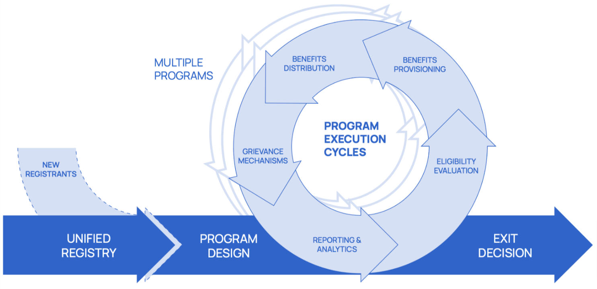

OpenSPP - Social Protection Platform
====================================

`OpenSPP` is an open-source project that aims to streamline the management of social protection programs.
It can be used on its own or in conjunction with other services.

`OpenSPP` is based on an open-source `ERP <https://en.wikipedia.org/wiki/Enterprise_resource_planning>`_ called `Odoo 15.0 <https://odoo.com/documentation/15.0/>`_. It allows
the project to take advantage of a vast ecosystem of existing integrations and modules.

It is a `Digital Public Good (DPG) <https://digitalpublicgoods.net/>`_ and it building on top of other DPG:s such as
`OpenG2P <https://openg2p.org/>`_.

.. image:: images/openspp_components_with_licensing.png
  :alt: OpenSPP components and licensing

`OpenSPP` is currently in development, and everything is evolving rapidly thanks to the input provided by our users.
If you have any questions or needs, please do not hesitate to contact the team through Github
issues or the `OpenSPP website <https://openspp.org/>`_.

Principles
----------

`OpenSPP` is based on the following principles:

- **Design for the user**: the project is designed to be easy to use and to meet the needs of the users in the field.
- **Focused on the needs of low to middle income countries**: the project is designed to meet the needs of low to
  middle income countries.
- **Open source**: the project is open source and free to use for any purpose, including commercial use.
- **Modular**: the project is modular and can be used on its own or in conjunction with other services.

Technical information
---------------------

`OpenSPP` is built on top of `Odoo 15.0 <https://odoo.com/documentation/15.0/>`_, a popular open-source `ERP <https://en.wikipedia.org/wiki/Enterprise_resource_planning>`_.
It is designed to be easy to install and maintain, and can be run on any Linux distribution.

The project is currently under development, and everything is evolving rapidly as a result of our users' comments.
If you have any questions or needs, please do not hesitate to contact the team through Github
issues or our `Website <https://openspp.org/>`_.

To learn more, take a look at the :doc:`technical_reference/architecture` pages.

.. Hidden TOCs

.. toctree::
   :caption: Getting started
   :maxdepth: 2
   :hidden:

   getting_started/installation_guide

.. toctree::
    :maxdepth: 2
    :caption: User guide
    :hidden:

    user_guide/access_management
    user_guide/audit_log
    user_guide/change_requests
    user_guide/consent_management
    user_guide/dashboards_and_reports
    user_guide/geotargeting
    user_guide/grievance_redressal_management
    user_guide/hardware_integration
    user_guide/managing_social_protection_programs
    user_guide/proxy_means_test
    user_guide/Registering_individuals_and_groups
    user_guide/vouchers

..
  .. toctree::
      :maxdepth: 2
      :caption: Best Practices
      :hidden:

    .. toctree::
      :maxdepth: 2
      :caption: Case studies
      :hidden:

.. toctree::
    :maxdepth: 2
    :caption: Technical reference
    :hidden:

    technical_reference/architecture
    technical_reference/programs/concepts
    technical_reference/programs/dashboards
    technical_reference/programs/program_manager
    technical_reference/programs/cycle_manager
    technical_reference/programs/eligibility_manager
    technical_reference/programs/entitlement_manager
    technical_reference/programs/deduplication_manager
    technical_reference/programs/notification_manager
    technical_reference/audit_logs
    technical_reference/oidc
    technical_reference/license

.. toctree::
    :maxdepth: 2
    :caption: Glossary
    :hidden:

    glossary/index

.. toctree::
    :maxdepth: 2
    :caption: Community and support
    :hidden:

    community_and_support/how_to_contribute_to_the_project
    community_and_support/module_lifecycle_development_status
    community_and_support/module_lifecycle_maintainer_role
    community_and_support/code_of_conduct
    community_and_support/security_report
