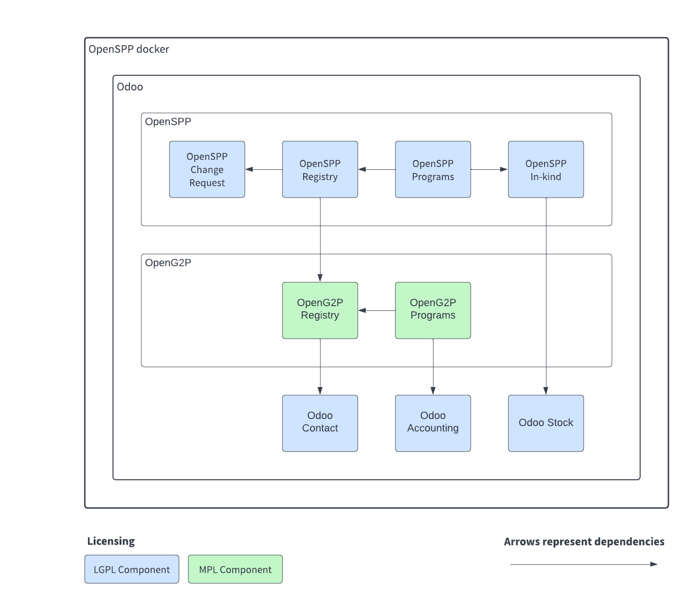

.. |br| raw:: html

   

|br|

OpenSPP - Social Protection Platform
====================================

`OpenSPP` is an open-source project that aims to streamline the management of social protection programs.
It can be used on its own or in conjunction with other services.

.. image:: images/openspp_process.png
  :alt: OpenSPP overview

`OpenSPP` is based on an open-source `ERP <https://en.wikipedia.org/wiki/Enterprise_resource_planning>`_ called `Odoo 15.0 <https://odoo.com/documentation/15.0/>`_. It allows
the project to take advantage of a vast ecosystem of existing integrations and modules.

It is a `Digital Public Good (DPG) <https://digitalpublicgoods.net/>`_ and it building on top of other DPG:s such as
`OpenG2P <https://openg2p.org/>`_.

`OpenSPP` is currently in development, and everything is evolving rapidly thanks to the input provided by our users.
If you have any questions or needs, please do not hesitate to contact the team through Github
issues or the `OpenSPP website <https://openspp.org/>`_.

Principles
----------

`OpenSPP` is based on the following principles:

- **Design for the user**: the project is designed to be easy to use and to meet the needs of the users in the field.
- **Focused on the needs of low to middle income countries**: the project is designed to meet the needs of low to
  middle income countries.
- **Open source**: the project is open source and free to use for any purpose, including commercial use.
- **Modular**: the project is modular and can be used on its own or in conjunction with other services.

Technical information
---------------------

`OpenSPP` is built on top of `Odoo 15.0 <https://odoo.com/documentation/15.0/>`_, a popular open-source `ERP <https://en.wikipedia.org/wiki/Enterprise_resource_planning>`_.
It is designed to be easy to install and maintain, and can be run on any Linux distribution.

The project is currently under development, and everything is evolving rapidly as a result of our users' comments.
If you have any questions or needs, please do not hesitate to contact the team through Github
issues or our `Website <https://openspp.org/>`_.

To learn more, take a look at the :doc:`architecture` pages.

Getting started with OpenSPP
---------------------------------

:doc:`installation`
    How to install this project on your server.

:doc:`configuring`
    Project configuration and customization options.

Development
-----------

:doc:`contributing`
    How to contribute changes to the project.

:doc:`changelog`
    The project development changelog.

.. Hidden TOCs

.. toctree::
   :caption: Getting started
   :maxdepth: 2
   :hidden:

   installation
   functional_architecture
   architecture
   features
   contributing
   license
   glossary

.. toctree::
   :maxdepth: 1
   :hidden:

   changelog

.. toctree::
    :maxdepth: 2
    :caption: Registrants
    :hidden:

    registrants/concepts
    registrants/exporting
    registrants/importing
    registrants/api

.. toctree::
    :maxdepth: 2
    :caption: Programs
    :hidden:

    programs/concepts
    programs/dashboards
    programs/program_manager
    programs/cycle_manager
    programs/eligibility_manager
    programs/entitlement_manager
    programs/deduplication_manager
    programs/notification_manager

.. toctree::
    :maxdepth: 2
    :caption: Disbursement Service
    :hidden:

    disbursement/index

.. toctree::
    :maxdepth: 2
    :caption: Using
    :hidden:

    using/managing_programs
    using/managing_users

.. toctree::
    :maxdepth: 2
    :caption: System Configuration and Administration
    :hidden:

    config_and_admin/oidc
    config_and_admin/audit_logs

.. toctree::
    :maxdepth: 2
    :caption: Community
    :hidden:

    contribution/index
    contribution/module_lifecycle_development_status
    contribution/module_lifecycle_maintainer_role
    code_of_conduct
    security-report
