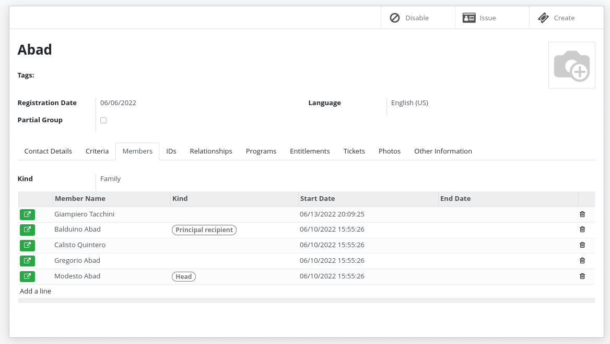

---
myst:
  html_meta:
    "title": "Registrant Concepts and Terminology"
    "description": "Core terminology for individuals, groups, group memberships, and their relationships in OpenSPP social protection systems"
    "keywords": "OpenSPP, registrant concepts, individuals, groups, memberships, relationships, social protection"
---

# Key Terminology

Registrants are at the heart of OpenSPP.
They are the people or groups that are being registered to be included in {term}`social protection` programs.

A {term}`registrant` can be:

- A `group`
- An `individual`

Depending on the project's requirements, a registrant can simply contain a `name` or full biographic information, ID document numbers, pictures, bank account numbers, phone numbers and more.

::::{important}

Consider only collecting the data you really need when conducting a project.

<!--  See: [Principles for Digital Development - Address Privacy & Security](https://digitalprinciples.org/principle/address-privacy-security/). -->

::::

## Concepts

### Individual

An `individual` is a registrant that represents a person.
It will have all the fields of a `registrant` plus some additional ones.

### Group

A group is a `registrant` that represents a set of individuals.
It will have all the fields of a `registrant` plus some additional ones.

For example, groups could represent:

- A {term}`household`
- A {term}`family`
- A school
- A farm association
- ...

Groups do not need to contain individuals registrants.
They can just contain their number of members.

For example:

- Adults: 2
- Children: 3
- Elderly: 2

### Group membership

Individuals can be part of one or more groups.
They can have specific roles in a group.

By default, the following roles exist:

- Head (There can be only one per group)
- Principal recipient (There can be only one per group)
- Alternative recipient

An `admin` has the right to add other roles using the configuration menu.

An individual can be the head of a group but have another or no role in another group.

### Registrants relations

When you need to store the relationship between registrants those relations can be useful.

You can define relationship type between different entities:

- Group - Group
- Individual - Individual
- Individual - Group

For example:

- Sibling (Individual - Individual)
- Parent/Child (Individual - Individual)
- Caretaker (Individual - Group)
- Neighbour (Group - Group)

### ID Documents

Registrants can have one or more ID Documents.

The system does not enforce uniqueness of Document ID by default.
If uniqueness is required, {term}`deduplication` should be performed.

ID Document types can be configured by an administrator.

### Event Data

Event data is a way to store information about a registrant that is not part of the registrant's profile.
It allows to store information without the need to modify the registrant's profile, providing few {term}`benefits`:

- Store multiple version of the data
- Manage separate data lifecycle, sharing agreements, etc.
- Better manage the source of different data
- Store data that should not be visible to all users

This data can be a lot of things:

- House visit
- Raw import data
- Information coming from another system through synchronization
- Data that lose relevance over time

The data stored in `Event Data` can be used in OpenSPP as a normal field by using computed fields.
