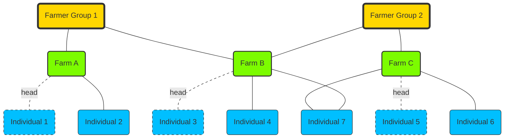

# Organizing Data in the Registry

## Importance of Minimizing Data in the Registry for OpenSPP

In OpenSPP, maintaining a minimalistic approach to the data stored in the registry is crucial while managing additional information on a per-program basis. This practice offers several key advantages, making the system more efficient, secure, and adaptable.

Firstly, enhancing privacy and security is a primary benefit. By limiting the amount of data stored in the central registry, the risk of exposure in case of a data breach is significantly reduced. This practice also helps comply with data protection regulations by minimizing the amount of personal data held centrally.

Secondly, a lean registry simplifies data management and ensures accuracy. With fewer data points to maintain, the administrative burden is reduced, making it easier to keep essential information current and accurate. This leads to more reliable data and less effort required for data management.

From a performance standpoint, smaller datasets improve system efficiency. This results in faster query responses and better scalability, allowing the system to handle growth without performance issues. A minimal registry ensures that OpenSPP can expand smoothly and maintain high performance.

Flexibility is another significant benefit of this approach. Storing data on a per-program basis allows for customization according to specific needs. Programs can manage and update their data independently, leading to more responsive and adaptable operations that cater to diverse requirements.

Maintaining data consistency and integration is also easier with a minimal registry. This approach prevents redundancy and ensures consistency across various programs. It also facilitates smoother integration with external systems by keeping the central registry focused on essential linking data, making interoperability more straightforward.

Resource optimization is achieved by reducing data storage requirements. This leads to cost savings and better resource allocation, enhancing overall system efficiency. A streamlined registry means fewer resources are needed for storage and maintenance, allowing those resources to be allocated more effectively elsewhere.

Balancing core registry data with program-specific data ensures that essential information remains up-to-date and universally accessible, while program-specific details are managed separately for greater precision. This balance supports both the overarching needs of OpenSPP and the specific needs of individual programs.

Finally, separating static data from dynamic data allows for accurate representation and easy updates. Static data, such as names and birthdates, are stored in the core registry, while dynamic data, like income changes or program participation, are managed as {term}`event data`. This separation keeps the core registry uncluttered and efficient, facilitating better management and updates.

By adopting these practices, OpenSPP ensures secure, efficient, and scalable data management, effectively supporting diverse program needs while maintaining a robust core infrastructure.

## Deciding Where to Store Data in OpenSPP

To effectively decide where different types of data should be stored in OpenSPP, it is essential to categorize the data into one of the following five categories: static core registry, dynamic core registry, static program, dynamic program, or not needed to be stored. This decision process ensures optimal data management, security, and efficiency. Here's a guide to help make these decisions:

1. **Static Core Registry**

   - **Characteristics:** Information that is unlikely to change over time or that does not change often and is universally relevant across all programs.
   - **Examples:** Names, birthdates, national identification numbers, contact details, marital status, address.
   - **Guidelines:**
     - Does the data remain constant throughout an individual's lifetime?
     - Is the data required by all programs for identification or basic profiling?
     - Is the data critical for decision-making or program operation?
     - Does storing this data comply with data minimization principles?

2. **Dynamic Core Registry**

   - **Characteristics:** Information that changes periodically and is relevant across multiple programs.
   - **Examples:** Household income level, poverty score.
   - **Guidelines:**
     - Does the data change but is still needed universally by all programs?
     - Is it important to keep this data updated centrally for all programs to access?
     - Is the data critical for decision-making or program operation?
     - Does storing this data comply with data minimization principles?

3. **Static Program**

   - **Characteristics:** Information that is specific to a particular program and does not change frequently.
   - **Examples:** Enrollment date in a specific program, initial eligibility criteria.
   - **Guidelines:**
     - Is the data relevant only to a specific program?
     - Is it unlikely to change once recorded?
     - Is the data critical for decision-making or program operation?
     - Does storing this data comply with data minimization principles?

4. **Dynamic Program**

   - **Characteristics:** Information that is specific to a particular program and changes over time.
   - **Examples:** Program participation status, progress updates.
   - **Guidelines:**
     - Is the data relevant only to a specific program and likely to change over time?
     - Does the program need to track updates or changes in this data?
     - Is the data critical for decision-making or program operation?
     - Does storing this data comply with data minimization principles?

5. **Not Needed to be Stored**
   - **Characteristics:** Information that is either unnecessary to store or can be derived from other data.
   - **Examples:** Temporary notes, redundant data, derived metrics.
   - **Guidelines:**
     - Is the data critical for decision-making or program operation?
     - Can the data be derived from other stored information?
     - Does storing this data comply with data minimization principles?

### Steps to Decide Data Storage

1. **Identify the Data Type:** Determine if the data is static or dynamic, and whether it applies universally or to a specific program.
2. **Assess the Necessity:** Evaluate if storing the data is essential for operations, decision-making, or compliance with regulations.
3. **Determine Accessibility Needs:** Consider who needs access to the data and how often it will be accessed or updated.
4. **Evaluate Cost, Security Risk, and Value:** Assess the cost of storing the data, the security risk it poses, and the value it adds.
   - **Cost:** Consider data collection costs, maintenance efforts, and potential impacts on system performance.
   - **Security Risk:** Evaluate the potential risks associated with storing the data, such as data breaches or unauthorized access.
   - **Value:** Determine the importance and utility of the data for program operations and decision-making.
5. **Apply the Guidelines:** Use the characteristics and guidelines provided above to categorize the data into one of the five categories.
6. **Review and Confirm:** Regularly review the categorization to ensure it remains appropriate as programs and data usage evolve.

### Practical Tips

- **Collaborate with Stakeholders:** Involve program managers and data analysts in the decision-making process to ensure all perspectives are considered.
- **Document Decisions:** Keep a record of why each data type was categorized a certain way to maintain clarity and consistency over time.
- **Stay Updated with Regulations:** Ensure compliance with data protection regulations by regularly reviewing and updating data storage practices.

### Example Scenario

**Data Type:** Household income level

- **Static Core Registry:** No, because it changes over time.
- **Dynamic Core Registry:** Yes, because it changes periodically but is needed by multiple programs for eligibility and benefit calculations.
- **Static Program:** No, because income can fluctuate.
- **Dynamic Program:** Potentially, but given its relevance across multiple programs, it fits better in the dynamic core registry.
- **Not Needed to Store It:** No, it is essential data for program eligibility and benefit calculation.

**Decision:** Store household income level in the dynamic core registry, considering its periodic changes and its relevance across multiple programs.

## Key concepts for organizing data in the OpenSPP registry

OpenSPP's registry is structured around four main components:

- **Registrant**
- **Group Membership**
- **Event Data**
- **Change Requests**

The `core registry` should maintain minimal information about the registrants to adhere to data minimization principles. This approach ensures the system remains manageable and maintainable over time.

## Registrant

### Definition

Registrants are individuals, families, households, farms, etc., who have provided their information during the intake and registration phase of the delivery chain. Registrants can provide their information either on their initiative (on demand; see applicants) or at the initiative of a public agency or program (e.g., en masse registration/census sweeps). In the latter case, they are not termed applicants because they did not technically “apply” for benefits and services.

In OpenSPP, there are two primary categories of registrants:

- **Individuals**
- **Groups**

Both categories use the same model: `res.partner`. This model leverages the extensive module ecosystem available in Odoo. Registrants have a field named `is_registrant` to filter them in the registry. To differentiate between Individuals and Groups, the field `is_group` is used.

OpenSPP supports flexible use cases:

- Use only individuals.
- Use only groups.
- Use both individuals and groups, linked through the `g2p.group.membership` model, which connects individuals to their respective groups.

#### Individuals

Individuals represent a single person, which can be a real person or a dummy person. They are the smallest unit of registrant in the OpenSPP registry.

#### Groups

Groups represent a collection of individuals that share something in common, such as a family, household, farm, community, village, school, company, cooperative, or any other type of group.

Groups can optionally be nested within other groups, such as a household being part of a cooperative. For this functionality, the `spp_registry_group_hierarchy` module is required.

## Group Membership

Group Membership in OpenSPP is a crucial feature that connects individuals to various groups, allowing for an organized and structured representation of relationships within the registry. This component ensures that data about how individuals are associated with larger entities like families, households, or organizations is clear and easily manageable.

### Key Elements

Group Membership revolves around a few key elements:

1. **Membership Type**: This defines the role or type of membership an individual has within a group. For example, in a family group, one member might be designated as the head of the household. Some roles can be unique, meaning only one person can hold that role within a group.

2. **Start Date**: This indicates when the membership began, providing a timeline of the individual's association with the group.

3. **End Date**: If applicable, this marks when the membership ended, helping track changes over time.

4. **Status**: The status of a membership is automatically

determined based on the end date. It can be either "active" if the membership is ongoing or "inactive" if it has ended.

### Example Structure

To illustrate, consider a scenario where several farms are part of larger farmer groups. Each farm includes multiple individuals working on them, and these farms can also be associated with different farmer groups. This structure allows for a clear and organized way to manage and visualize the relationships between individuals and their respective groups.

### Rules and Validation

Certain rules ensure the integrity and consistency of the data:

- **Unique Roles**: Some roles within a group must be unique. For instance, a group can have only one head of household.
- **End Date**: The end date of a membership cannot be earlier than the start date, ensuring logical consistency.
- **Duplication**: An individual cannot be added to the same group more than once, preventing data redundancy.

By understanding and utilizing the Group Membership feature, users can effectively manage complex relationships within the OpenSPP registry, ensuring that the data remains organized, accurate, and easy to navigate.

## Event Data

Records of significant occurrences related to registrants, such as registration events, updates, or any other tracked activities.

## Change Requests

Requests for modifications to registrant data, including the workflow for approval and implementation of these changes.

By integrating the decision-making process for data storage and organizing the core components efficiently, OpenSPP ensures a robust, scalable, and secure system for managing social protection programs. This approach not only supports diverse program needs but also maintains a streamlined and efficient core infrastructure.
