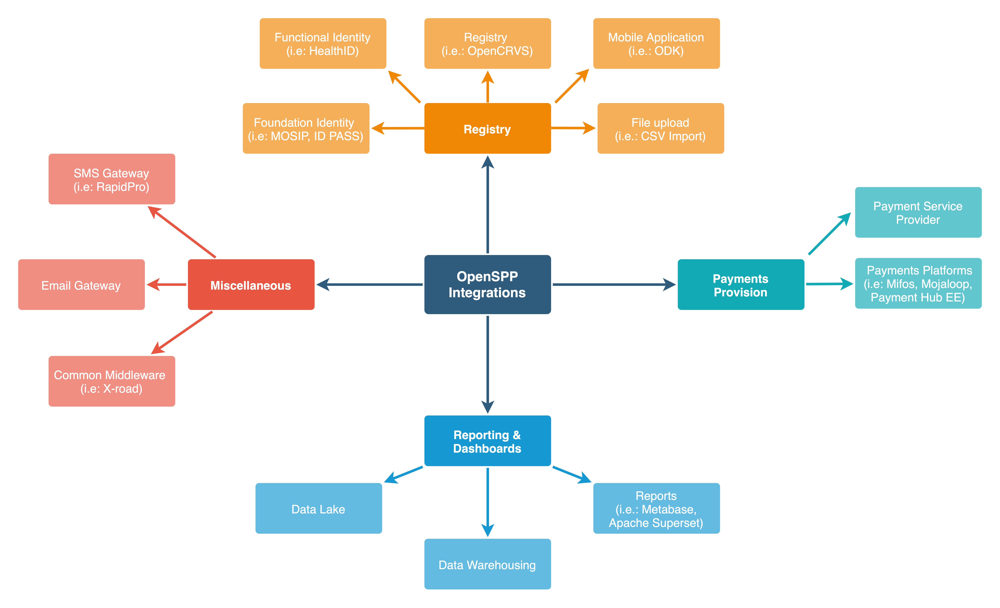

# Integrations

The following diagram depicts the integration mindmap of OpenSPP.

OpenSPP, as a digital public good, is designed with interoperability in mind. It recognizes the interconnected landscape of digital solutions and strives to ensure smooth, seamless interaction with many other systems as shown above. This commitment to broad compatibility is reflected in the system's ability to easily exchange data in widely recognized, non-proprietary formats and its support for API-based integrations leveraging XML-RPC and REST APIs. One of the key aspects that makes OpenSPP a versatile solution is its ability to exchange data with other systems. This is not just about sending and receiving data but doing so in a manner that is universally understood and broadly accessible. This high-level API-based integration support provides flexibility, allowing OpenSPP to fit neatly into various digital ecosystems without requiring extensive customization or proprietary interfaces.

## API Design

One cornerstone of OpenSPP's architecture is its API design, implementation, and governance approach. This page explains OpenSPP's key API-related capabilities and practices, evidencing its commitment to interoperability, security, and flexibility.

Starting with API design, OpenSPP implements Open API Specifications. Further, it adheres to the guidelines of G2P Connect, a comprehensive solution architectural blueprint, ensuring it can seamlessly interact with various systems involved in G2P delivery.

On the security front, OpenSPP lays considerable emphasis on ensuring the robustness of its APIs. The APIs are designed to be secure, incorporating various techniques to ward off potential threats. The goal is to reduce the amount of data shared via APIs based on the context, ensuring only necessary information is exchanged, thereby bolstering privacy protection.

API governance, which is the process of controlling, monitoring, and analyzing the usage and performance of APIs, is presently manually managed in OpenSPP. This rigorous manual process ensures that all APIs adhere to set standards and perform optimally. However, OpenSPP plans to enhance its API governance capabilities by deploying an API Manager product. This tool will automate many governance tasks, ensuring API compliance and performance.

OpenSPP is versatile regarding API communication, supporting various methods such as synchronous, asynchronous, and WebSocket API communications. This versatility enables OpenSPP to adapt its communication methods based on the specific needs of a given interaction, thereby ensuring optimal performance and user experience.

With respect to API versioning management, OpenSPP currently manages this aspect manually. This approach ensures backward compatibility, allowing older API versions to continue functioning alongside newer ones. It also fosters forward innovation, facilitating the development of new API features. However, to further streamline this process, OpenSPP plans to deploy an API Manager.

OpenSPP supports sandboxing for API testing, ensuring APIs perform optimally in real-world scenarios. Invitation-only access is provided to demo.openspp.org, allowing prospective integrations to be thoroughly tested and tweaked in a controlled environment before they are deployed in production.

[More Infomation](/technical_reference/external_api.html)
