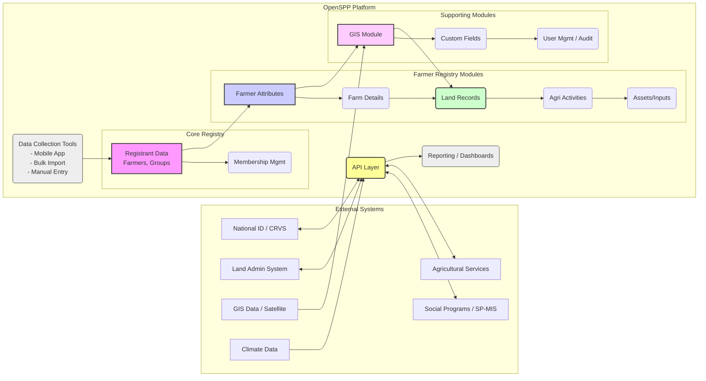

---
html_meta:
  "title": "Farmer Registry with OpenSPP"
  "description": "Overview of Farmer Registries, key principles, and how OpenSPP helps implement them, guiding users to relevant documentation features."
  "property=og:description": "Overview of Farmer Registries, key principles, and how OpenSPP helps implement them, guiding users to relevant documentation features."
  "property=og:title": "Farmer Registry with OpenSPP"
  "keywords": "OpenSPP, Farmer Registry, Agricultural Registry, Farm Management, Social Protection, GIS, Data Management, Interoperability"
---

# Farmer Registry with OpenSPP

This page explains how OpenSPP helps you implement effective Farmer Registries, outlining key principles and guiding you to relevant features. It serves as an entry point for users interested specifically in this use case.

### 1. Introduction: What is a Farmer Registry?

*   **General Definition:** A {term}`farmer registry` is a system designed to collect, store, and manage information about {term}`farm holdings` (the land and associated assets) and {term}`farmholders` (the individuals or groups managing the farms).
    
*   **Purpose:** The primary goals of implementing a farmer registry include supporting better planning and coordination for agricultural and {term}`social protection` programs, helping to address rural poverty and food insecurity, and aiding climate change adaptation efforts. Globally, {term}`agricultural censuses` and registries are common tools for administration and policy-making.
    
*   **OpenSPP's Role:** OpenSPP offers a flexible, modular, {term}`open-source software` platform that enables governments and organizations to build and manage robust Farmer Registries. A key strength is its ability to integrate these registries with other critical systems, such as social protection programs ({term}`SP-MIS`) and land administration databases.
    
*   **Further Reading:** For a deeper dive into the concept, see {doc}`/overview/concepts/farmer_registry`.
    

### 2. Key Principles & Components of a Farmer Registry (General)

Implementing a successful Farmer Registry involves considering several key components and principles:

*   **Core Data:** Typical data collected includes:
    
    *   _{term}`Farm Holder` Information:_ Demographics (age, gender), {term}`household` composition, socio-economic indicators.
        
    *   _{term}`Farm Holding` Details:_ Geographic location (GPS coordinates, boundaries), land parcel details, total size, ownership or tenure status (owned, rented, communal).
        
    *   _{term}`Agricultural Activities`:_ Types of crops grown, livestock raised, aquaculture practices.
        
    *   _{term}`Assets & Inputs`:_ Ownership of machinery, access to irrigation, use of fertilizers/pesticides.
        
*   **Essential Functions:** Common operational functions involve:
    
    *   _{term}`Data Collection & Intake`:_ Methods can range from comprehensive {term}`census sweep` approaches to {term}`on-demand` registration at local offices or via mobile applications.
        
    *   _{term}`Data Validation` & {term}`Data Verification`:_ Ensuring data accuracy through cross-checking with official documents (ID cards, land titles), other administrative systems, or community validation processes.
        
    *   _{term}`Dynamic Updates`:_ Recognizing that farm situations change, registries should allow for periodic updates or continuous registration to maintain data relevance.
        
    *   _{term}`Reporting & Analytics`:_ The ability to generate reports and analyze registry data is crucial for policy design and program monitoring.
        
*   **Integration Potential:** The value of a Farmer Registry is significantly enhanced when linked with other systems:
    
    *   _{term}`Social Protection Systems (SP-MIS)`:_ Enables targeted support, coordination of agricultural and social benefits.
        
    *   _{term}`National ID` / {term}`CRVS` Systems:_ Facilitates farmer verification and helps prevent duplicate registrations ({term}`deduplication`).
        
    *   _{term}`Land Administration Systems`:_ Provides clarity on land tenure and rights.
        
    *   _{term}`GIS` & Remote Sensing Data:_ Allows for spatial analysis, crop monitoring, and verification of land use.
        
    *   _{term}`Climate & Weather Data`:_ Supports early warning systems and climate adaptation planning.
        
*   **Key Considerations:** Implementers face challenges such as:
    
    *   _{term}`Data Privacy` & Security:_ Protecting sensitive {term}`personal data` and farm data.
        
    *   _{term}`Inclusivity`:_ Ensuring smallholders, tenants, landless farmers, and women farmers are adequately represented.
        
    *   _{term}`Data Quality`:_ Maintaining accuracy and completeness over time.
        
    *   _{term}`Cost & Sustainability`:_ Managing the resources required for setup and maintenance.
        

### 3. Implementing a Farmer Registry with OpenSPP

OpenSPP's modular architecture provides a strong foundation for building a Farmer Registry tailored to specific needs. Here’s how its features map to the general principles:

*   **Registry Core:** Modules like `g2p_registry_base`, `g2p_registry_individual`, `g2p_registry_group`, and `g2p_registry_membership` provide the tools to manage farmers (as individuals) and farmer groups/households/cooperatives (as groups), along with their relationships.
    
*   **Farmer Specifics:** The `spp_farmer_registry_base` module extends the core registry with data models specifically designed for farmer attributes, farm details, activities, assets, etc.
    
*   **Land Data:** The `spp_land_record` module allows detailed management of land parcels associated with farms, while `spp_area_gis` enables mapping and spatial analysis of these records.
    
*   **Customization:** `spp_custom_field` allows administrators to easily add country- or program-specific fields to capture unique data requirements without needing code changes.
    
*   **Data Collection:** OpenSPP supports various data intake methods, including bulk import from spreadsheets (`.xlsx`, `.csv`), manual entry, and potential integration with mobile data collection tools like CommCare.
    
*   **Interoperability:** The {term}`API` layer (`spp_api`, `spp_api_records`) enables secure data exchange with external systems (National ID, Land Admin, SP-MIS, etc.).
    
*   **Detailed Features:** Explore features relevant to Farmer Registries in {doc}`/overview/features/registry_data_management`.
    
*   **Relevant Modules:** Find detailed documentation for key modules in the {doc}`/reference/modules/index`.
    

### 4. Getting Started (Links)

*   **Installation:** Start with the general OpenSPP installation guide: {doc}`/getting_started/index`.
    
*   **Initial Setup:**
    
    *   Setting up the Farmer Registry
        
    *   Configuring Areas
        
    *   Importing Initial Data: {doc}`/user_guide/registry_management/import_export_data`
        

### 5. Common Tasks & User Guides (Links)

*   **Registry Management:**
    
    *   Registering Farmers/Groups: {doc}`/user_guide/registry_management/register_individual`
        
    *   Managing Group Memberships
        
    *   Importing/Exporting Data: {doc}`/user_guide/registry_management/import_export_data`
        
*   **Land & GIS:**
    
    *   Managing Land Records: `[TODO: Link to How-to Guide for Managing Land Records - Needs Content?]`
        
    *   Using Map Features: `[TODO: Link to How-to Guide for Using Map Features - Needs Content?]`
        
*   **Administration:**
    
    *   Managing Custom Fields: `[TODO: Link to How-to Guide for Managing Custom Fields]`
        
    *   User Access Control: {doc}`/user_guide/administration/user_access`.
        

### 6. Development & Customization (Links)

*   Customizing Registry Fields/Indicators: {doc}`/developer_guide/customization/customizing_fields`.
    
*   Integrating with GIS: `[TODO: Link to Developer Guide for GIS Integration]`
    
*   Module Development Overview: {doc}`/developer_guide/module_development`.
    
*   Relevant Modules: See {doc}`/reference/modules/index` (especially `spp_farmer_registry_base`, `spp_land_record`, `spp_area_gis`).
    
*   API Usage: {doc}`/developer_guide/api_usage/index`.
    

### 7. Diagram: OpenSPP Farmer Registry Ecosystem

A Farmer Registry built with OpenSPP typically interacts with various internal modules and external systems:

_Caption:_ Functional overview of OpenSPP Farmer Registry components and integrations.

### 8. Further Reading & See Also

*   Detailed Conceptual Explanation: {doc}`/overview/concepts/farmer_registry`.
    
*   Other Use Cases: {doc}`/overview/use_cases/index`.
    
*   Core Concepts Overview: {doc}`/overview/concepts/index`.
    
*   `[TODO: Add optional links to relevant external standards or resources, e.g.,