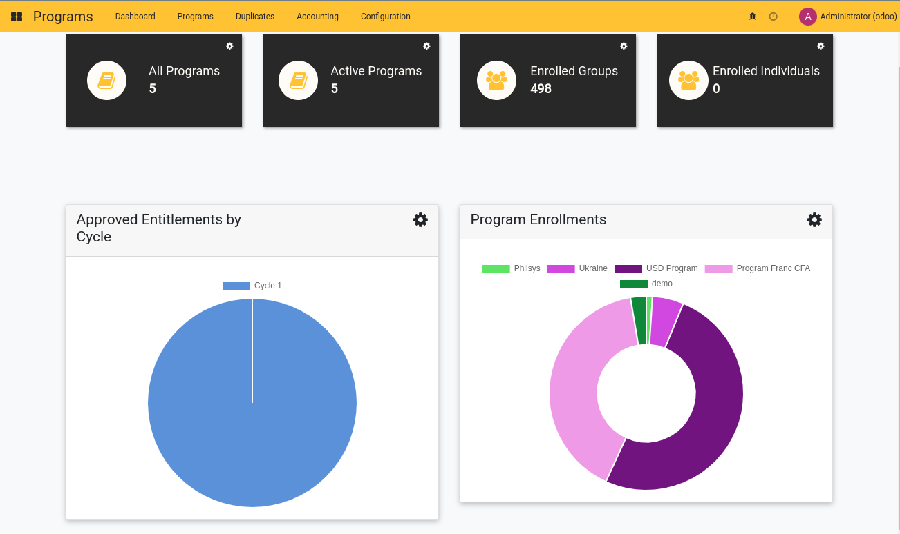

---
openspp:
  doc_status: unverified
---

# Dashboards

## Programs dashboard

Based on the foundation of Odoo and OpenG2P, OpenSPP facilitates rich data visualizations and dynamic reporting capabilities. This documentation delves into the system's approach towards data warehousing, reporting, and visualization.

Firstly, OpenSPP's architecture is designed with a key emphasis on configurability. This approach is particularly evident in its support for data warehousing. OpenSPP can be easily connected to advanced reporting platforms such as Apache Superset or Tableau. These powerful data visualization tools offer comprehensive capabilities for interactive data exploration, from basic charting to complex data processing. By allowing seamless integrations with such platforms, OpenSPP ensures that its data warehousing aligns with the organization's business intelligence requirements.

In addition to its robust data warehousing capabilities, OpenSPP offers dynamic reporting functionalities. Users can access real-time, web-based querying and dashboards through integrated platforms like Apache Superset or Metabase. These tools allow users to explore data on their terms, constructing personalized dashboards to capture essential insights. The integration of dynamic reporting capabilities within OpenSPP ensures that users can not only access their data but can also manipulate and explore it to discover valuable trends and patterns.

A pivotal aspect of OpenSPP's design ethos revolves around effective data visualization. OpenSPP supports data visualization through Apache Superset or Metabase, but it is the system's commitment to {term}`data privacy` that sets it apart. Before any visualization, OpenSPP ensures the anonymization of data, thereby upholding the privacy of the users while facilitating data-driven decision-making. Anonymization, along with the use of dynamic and interactive visualizations, allows users to gain actionable insights without compromising on privacy.

Furthermore, OpenSPP adheres to best practices in data visualization, such as using appropriate graph types for different data sets, providing proper context for data, and ensuring readability and accessibility. By following these guidelines, OpenSPP ensures that its visualizations are not only insightful but also ethical, effective, and user-friendly.
