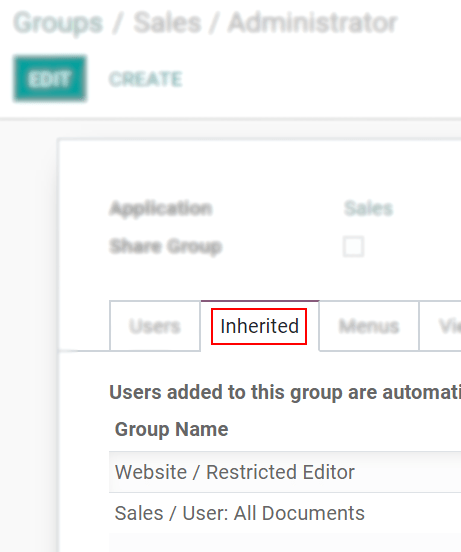

# Access management

## Introduction

User Access Management is a key component of OpenSPP that enables program administrators to control and manage user access to the platform's features and data. With OpenSPP's role-based access control system, administrators can define different levels of access for individual users or groups, ensuring that only authorized users have access to specific data and features.

There are different dimensions to access rights in OpenSPP, including access to specific app features and access to specific data or subsets of data (for example, data related to a specific location). By defining these access rights, administrators can make sure that users are able to perform their roles and responsibilities effectively while minimizing the risk of data breaches or unauthorized access.

This user guide provides step-by-step instructions on how to manage user access in OpenSPP, including how to create and manage user accounts, assign roles and permissions, and customize user access rights. By the end of this guide, you should have a solid understanding of how to effectively manage user access in OpenSPP to make sure the security and integrity of your {term}`social protection` program data.

## User management

OpenSPP considers someone who has app access to perform daily tasks as a **user**. You can add as many users as required and enforce rules to limit their access to specific information. Adding or modifying user accounts and access rights is possible at any time.

(users/add-individual)=

### Add individual users

Go to **Settings → Manage Users** and click **Create**.

```{figure} access_management/manage-users.png
:align: center
:height: 280
:alt: View of the settings page emphasizing the manage users field in OpenSPP
```

- Fill in the form with the necessary information. Under the tab {ref}`access_rights` choose the group within each app the user can have access to.
- The list displays applications based on the installed applications in the database.

```{figure} access_management/new_user.png
:align: center
:alt: View of a user’s form emphasizing the access rights tab in OpenSPP
```

After the user edits the page and clicks **Save**, the system automatically sends an invitation email to the user, which they must click to accept. This creates their login.

```{figure} access_management/invitation-email.png
:align: center
:alt: View of a user’s form with a notification that the invitation email has been sent in OpenSPP
```

Activating the {ref}`developer-mode` enables users to select **User Types**.

```{figure} access_management/user-type.png
:align: center
:height: 300
:alt: View of a user’s form in developer mode emphasizing the user type field in OpenSPP
```

The **Portal** and **Public** options don't allow you to choose access rights. Members have specific ones (such as record rules and restricted menus) and usually don't belong to the usual OpenSPP groups.

(access-rights)=

## Access rights

Activate the {ref}`developer-mode`, then go to **Settings -> Users & Companies -> Groups**.

### Groups

The Access Rights menu doesn't display details of the rules and inheritances of a group when the user is selecting the groups they can access. This is where the Groups menu comes into play. Users create groups to define rules to models within an app.
The current users are listed under Users. The ones with administrative rights appear in black.


_Inherited_ means that users added to this app group are automatically added to the following ones. In the example below, users who have access to the group _Administrator_ of _Sales_ also have access to _Website/Restricted Editor_ and _Sales/User: All Documents_.



```{note}
Remember to always test the settings being changed in order to ensure that they are being applied to the needed and right users.
```

The _Menus_ tab is where you define which menus (models) the user can have access to.


The first level of rights is the _Access Rights_ rules. The _Access Rights_ field comprises of the object name, which is a technical name assigned to a model. Enable the following options for each model:

- _Read_: The user can only view the values of that object.
- _Write_: The user can edit the values of that object.
- _Create_: The user can create values for that object.
- _Delete_: The user can delete the values of that object.


You can form _Record Rules_ as a second layer of editing and visibility rules. They overwrite, or refine, the _Access Rights_.
The user writes a record rule using a _Domain_. Domains are conditions used to filter or searching data. Therefore, a domain expression is a list of conditions. For each rule, choose among the following options: _Read_, _Write_, _Create_ and _Delete_ values.


```{note}
Making changes in access rights can have a big impact on the database. For this reason, we recommend you to contact your OpenSPP Business Analyst or our Support Team, unless you have knowledge about Domains in OpenSPP.
```

```{note}
This page is adapted from the Odoo documentation.
```

### OpenSPP groups

```{note}
TODO
```
