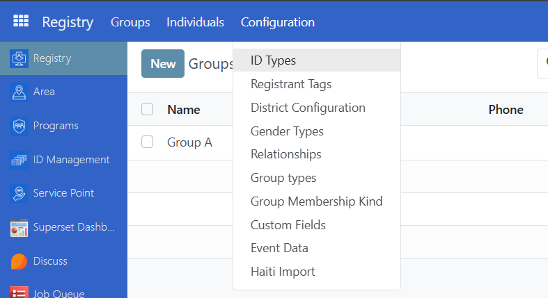
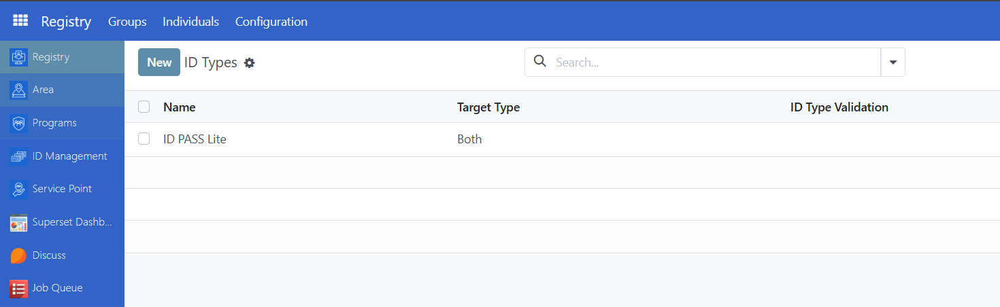
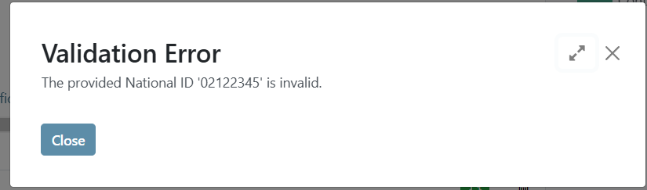
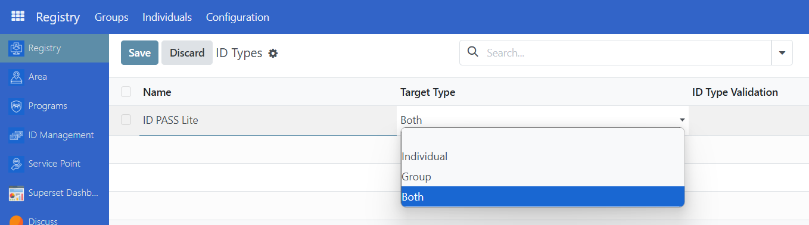
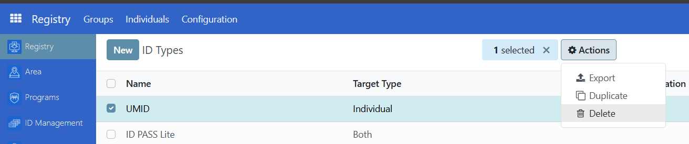
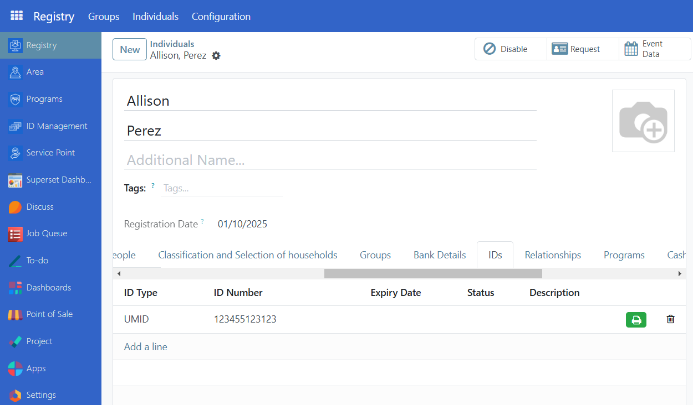
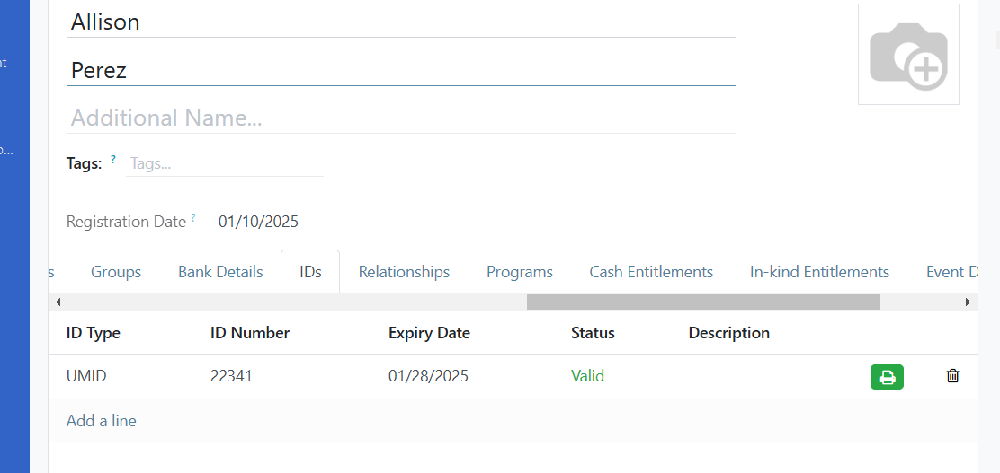
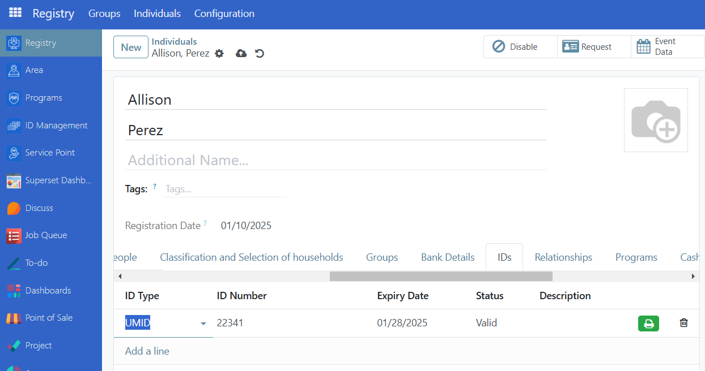
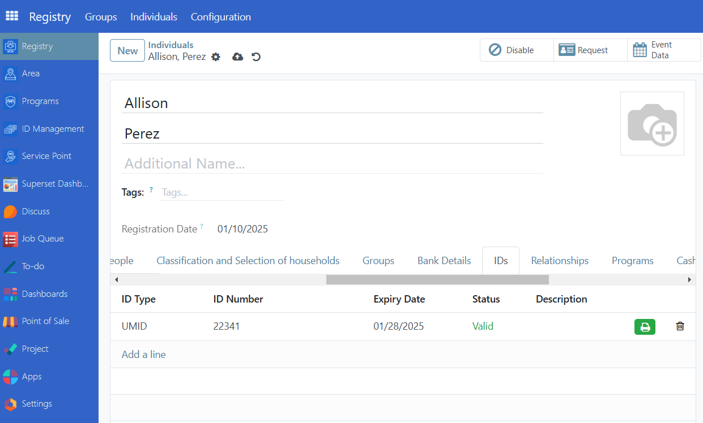

---
openspp:
  doc_status: unverified
  products: [core]
---

# Configure ID and generate QR code

## Introduction

In this Tutorial you will learn how to configure the ID of a registrant and how to print its QR code.

## Prerequisites

To configure ID and generate QR code, you need to:

- Have existing individual records in your registry, either by creating records manually or importing records into OpenSPP.
- Have an access role as an **Operations Admin** or **Administrator**. Learn more about this in the guide [Administrating role-based access](https://docs.openspp.org/user_guide/getting_started/administrating_role_based_access.html)
- Make sure that the module **OpenSPP POS: ID Redemption** is installed and activated.

## Objective

By the end of this tutorial you will be able to configure ID types, manage IDs of Individuals and Groups, generate QR code of the IDs and be able to print it.

## Process

### Configure ID type

To be able to create IDs, you must first configure the ID types. Login to OpenSPP as administrator, click on the square tile icon beside **Registry**, then click on **Registry** from the menu.

Click the button **Configuration** in the top menu bar and select **ID Type**.

This will display the table view of all existing IDs where you can either View, Create, Edit or Delete IDs.

#### Create ID type

To create a new ID type, click on **New**.

**Name** \- (Required) The name of the ID type  
**Target Type** \- (Required) Define whether this ID is used for individuals or groups only, or both.  
**ID Type Validation** \- (Optional) Define a required prefix for the ID. For example, if inputting ‘022’ , then all IDs must start with 022, otherwise an error message will appear.

#### Edit ID type

To Edit an existing ID Type, redirect back to ID type table view by clicking **Configuration** and selecting **ID types**. Click on the field you wish to modify and click **Save** to apply the changes.

#### Delete ID type

To delete an ID type, select the ID type by clicking the checkbox and click on the **Actions** button. Click on **Delete**. Note that an ID type can only be removed if it is not in use.

### Manage ID of a Group or Individual

Once the ID types are successfully configured you can add it to an Individual or Group by going to the **Registry**. Navigate to the desired Individual/Group and click on the **ID** tab.

**ID type** \- Displays the type of ID.  
**ID Number** \- Displays the value of the ID  
**Expiry Date** \- Indicates when the ID will expire  
**Status** \- Indicates if the ID is valid or invalid  
**Description** \- Description of the ID.

#### Add ID

To add an ID, click on **Add a line** under the ID tab and select the type of ID you desire to add.

Alternatively, you can also add an ID by **import to update an already existing individual or group** along with its new ID details, Read [Import registrant data](https://docs.openspp.org/tutorial/user_guides/import_registrant_data.html) to learn more. You would need the following column headers for the ID data.  
**reg_ids/id_type** \- ID pass, UMID etc.. make sure that the id type you will import is already defined in OpenSPP.  
**reg_ids/status** \- Valid or Invalid.  
**reg_ids/value** \- 11223412394, etc..

#### Edit ID

To edit an ID, click on the field to edit it. Once done click the **Save** icon beside the Gear icon. You may also click on the **Counterclockwise arrow** icon to undo any changes.

#### Delete ID

To delete an ID, click on the trashbin icon that corresponds to the ID you wish to delete.

### Generate QR code

To generate QR code, make sure **OpenSPP POS: ID Redemption** is installed and activated on your OpenSPP instance. When installed, you should be able to see a **green printer button** beside the ID values from the ID tab of a Group or Individual.

Once you click the green printer button, a download of a pdf will automatically start which contains the ID information and QR code.

