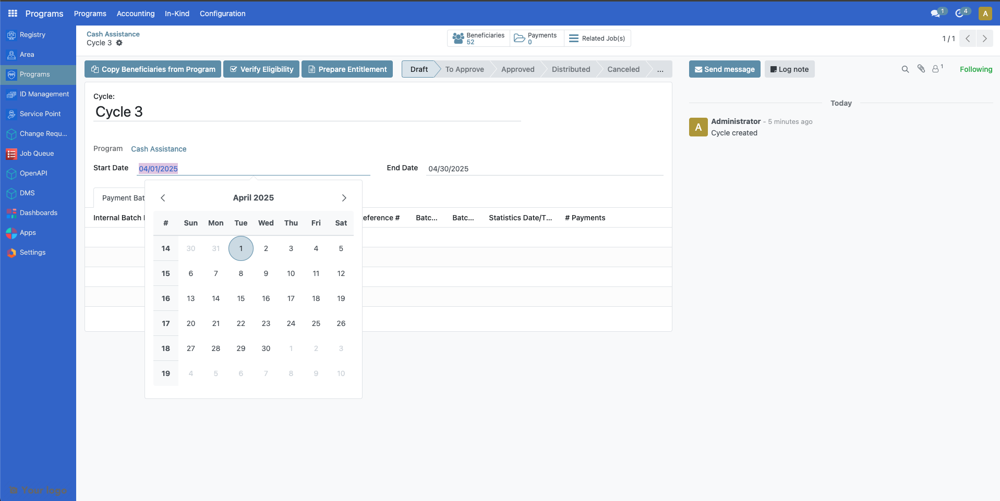
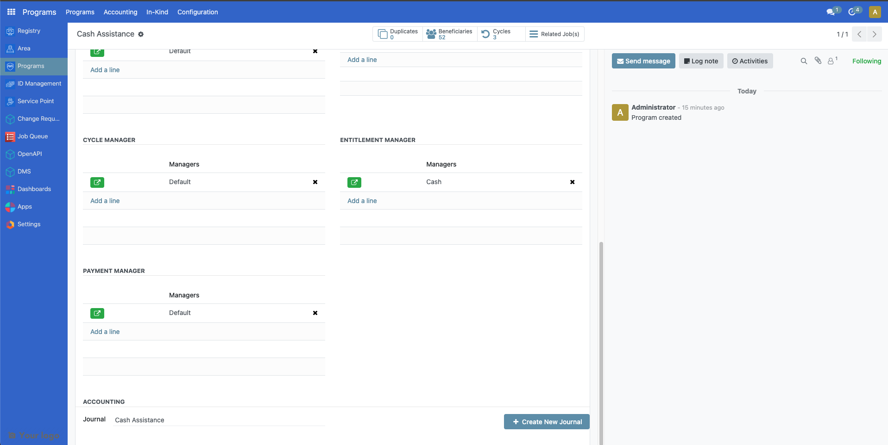
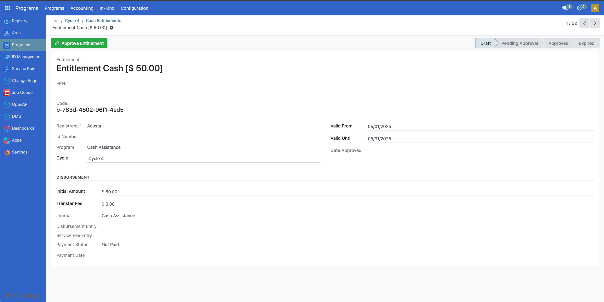
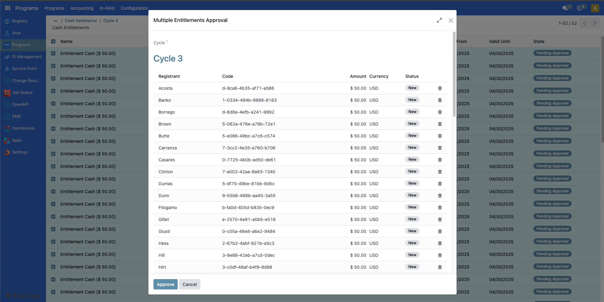

---
openspp:
  doc_status: unverified
  products: [core]
---

# Create a program cycle & prepare entitlements

## Introduction

In this tutorial, you will learn the process of configuring, creating, and approving cycles and preparing entitlements in OpenSPP.

## Prerequisites

To create a cycle and prepare entitlements in OpenSPP, you need to:

- Ensure your program is set and ready. Learn more about this in the documentation [Create a social protection program](https://docs.openspp.org/tutorial/user_guides/create_social_protection_program.html).
- Enroll beneficiaries in the program. Learn more about this in the documentation [Enroll beneficiaries](https://docs.openspp.org/tutorial/user_guides/enroll_beneficiaries.html).
- Allocate funds to the program. Learn more about this in the documentation [Allocate funds](https://docs.openspp.org/tutorial/user_guides/allocate_funds.html).

## Objective

By the end of this tutorial, you will have gained a deeper understanding of configuring cycles, either new or existing ones. You will also have gained familiarity with creating and handling entitlements as well as management of funds to allocate to existing programs. Ensuring correct setup upon cycle approval and entitlements is essential for a precise distribution of assistance.

## Process

To begin configuring cycles and preparing entitlements in OpenSPP, first log into your OpenSPP account, then go to Programs.

If any modifications are required to either the cycle or entitlement configuration of the program, these should be done prior to approving a cycle. This is because once a cycle is approved, configuration changes you applied to the program will not take effect unto the cycles that you already approved. However, if you are already satisfied with the current program configurations, you may proceed to [Creating Cycle](#creating-cycle).

### Editing program configuration

Configuring a cycle is done as a part of creating a program, as described in the documentation Configure the Cycle Manager; however, it is possible to modify an existing program’s cycle configuration.

Click on a program and navigate to the **Configuration** tab.

### Eligibility managers

You can edit the eligibility manager by clicking on the green icon.

On the popup that appears, click on the **Admin Area** dropdown field to select the target area of the cycle. You may also narrow down your criteria by clicking on **New Rule**.

The number indicated in **record(s)** represents the number of beneficiaries that qualify your criteria. After configuring, click on the **Save** button to apply changes.

The changes made will only be applied to existing cycles that are in **Draft** and **To Approve** state, it will not be applied to cycles that fall under **Ended** or **Approved** state.

To apply the latest eligibility changes for the cycles under **To Approve** state, it must first be set back to **Draft** state. Click on the green button beside the cycle, then click on **Reset to Draft** button. This resets the cycle back to **Draft** state.

To apply the latest eligibility changes for the cycles under **Draft** state, click on the green button beside the cycle then click on **Verify Eligibility** button.

The **Beneficiaries** count should be updated accordingly.

### Cycle manager

You can edit the cycle manager by clicking on the green icon.

A popup is displayed. Make the necessary changes and then click **Save**.

See **Configure the cycle manager** section of the document [Create a social protection program](https://docs.openspp.org/tutorial/user_guides/create_social_protection_program.html) for more information on the displayed fields.

Please note that changes you made on **Auto-Approve entitlements** and **Approver Group** are only applicable to **New**, **Draft** or **To Approve** cycles, while changes made for **Recurrence** only apply to the **New** cycles created thereafter. If you wish to edit the current recurrence of an already existing cycle, it must first be on **Draft** state. Click on the green button beside the cycle, then on the popup menu, click on the **Start date** and **End date** of a program to modify. Click on **Save** to apply changes.

### Entitlement manager

You can edit the entitlement manager by clicking on the green icon.

A popup should appear. Make the necessary changes and then click **Save**.

See Tutorial - [Configure cash entitlements](https://docs.openspp.org/tutorial/user_guides/configure_cash_entitlements.html) to learn more on configuring cash entitlements.

Please note that changes you made into the following fields are only applied to newly prepared entitlements.

### Creating Cycle

A cycle can only be created under a program. If you do not have any existing programs yet, you may refer to this document [Create a social protection program](https://docs.openspp.org/tutorial/user_guides/create_social_protection_program.html).

Select an existing program from the program table list. You will be directed to the screen below. Click **Create New Cycle** to generate a cycle for the program.

Please note that during the creation of the program, if **One-time Distribution** was enabled, a single cycle will be automatically generated upon creation of the program and this program will not have any **Create New Cycle** button, as this program is meant to run with one cycle only.

Once a cycle is created, click on the green button beside it to open it. You may click on the **Edit** button to change **Cycle name**, **Start date** and **End Date** fields.

If there were beneficiaries added into the program after this cycle was created, you may click on **Copy Beneficiaries from Program** to sync beneficiaries into this cycle. The **Verify Eligibility** button is to check if beneficiaries enrolled would still qualify the criteria set for this cycle.

### Preparing entitlements

It is important to prepare entitlements for a cycle before a cycle is approved, as you will not be able to prepare entitlements anymore once the cycle has been approved.

Select the program you wish to act upon and click the green icon beside the cycle you wish to generate entitlements for.

Click on the **Prepare Entitlement** button. Entitlements will be generated.

The number count on top of **Entitlements** indicates the amount of entitlements prepared for the enrolled beneficiaries.

**Note**: A yellow warning message appears if processes are still running. If displayed, click **Refresh** within the yellow warning message. Repeat every now and then until the yellow warning message disappears. It is important to let the warning message resolve before proceeding into the next step as it might otherwise cause data discrepancy.

To verify the prepared entitlements, Click on **Entitlements** beside **Beneficiaries** to display a table of entitlements under **Draft** state.

Click further on an entitlement to show more details.

### Approving a cycle

After entitlements are prepared, the next step is to approve the cycle. Please note that only the assigned user with correct access rights is able to approve cycles for the program. This is set during the creation of the program, however it can also be changed in the **Approver group** dropdown within the Cycle manager of the program configuration.

Login to OpenSPP with a user role to approve the cycle. After clicking on the program, select a cycle to approve by clicking on the green button beside it, click on **To Approve** button.

**Note:** If a yellow warning message displays, click on the refresh button within the yellow warning message until it resolves.

Click on the **Approve** button to approve the cycle.

Please note that enabling Auto-approve entitlements in the program’s [Cycle manager](#cycle-manager) configuration auto approves the entitlements upon approving the cycle. Therefore, you may skip Approving entitlements if this is enabled.

If entitlements were not auto approved successfully. It could be that the [Allocate funds](https://docs.openspp.org/tutorial/user_guides/allocate_funds.html) for the program are insufficient or missing. See the documentation Allocate funds for more details.

### Approving entitlements

After approving a cycle, the next step is to approve the entitlements. Please note that only the assigned user with correct access rights is able to approve entitlements for the cycle. This is set during the creation of the program, however it can also be changed in the **Entitlement Validation Group** dropdown within the [Entitlement manager](#entitlement-manager) of the program configuration.

Login to OpenSPP with correct user role to approve the entitlements. After clicking on the program, select a cycle by clicking on the green button beside it and click on **Approve entitlement**. A yellow warning message appears if processes are still running. Make sure to click **Refresh** within the yellow warning message. Repeat every now and then until the yellow warning message disappears. It is important to let the warning message resolve before proceeding into the next step as it might otherwise cause data discrepancy.

Note: If a yellow warning message resolves, you may click on **Entitlements** beside **Beneficiaries** to verify its status.

You may also individually approve them by clicking on **Entitlements** and clicking on the checkboxes beside the entitlements, then click on the **Action** button and click **Approve**.

You could also approve them all manually at once by clicking the checkbox beside **Name** then click on **Select all**. Click on the **Action** button then click **Approve**.

A popup should appear, click on **Approve** to complete the approval of entitlements.

