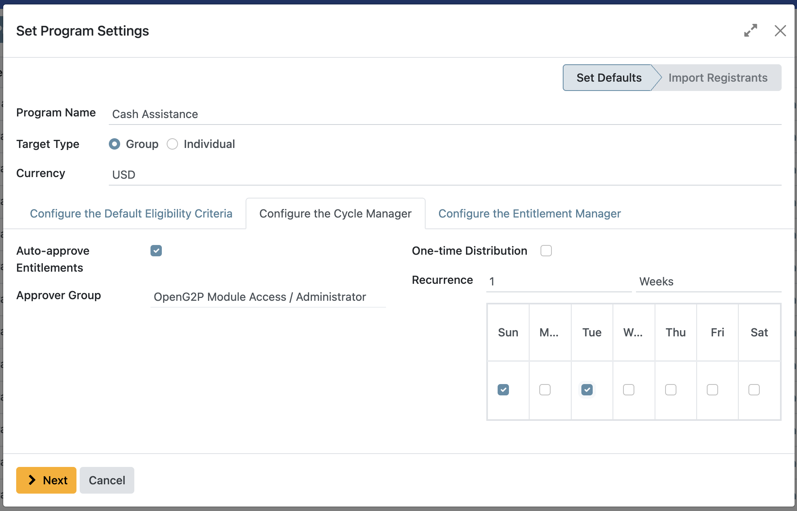

# Create a social protection program

## Introduction

In this tutorial, you will learn the process of creating a social protection program using the OpenSPP platform to meet the specific needs and objectives of the program.

## Prerequisites

To create a social protection program using OpenSPP, you need to:

- Have a clear understanding of the goals and objectives of your social protection program.
- Prepare the details of your program in advance. This includes deciding on the program name, the target beneficiary types, and the specific benefits that will be offered.
- Have an access role as a system administrator or global program manager to perform tasks in this tutorial. Learn more about this in the documentation [Administrating role-based access](https://docs.openspp.org/tutorial/user_guides/administrating_role_based_access.html)
- Have existing groups or individuals in your registry either through manual creation or through import. Learn more about this in the documentation [Import registrant data](https://docs.openspp.org/tutorial/user_guides/import_registrant_data.html)

## Objective

By the end of this tutorial, you will have successfully set up and created social protection programs within the OpenSPP platform.

## Process

### Creating a social protection program

The creation process consists of logging in to OpenSPP with a user account that has the system admin or global program manager role. Also make sure to verify that the **Registry** contains existing groups or individuals. After verifying, navigate to the programs by clicking on the four-square icon in the top-left corner, click Programs, and then click on **Create Program**.

### Set Program Settings

To set up the program, first enter the **Program Name** which will serve as the identifier of the program. Choose the **Target Type** for the program, which can be either **Group** or **Individual**. When the **Target Type** is configured as a **Group**, entitlement generation is for groups. However, selecting an **Individual** as the target type restricts entitlement generation to individual criteria. Next, specify the **Currency** type by selecting your preferred option from the **Currency** section. Once done, navigate to the other configuration tabs to set up the **Default Eligibility Criteria**, the **Cycle Manager**, and the **Entitlement Manager**.

### Configure the Default Eligibility Criteria

The **Default Eligibility Criteria** feature determines which registrants are eligible to participate in a program. If no eligibility criteria are configured, then all registrants in the database are considered eligible by default. This documentation will describe the **Default** option.

First, you need to specify the **Admin Area** for the targeted individuals.

Then, under Filter, click on **New Rule**. Proceed by selecting the appropriate data from the options provided, such as family status (e.g., families with children), gender, or income bracket. Following this, establish a specific condition for the data selection—options include criteria like greater than, equal to, or contains. Subsequently, input the necessary criteria to define the filter parameters. by selecting either **All** or **Any** to determine if data points must satisfy all specified conditions or any one of them, respectively. The filters applied depend on the target type, as some filters apply to groups while others apply to individuals only.

### Configure the Cycle Manager

The configuration of the **Cycle Manager** feature involves defining several fields, such as the auto-approval of entitlements, the selection of approver groups, one-time distribution, and recurrence of distribution through a specific number of days, weeks, months, or years. These settings ensure that the entitlement process aligns with the program's specifications and requirements. To set up the cycle, you need to define the following fields:

- **Auto-approve Entitlements**. Choosing this feature enables the auto-approval of entitlements, meaning that entitlements will be automatically approved upon generation.
- **Approver Group**. Selects which user account role should approve the cycle.
- **One-time Distribution**. Choosing this feature creates the cycle as a one-time distribution, which can be used for one-time grants or support. The use of this feature disables the recurrence field.
- **Recurrence**. Specifies the length of duration of each cycle, whether it be days, weeks, months or by year.
- **Day of Month**. When Selecting **Months** as recurrence, this field defines when each cycle should start, either by a specific date in a month(e.g 3rd of each month) or by a specific day of the week(every first monday etc..)

- **Day of the week**. When selecting weekly recurrence, it is possible to select which day(s) the distribution should be made on.

### Configure the Entitlement Manager

The **Entitlement Manager** defines what should be distributed to the beneficiaries covered by the program and should match the program’s needs to achieve the program’s goals. The **Entitlement Manager** supports multiple forms of entitlement, which are explained in separate documentation:

- **Cash:** designated for cash disbursements. The system automatically generates cash benefits for individuals identified as qualified beneficiaries. Read more in the documentation Configure cash entitlements(Yet to be published).
- **In-kind:** designated for the distribution of goods, such as food and various materials. Read more in the documentation Configure in-kind entitlements(Yet to be published).
- **Basket Entitlements:** similar to in-kind entitlements, this is for the distribution of a set of products or materials. Unlike individual distributions, these are assembled into one basket rather than listed as separate items. Read more in the documentation Configure basket entitlements(Yet to be published).

### Import Registrants

The **Import Registrants** feature allows you to import registrant records into the new program as part of the program creation and is triggered by selecting **Yes** in the final step. If the option **No** is selected, this import needs to be done afterwards. Learn more about this in the documentation [Enroll beneficiaries](https://docs.openspp.org/tutorial/user_guides/enroll_beneficiaries.html).

After choosing whether to import the registrants as part of the program creation or not, click **Create**.

The program is now created and can be edited anytime.

