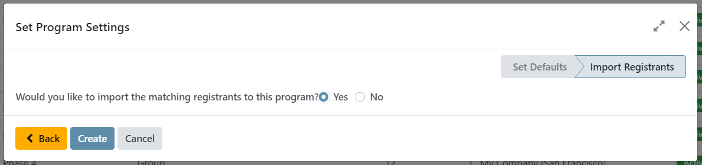
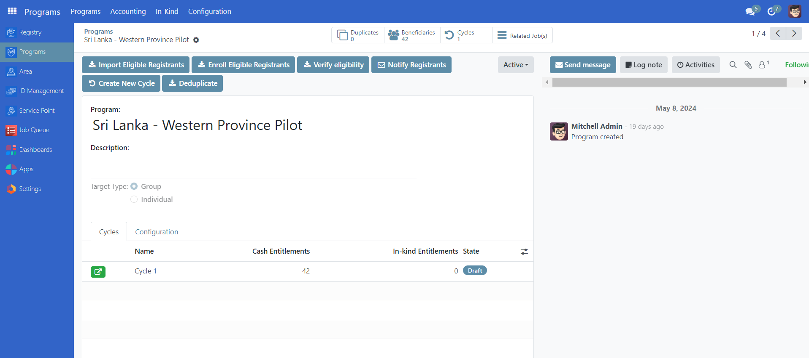
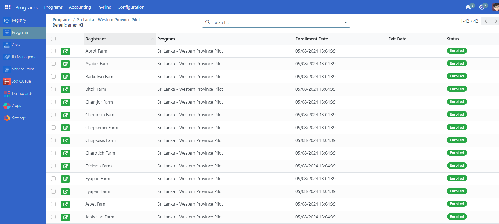
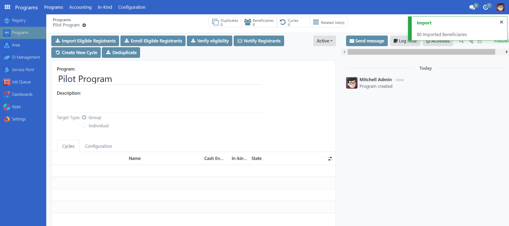
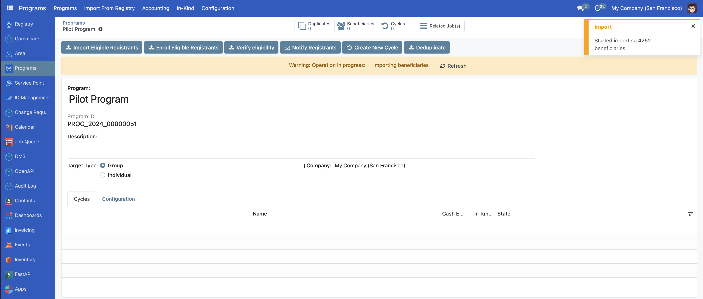
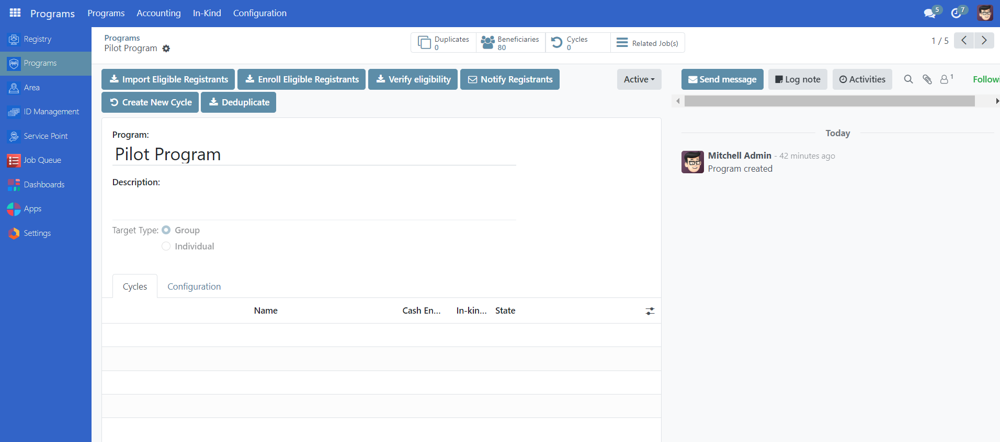

# Enroll beneficiaries

## Introduction

In this tutorial, you will learn the process of enrolling beneficiaries in OpenSPP. Accurate beneficiary enrollment ensures that the right individuals or groups receive the intended benefits.

## Prerequisites

To enroll beneficiaries in OpenSPP, you need an existing program. Learn more about how to configure a program in the documentation Create a social protection program.

## Objective

This tutorial instructs users on how to enroll beneficiaries into a program in OpenSPP. By following these procedures, users will be able to import and enroll both individual and group beneficiaries, ensuring they are registered for the necessary support and benefits. Upon completion, users will have successfully added eligible beneficiaries to their respective social protection programs.

## Process

Efficient enrollment is important for the success of social protection programs in OpenSPP. Depending on the target type, the enrollment is done for groups or individuals. Both enrollments can be done either as part of the program setup or after configuring the program. The process of creating a social protection program is described in the documentation Create a social protection program.

## Beneficiary Import and Enrollment

Upon finalizing the creation of the program, the process progresses through two sequential stages, regardless of whether the program supports individual or group beneficiaries:

- Import beneficiaries. This step involves the integration of beneficiaries who are eligible to receive support from a social protection program. Which beneficiaries to import into the program are defined by the filter in the eligibility criteria.
- Enroll beneficiaries. After the beneficiaries have been imported into the system, the next step is to enroll them in the program. Enrollment involves verifying the eligibility of each beneficiary based on the program's criteria, such as income level, age, or other factors. Once a beneficiary is enrolled in the program, they are entitled to receive the benefits or services provided by the program

Depending on the choices made in the program setup, there are two different ways to perform these steps, both of them are described below.

## Import and enrollment as part of program setup

If the option **Yes** has been selected at the final step of the program setup, the import and enrollment will be carried out as part of the program creation.

Once completed, the number of beneficiaries imported and enrolled is displayed on the toolbar.

Click the **Beneficiaries** icon to view the imported and enrolled beneficiaries in the table view.

This confirms that the beneficiaries are imported and enrolled.

## Import and enrolment after program creation

If the option **No** has been selected as the final step of the program setup, this needs to be done as a separate action prior to proceeding.

This action consists of two steps, first the import of beneficiaries into the program, and then the enrollment of the previously imported beneficiaries into the program.

Take note that, given the significant number of beneficiaries for importation, it's important to make sure that the import process has been completed before initiating any enrollments to avoid complications.

Select **Import Eligible Registrants**. In the case of less than 1000 beneficiaries, a green pop-up will appear on the right side of the screen, indicating that the import process is complete and beneficiaries have already imported. The time it takes to import the beneficiaries will depend on the number of beneficiaries eligible for the program, and it is vital to allow the import to complete before proceeding.

In the case of more than 1000 beneficiaries, a yellow notification will display informing that the page needs to be refreshed to see the status of the import.

Once the import has been confirmed to be completed, either by seeing the green notification popup or, in the case of more than 1000 beneficiaries, by refreshing the page until the yellow notification popup no longer appears, it is time to enroll the beneficiaries.

Click the **Enroll Eligible Registrants** icon. A yellow pop-up will appear on the right side of the screen, indicating the process of enrollment. Following the completion of enrollment for all participants, refresh the page and if the warning message disappears, this indicates that the import is complete. You should also check the beneficiary page to verify that the registrants are there.

The number of beneficiaries imported and enrolled is displayed on the **Beneficiaries** icon.

Click the **Beneficiaries** icon to view the imported and enrolled beneficiaries in the table view.

