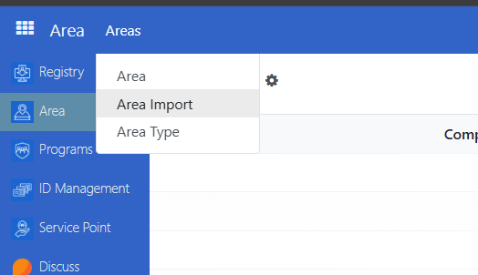
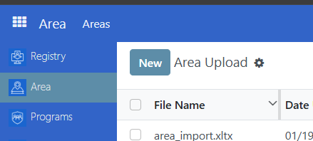
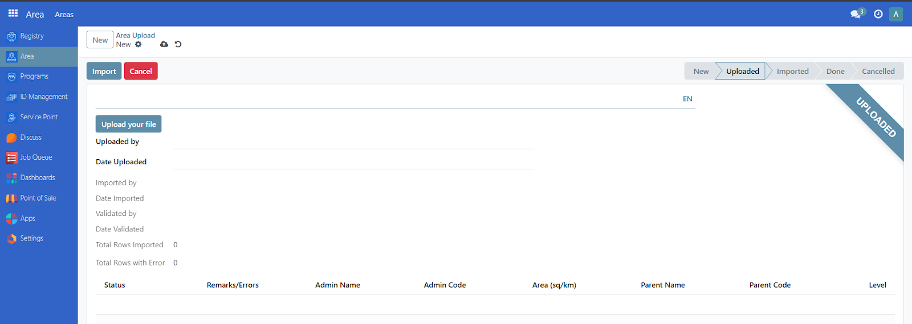
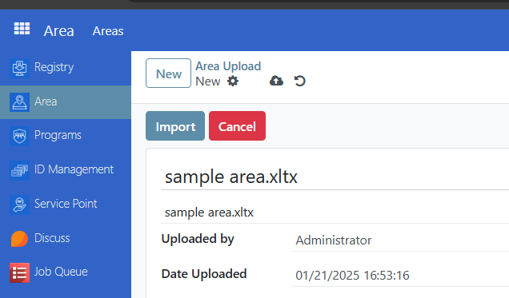
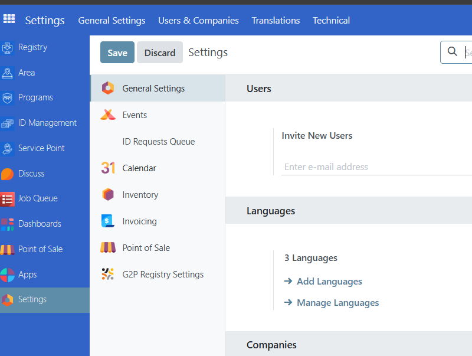
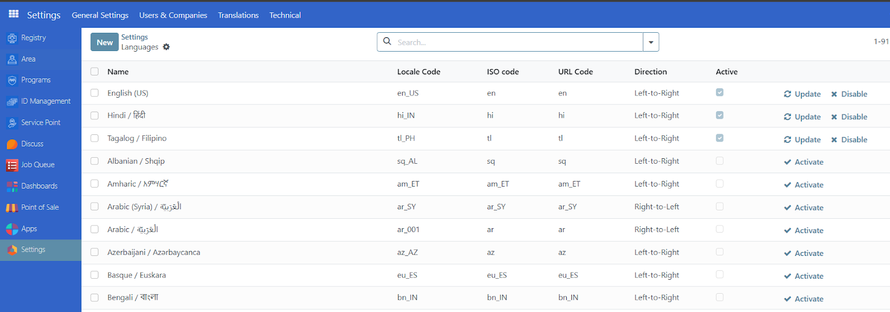

# Import area

## Introduction

In this tutorial, you will learn how to prepare and import area data into OpenSPP using an Excel workbook.

## Prerequisites

To be able to successfully import area data into OpenSPP, the following is required:

- Authorized administrative access to the OpenSPP platform.
- As OpenSPP supports multiple languages for an area name, language support for the languages you want to use must be configured.
- A spreadsheet software that can export data as an Excel workbook.

## Objective

By the end of this tutorial, you should understand the purpose and process of preparing the data required to import area data into OpenSPP. You will learn how OpenSPP’s area structure can be used to represent the hierarchical relationship between the areas of your operations.

## Process

To access the area import feature, you must log in to OpenSPP with a user account with the **System Admin** role since the functionality is not included for other roles. Learn how to set up roles and accounts in [Administrating role-based access](https://docs.openspp.org/tutorial/user_guides/administrating_role_based_access.html).

### Understand the Data Structure

The area data is structured hierarchically, with each sheet representing an **administrative level**:

- **Level 0:** Top-level areas (e.g., Countries).
- **Level 1 and below:** Subdivisions (e.g., Provinces, States).

Each sheet must follow specific rules regarding column headers and data.

### Create the Excel File/Workbook

1. Open Excel or any spreadsheet software.
2. Create a new workbook.
3. Rename each sheet to represent an administrative level, starting with the top-most level (e.g., "ADM0", "ADM1").

### Add Column Headers

Use the following column headers:

#### **Level 0 Sheet (Top-Level Areas) – sheet name “ADM0”**

| Column             | Description                                                                                              | Example |
| ------------------ | -------------------------------------------------------------------------------------------------------- | ------- |
| ADM0_PCODE         | Unique code for the top-level area.                                                                      | CN01    |
| ADM0\_\<ISO_CODE\> | Name of the area in each language. Replace `<ISO_CODE>` with the language's ISO code (e.g., `EN`, `FR`). | China   |
| AREA_SQKM          | Area size in square kilometers (optional).                                                               | 9596961 |

#### **Level 1 Sheet (Subdivisions) – sheet name “ADM1”**

| Column             | Description                                                                                  | Example   |
| ------------------ | -------------------------------------------------------------------------------------------- | --------- |
| ADM1_PCODE         | Unique code for the subdivision.                                                             | CN01_PR01 |
| ADM1\_\<ISO_CODE\> | Name of the subdivision in each language. Replace \<ISO_CODE\> with the language's ISO code. | Beijing   |
| ADM0_PCODE         | Code of the parent area (from Level 0).                                                      | CN01      |
| ADM0\_\<ISO_CODE\> | Name of the parent area in each language.                                                    | China     |
| AREA_SQKM          | Area size in square kilometers (optional).                                                   | 16411     |

Repeat the same structure for additional levels, adjusting the column headers to match the level (e.g., `ADM2_PCODE` for Level 2).

### Fill in the Data

**Start with Level 0:**

- Fill in the **ADM0_PCODE** column with unique codes for each top-level area.
- Add the name of each area in at least one language (e.g., ADM0_EN for English).
- (Optional) Provide area sizes in the **AREA_SQKM** column.

**Example (Level 0 Sheet):**

**Move to Level 1:**

- Use the **ADM1_PCODE** column to add unique codes for subdivisions.
- Reference the parent area by filling in **ADM0_PCODE** and its corresponding names.
- Add names for subdivisions in each active language.
- (Optional) Add area sizes.

**Example (Level 1 Sheet):**

Repeat the process for additional levels.

### Verify the Data

- **Unique Codes:** Ensure that all **ADMx_PCODE** values are unique.
- **Language Headers:** Check that all language ISO codes in the headers match the active languages in OpenSPP.
- **Hierarchy:** For levels \> 0, ensure that each row references a valid parent area in the **ADMx_PCODE** column.
- Make sure there are no trailing spaces on the column headers.

### Save the File

Save the workbook in .xlsx format. Then name the file descriptively, e.g., Area_Import.xlsx.

### Import the File

Navigate to the **Areas Import** module in OpenSPP by clicking on **Area →Areas**

Click on **New**  

Click on **Upload your file.** Once uploaded, click on **import button to complete**  

Once uploaded, click on the **import** button to complete.

### Tips for Success

- **Batch Updates:** If importing large datasets, break them into smaller files for easier management.
- **Error Handling:** If the system reports errors during validation, review the "Remarks/Errors" column in the raw data to fix issues.

### Additional information

Each sheet must contain the following headers in the first row:

#### **General Columns**

1. **ADM{level}\_PCODE**
   - **Description:** Unique code for the administrative area at the current level.
   - **Example:** CN01 for a province code.
   - **Required:** Yes.
2. **ADM{level}\_\<ISO_CODE\>**
   - **Description:** Name of the administrative area in various languages. Replace \<ISO_CODE\> with the language's ISO code (e.g., EN, FR).
   - **Example:** ADM1_EN for the English name of a first-level administrative area.
   - **Required:** At least one language column must be provided. Multiple language columns are supported.
3. **AREA_SQKM**
   - **Description:** Size of the administrative area in square kilometers.
   - **Required:** No. If provided, must be numerical.

#### **Parent Area Columns (For levels \> 0\)**

4. **ADM{parent_level}\_PCODE**
   - **Description:** Code of the parent administrative area (one level above).
   - **Example:** ADM0_PCODE in ADM1 sheet.
   - **Required:** Yes for levels \> 0\.
5. **ADM{parent_level}\_\<ISO_CODE\>**
   - **Description:** Name of the parent administrative area in various languages.
   - **Required:** Yes for levels \> 0\.

### Data Rules

- **Languages:** All ISO codes in the headers must match active languages in the system. Inactive languages will cause the import to fail.
- **Level 0 Areas:** Should not have parent codes or parent names.
- **Level \> 0 Areas:** Must include parent codes and parent names.
- **Area Codes:** Must be unique across all sheets.
- **Square Kilometers (AREA_SQKM):** Should be a valid numerical value if provided.

### Validation

1. **Automatic Checks:**
   - The system validates for missing or invalid values.
   - Rows with errors are marked with details in the "Remarks/Errors" column.
2. **Error Scenarios:**
   - Missing or non-numerical values in required columns.
   - Inconsistent hierarchy (e.g., missing parent codes for levels \> 0).

### How data is processed

- Sheets are processed sequentially by level.
- Data is imported in batches for efficiency. Errors are logged for each batch.
- After import, data can be validated and saved into the main area database.

### ISO codes

To get the ISO codes of the language you wish to use in the workbook. Go to OpenSPP and login as Administrator, Click on **Settings** and click on **Manage Languages** from the Languages section.

You can find the ISO code under the **ISO code** column of the language you want to add in your workbook.

