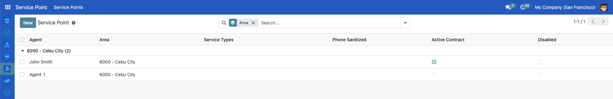

# Setting up service points

## Introduction

A service point is a virtual or physical location where individuals can receive or access their social protection services and benefits. Setting up service points is crucial for entitlement delivery to ensure that services and benefits are delivered to the recipients correctly. In this tutorial, you will learn how to set up service points.

## Prerequisites

To do this tutorial, the logged-in user must have permission to set up service points..

## Objective

After completing this tutorial, you will understand how to create, update, disable, enable, and export service points in OpenSPP.

## Process

Service points-related tasks such as creating, updating, listing, disabling, enabling, and exporting CSV are performed on the **Service Point** page.

You can access the service point page by clicking on the menu icon on the left side of the header and clicking **Service Point** on the dashboard.

### Filtering service points

You can filter the list of service points by using the **Search** bar. Type the text you want to search for, for example, if you search for a service point with the agent name of John. Type the word John and click the **Search Agent for John**.

The list will be filtered with agents named John.

You can also group service points by **field**. For example, you want to group by **Area**. Click **Group By**, and a dropdown will show. Click **Area**, the result list will be a group of service types by **Area** list.

To filter service points using service type fields like **Active Contract**, click the **Arrow down icon** in the **Search** bar and click the **Add Custom Filter**.

If you want to filter service points with **Active Contract**, click **Active Contract is set**.

The list of service points with **Active Contract** will be displayed.

### Creating service point

To create a service point, click the **New** button, you will be redirected to a form.

Fill in the **Agent Name, Address, Phone Number**, and other fields. Select the **Area** from the list, add **Service Types**, tick **Active Contract**, and hit the **Save** button.

### Updating service point

Choose the service point you want to update from the list of service points. You will be redirected to the view page. Update fields and click the **Save** button.

You can disable a service point by clicking the **Disable** button. The beneficiaries won’t be able to redeem their entitlements from this service point.

To enable a disabled service point, click the service from the list, then click **Enable**.

### Exporting service points

On the **Service Point** page, you can use the export feature to download service points. You can use filters to narrow down the fields you want your list to have. Use the **Group By** feature to group service points. For example, group service points by **Area**, click **Group By**, and select **Area**.

Click the **Gear icon**, and click **Export All** as a CSV file. The result CSV will contain a grouped by **Area** service points.

The specific steps and interface may vary depending on the OpenSPP version. Always seek assistance from the support team if you need further guidance.
