# Registring individuals and groups

Registrants are at the heart of OpenSPP. They are the people or groups that are being registered to be
included in social protection programs.

A registrant can be:

- A `group`
- An `individual`

Depending on the project's requirements, a registrant can simply contain a `name` or full biographic
information, ID document numbers, pictures, bank account numbers, phone numbers and more.

::::{important}

Consider only collecting the data you really need when conducting a project.

See:
[Principles for Digital Development - Address Privacy & Security](https://digitalprinciples.org/principle/address-privacy-security/).

::::

## Concepts

### Individual

An `individual` is a registrant that represents a person. It will have all the fields of a `registrant` plus
some additional ones.

### Group

A group is a `registrant` that represents a set of individuals. It will have all the fields of a `registrant`
plus some additional ones.

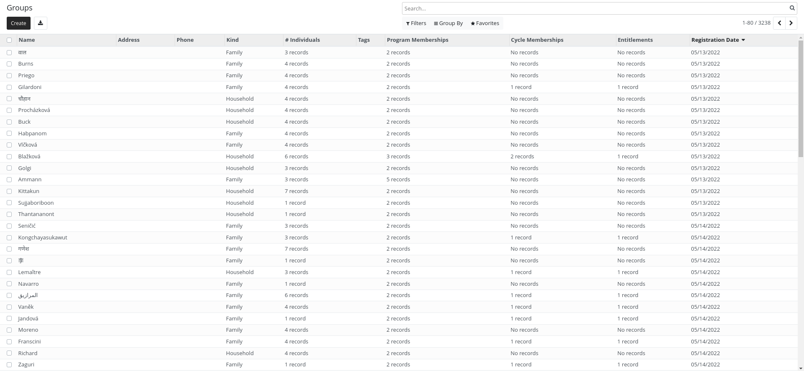

For example, groups could represent:

- A household
- A family
- A school
- ...

Groups do not need to contain individuals registrants. They can just contain their number of members.

For example:

- Adults: 2
- Children: 3
- Elderly: 2

### Group membership

Individuals can be part of one or more groups. They can have specific roles in a group.

By default, the following roles exist:

- Head (There can be only one per group)
- Principal recipient (There can be only one per group)
- Alternative recipient

An `admin` has the right to add other roles using the configuration menu.

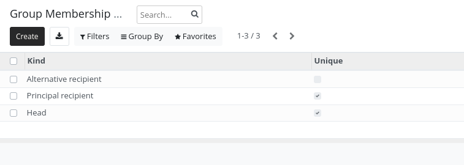

An individual can be the head of a group but have another or no role in another group.

### Registrants relations

When you need to store the relationship between registrants those relations can be useful.

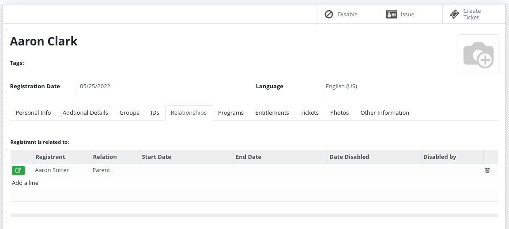

You can define relationship type between different entities:

- Group - Group
- Individual - Individual
- Individual - Group

For example:

- Sibling (Individual - Individual)
- Parent/Child (Individual - Individual)
- Caretaker (Individual - Group)
- Neighbour (Group - Group)

### ID Documents

Registrants can have one or more ID Documents.

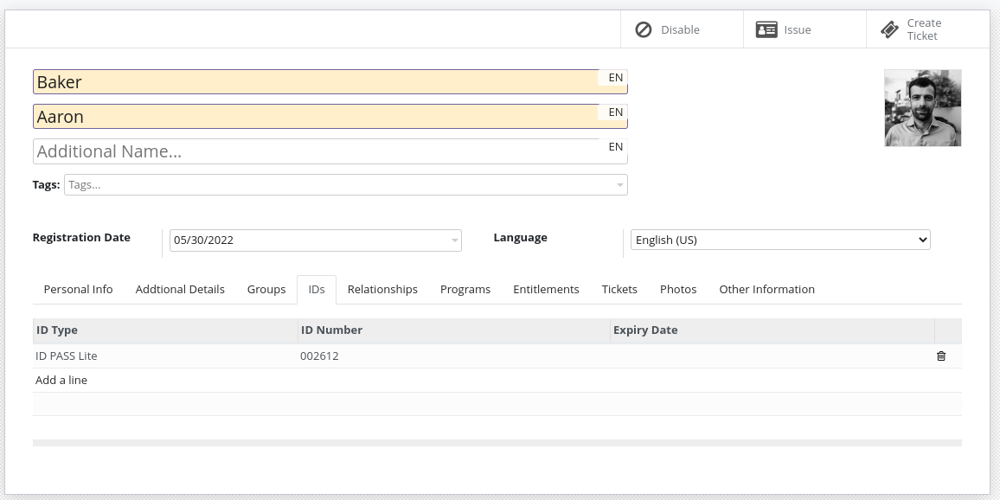

The system does not enforce uniqueness of Document ID by default. If uniqueness is required, deduplication
should be performed.

ID Document types can be configured by an administrator.

### Event Data

Event data is a way to store information about a registrant that is not part of the registrant's profile. It
allows to store information without the need to modify the registrant's profile, providing few benefits:

- Store multiple version of the data
- Manage separate data lifecycle, sharing agreements, etc.
- Better manage the source of different data
- Store data that should not be visible to all users

This data can be a lot of things:

- House visit
- Raw import data
- Information coming from another system through synchronization
- Data that loose relevance over time

The data stored in `Event Data` can be used in OpenSPP as a normal field by using computed fields.

## Importing registrants

### Import from CSV/Excel

These are the steps to follow:

1. Open the Import records menu.

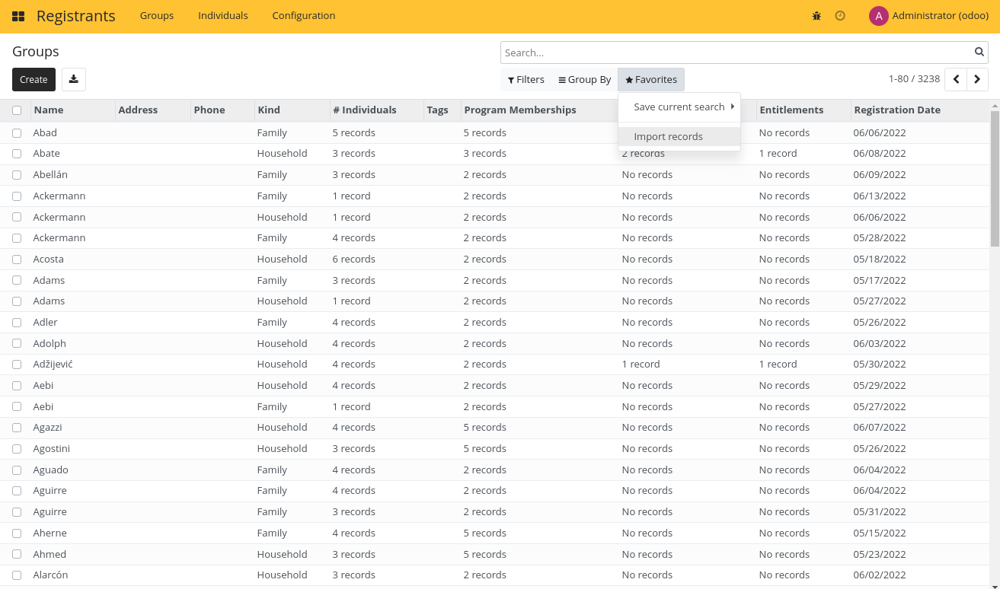

2. Upload your import file.

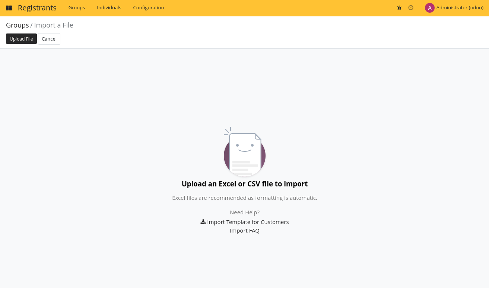

3. Map the fields in your file to the fields in OpenSPP.

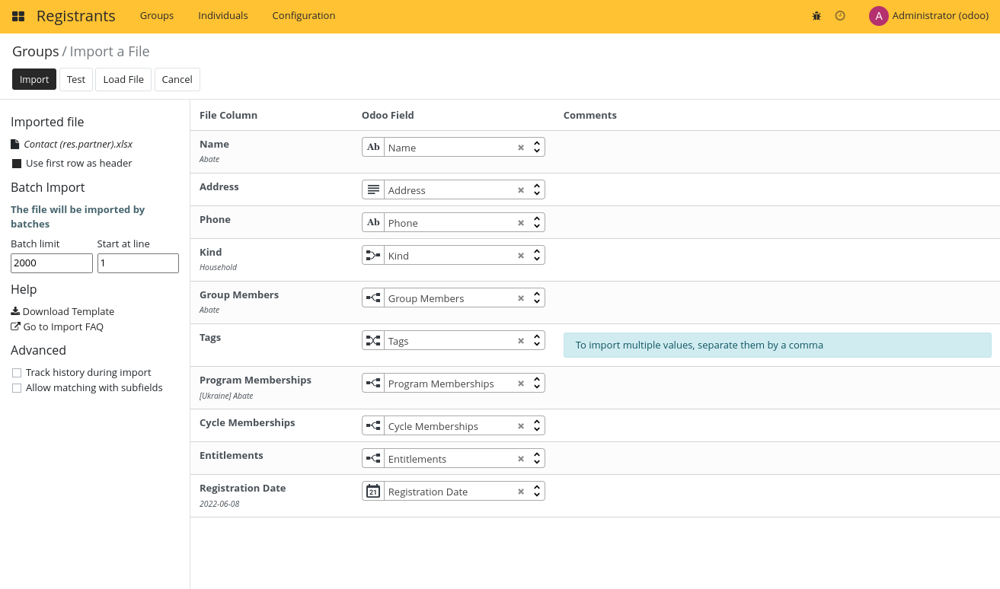

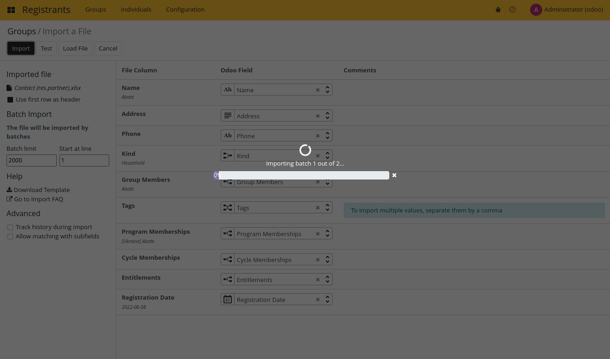

### Using Import to update data

The import feature can also be used to update existing data. The easiest way to achieve this is to export the
data with the export feature by enabling the `I want to update data (import-compatible export)`

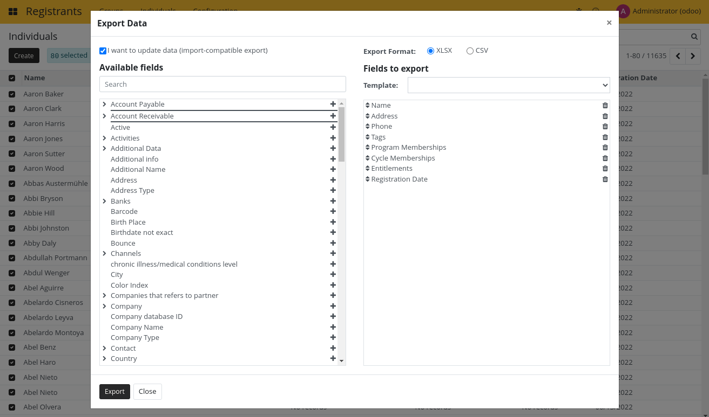

### Import from ODK Central

TBD

## Exporting Registrants

### Export to Excel or CSV

Both Groups and Individuals can be exported.

These are the step to follow:

1. Filter the registrants you want to export using the list filtering features.

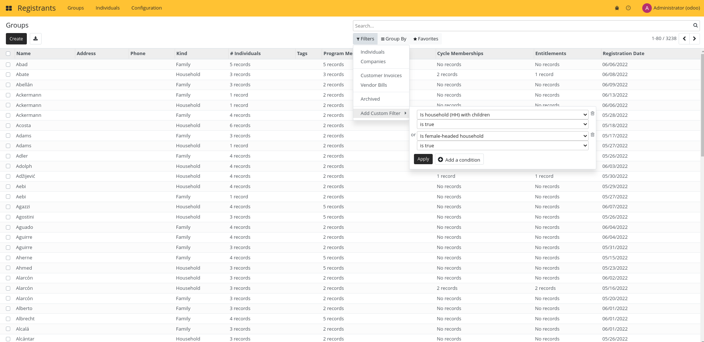

2. Select the registrants you want to export.

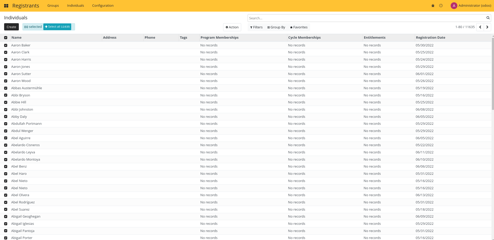

3. Click on export from the action menu.

4. Configure your export. You can create your own export template to make the process faster.

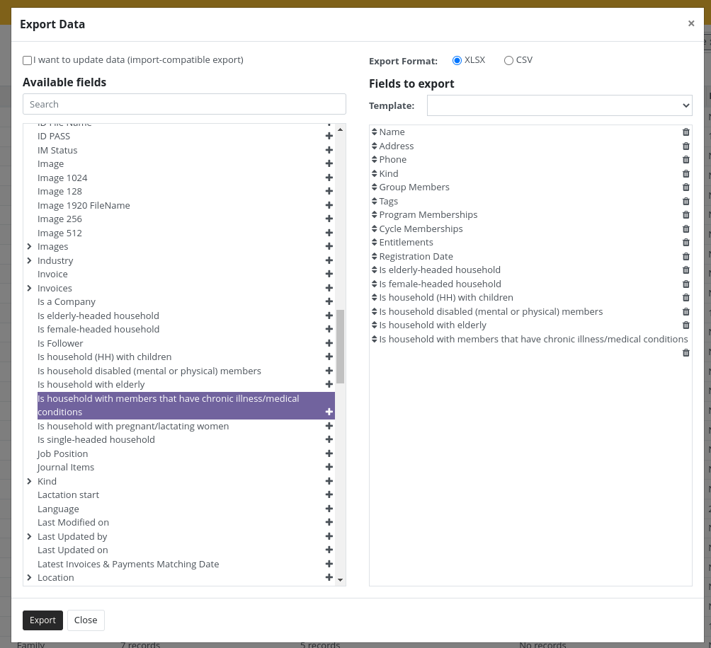

5. Click on Export, your Excel (XLSX) or CSV export will be downloaded.

To learn more about export capabilities, read the Odoo documentation.

## API

### Odoo API

Odoo is providing a [generic API](https://www.odoo.com/documentation/15.0/developer/api/external_api.html)
based on [XML-RPC](https://en.wikipedia.org/wiki/XML-RPC) for all the models in the systems. This API can be
used to import or export any data into the system.

### REST API

The REST API is currently being reworked.
