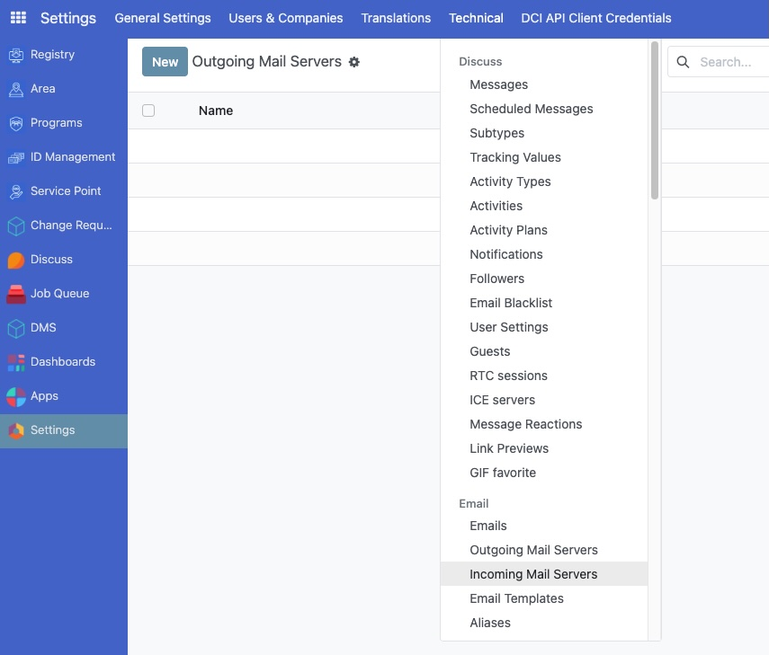

---
myst:
  html_meta:
    "title": "Email gateway configuration"
    "description": "Configure SMTP outgoing and IMAP/POP incoming email servers in OpenSPP for automated communication and data processing"
    "keywords": "OpenSPP, email gateway, SMTP, IMAP, POP, email configuration, system administration"
---

# Email gateway configuration

The Email Gateway in OpenSPP allows the platform to both send and receive emails, automating key communication and data entry tasks.
- **Outgoing emails (SMTP):** Used for sending system notifications, user invitations, password resets, and other communications from OpenSPP to users and beneficiaries.
- **Incoming emails (IMAP/POP):** Used to automatically create or update records in OpenSPP from a dedicated mailbox. For example, an email sent to a specific address could automatically generate a grievance ticket or a change request.

This guide provides a step-by-step process for configuring both outgoing and incoming email servers in OpenSPP.
---

## Outgoing email server (SMTP) Configuration

Configuring an outgoing email server allows OpenSPP to send emails using your organization's own email service. This ensures better deliverability, branding, and control over your email communications.

### Prerequisites

To configure an outgoing email server, you will need:
- A user account with **System Admin** role. For details on user roles and access levels, refer to the {doc}`user_access` documentation.
- The connection details for your SMTP email server:
    - SMTP server address (e.g., `smtp.youremailserver.com`)
    - SMTP port (e.g., 587, 465, or 25)
    - Connection security type (None, SSL/TLS, or STARTTLS)
    - Username and password for the email account that will be used to send emails.

### Objective

After completing this section, you will be able to configure OpenSPP to reliably send emails using your own custom SMTP server.

### Process

The process involves activating developer mode, navigating to the outgoing email server settings, creating a new configuration, and testing it to ensure it works correctly.

#### Activate developer mode

To access the technical settings required for email configuration, you must first activate developer mode.

1.  Click on the menu icon in the top-left corner and select **Settings**.
2.  Scroll to the bottom of the **Settings** page.
3.  Click **Activate the developer mode**.

Once activated, a bug icon will appear in the top-right corner of the header, and new technical menus will become available.

#### Navigate to outgoing email servers

With developer mode active, you can now access the menu for configuring outgoing email servers.

1.  Go back to the main **Settings** page.
2.  Click on the **Technical** menu in the header.
3.  Under the **Email** section, click on **Outgoing Email Servers**.

#### Create a new server configuration

On the **Outgoing Email Servers** page, you will see a list of any existing servers.

1.  Click the **New** button to create a new configuration.

This will open a new form where you can enter your SMTP server details.

#### Fill in server details

Now, fill in the form with the details from your email provider.

- **Name**: Enter a user-friendly name for this configuration, such as `My Organization's Email Server`.
- **Priority**: Set this to a low number, like `1`. Odoo uses the server with the lowest priority number as the default.
- **Connection Encryption**: Select the appropriate security protocol. `TLS (STARTTLS)` is a common and secure choice.
- **Username**: Enter the full email address of the account you are using to send mail.
- **Password**: Enter the password for the email account. It is recommended to use an "App Password" if your provider supports it.
- **SMTP Server**: Enter your server's address. For this guide, we'll use `smtp.youremailserver.com`.
- **SMTP Port**: Enter the port number. `587` is common for STARTTLS.

#### Test and save the configuration

After filling in all the details, it's crucial to test the connection to ensure everything is correct.

1.  Click the **Test Connection** button at the top of the form.
2.  If the configuration is correct, you will see a confirmation message.
3.  If you see an error, double-check your server details, username, and password.
4.  Once the test is successful, click the **Save** button.

Your new email server is now configured and, if it has the lowest priority, will be used by OpenSPP to send all outgoing emails.
---

## Incoming email server (IMAP/POP) Configuration

Configuring an incoming email server allows OpenSPP to fetch emails from a dedicated mailbox and process them automatically. This is a powerful feature that can create or update records based on the content of the emails. For example, an email sent to `support@youremailserver.com` could automatically create a new Grievance ticket.

### Prerequisites

To configure an incoming email server, you will need:
- A user account with **System Admin** role. For details on user roles and access levels, refer to the {doc}`user_access` documentation.
- The connection details for your IMAP or POP email server:
    - Server type (IMAP or POP)
    - Server address (e.g., `imap.youremailserver.com`)
    - Server port (e.g., 993 for IMAP with SSL/TLS)
    - Whether SSL/TLS is required
    - Username and password for the dedicated email account.

### Objective

After completing this section, you will be able to configure OpenSPP to fetch emails from a mailbox and create new records automatically.

### Process

The process is similar to configuring an outgoing server, involving developer mode and navigating to the technical settings.

#### Activate developer mode

If you have not already, activate developer mode to access the technical settings.

#### Navigate to incoming email servers

1.  Go back to the main **Settings** page.
2.  Click on the **Technical** menu in the header.
3.  Under the **Email** section, click on **Incoming Email Servers**.

#### Create a new server configuration

1.  On the **Incoming Email Servers** page, click the **New** button.

This will open a form to enter your incoming server details.

#### Fill in server details

Fill in the form with the details for the mailbox you want OpenSPP to monitor.

- **Name**: A descriptive name, e.g., `Grievance Mailbox`.
- **Server Type**: Choose `IMAP Server` or `POP Server`. IMAP is generally recommended.
- **Server Name**: Enter your server's address, e.g., `imap.youremailserver.com`.
- **Port**: Enter the correct port number (e.g., `993` for IMAP).
- **SSL/TLS**: Check this box if your server uses SSL/TLS encryption.
- **Username**: The full email address of the mailbox.
- **Password**: The password for the email account.
- **Action to Perform on Incoming Mails**: Select `Create a new Record`.
- **Create a New Record**: This is a critical field. Select the type of record you want to create from incoming emails. For example, you could select `Grievance` if you have a grievance module installed. The available options depend on the modules installed in your system.

#### Test and save

1.  Click the **Test & Confirm** button.
2.  OpenSPP will attempt to connect to the mailbox. If successful, you will see a confirmation.
3.  If there is an error, re-check all your server settings.
4.  Once the test is successful, click **Save**.

OpenSPP will now periodically check this mailbox for new emails and create records based on your configuration.

