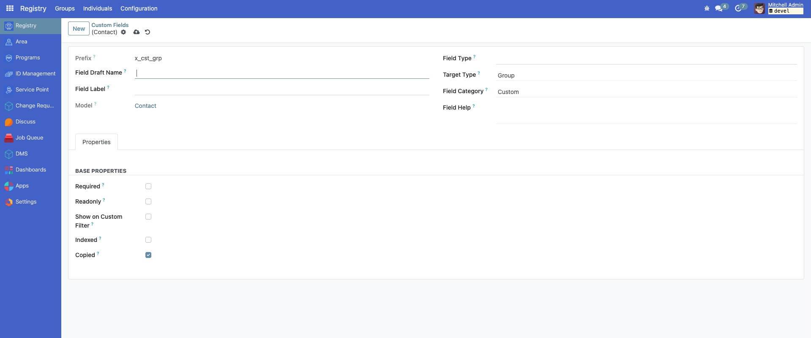
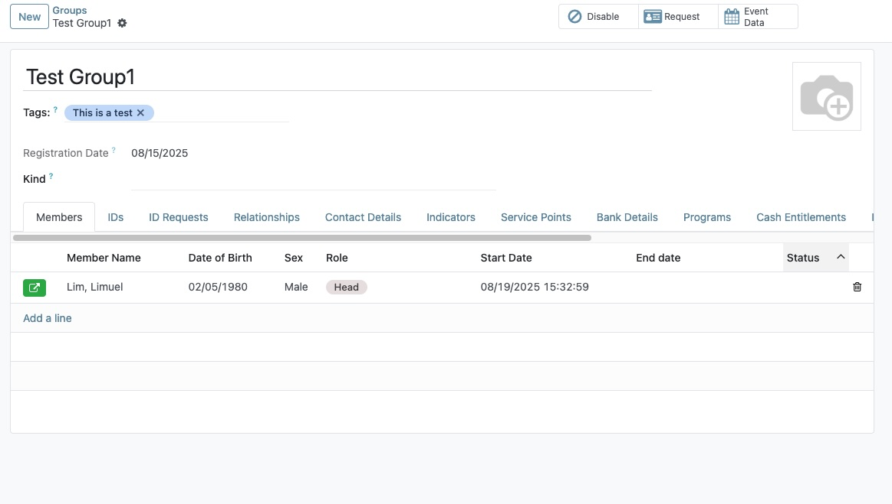

# Indicator Fields

Indicator fields are a powerful feature in OpenSPP that allow for dynamic data calculation based on existing information in the registry. They can be used to create simplified data points, such as the number of children in a household or the count of members with a specific attribute. These indicators are crucial for program operations, particularly for defining eligibility criteria and targeting beneficiaries for social protection programs.

This guide provides step-by-step instructions on how to create a simple indicator field using the **Custom Fields UI**. We will create an indicator that computes the total number of male individuals within a group.

```{note}
The Custom Fields UI is designed for creating straightforward, user-defined indicators. Creating complex indicators with advanced logic should be done by a developer in a custom module. This process will be covered in a separate developer guide.
```

## Prerequisites

To create and manage indicator fields, you need:
- A user account with **System Admin** role. For more details, see the {doc}`user_access` guide.
- The **OpenSPP Custom Fields** (`spp_custom_field`) and **OpenSPP Custom Fields UI** (`spp_custom_fields_ui`) modules must be installed and activated in your OpenSPP instance.

## Objective

After completing this tutorial, you will understand how to create, configure, and verify a custom indicator field in OpenSPP.

## Process

The process involves navigating to the Custom Fields menu, defining the properties of the new indicator, providing the calculation logic, and verifying its presence on the group records.

### Navigate to Custom Fields

First, access the Custom Fields management interface.
1.  Click on the menu icon in the top-left corner and select **Registry**.
2.  In **Registry** click the **Configuration** menu.
3.  Click on the **Custom Fields** sub-menu.


### Create a New Field

On the **Custom Fields** page, you will see a list of existing custom fields.
1.  Click the **New** button to start creating a new indicator field.


The **Custom Fields** form view will appear.



### Configure Basic Properties

Now, define the basic characteristics of your new indicator field. For this example, we are counting male members in a group.

- **Field Draft Name**: Enter a technical name for the field, such as `total_male`. This name should be unique and follow standard naming conventions (lowercase with underscores).
- **Field Label**: Provide a user-friendly label, like `Total Male Members`. This is what users will see on the interface.
- **Field Type**: Select `Integer`, as we are counting a number of people.
- **Target Type**: Choose `Group`, because the indicator will be calculated for each group record.
- **Field Category**: Select `Calculated`. This designates the field as an indicator whose value is computed automatically.
- **Field Help**: Specify a text that will appear in the **Field Description** section in the form.


### Configure Advanced Properties

Since this is a calculated field, you must provide the logic for its computation in the **Properties** tab.

1.  **Dependencies**: This optional field tells Odoo when to re-calculate the indicator. For our example, the count depends on the gender of each member in the group. Set the dependency to `group_membership_ids.individual.gender`. 
2.  **Compute**: This field requires a short Python script to perform the calculation. OpenSPP provides a helper function `compute_count_and_set_indicator` to simplify this.

Enter the following code in the **Compute** box:

```python
kinds = None
# Define a domain to filter for male individuals
domain = [('gender.code', '=', 'Male')]

# Use the helper method to count members matching the domain
# and set the value on the indicator field.
# The first argument is the technical name of the indicator field itself.
self.compute_count_and_set_indicator('x_ind_grp_total_male', kinds, domain)
```


### Save and Open a Group

Once all properties are configured, save the new field.

1.  Click the **Save** button. Odoo will create the new field in the database and apply the computation logic.
2.  Navigate to the **Registry** and click the **Groups** menu.


### Verify the Indicator Field

1. To verify, open any record in the **Groups** list view.


2. In the **Members** tab, check the **Sex** field and look for **Male** members.



3. A new tab named **Indicators** will appear, displaying your new "Total Male Members" field with its calculated value.


