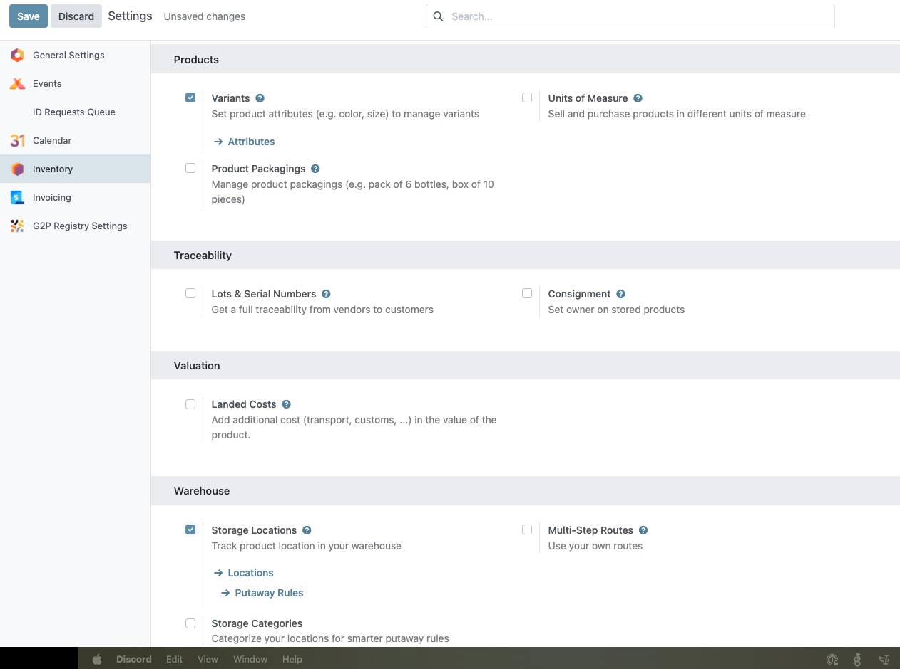

# Inventory Configuration

OpenSPP's In-Kind and Basket Entitlement modules leverage Odoo's powerful Inventory application to manage the distribution of goods and services to beneficiaries. To ensure these modules function correctly, specific features within the Inventory settings must be activated.

This guide provides a step-by-step process for enabling two critical inventory features:
- **Storage Locations:** Allows for the management of specific locations within a warehouse (e.g., shelves, bins), which is essential for detailed stock tracking.
- **Units of Measure:** Enables the use of different units for buying, selling, and storing products (e.g., kilograms, boxes, individual units), which is crucial for accurate entitlement definition.

---

## Prerequisites

To configure the Inventory settings, you will need:
- A user account with **System Admin** or **Inventory Admin** role.
- The **Inventory** (`stock`) module must be installed in your OpenSPP instance.

## Objective

After completing this guide, you will have enabled the necessary Inventory configurations to support the `spp_entitlement_in_kind` and `spp_entitlement_basket` modules, ensuring proper management of products for distribution.

---

## Process

The process involves navigating to the Inventory settings and activating two key options: Storage Locations and Units of Measure.

### Enabling Storage Locations

This feature allows you to manage a structured warehouse with specific locations.

#### Navigate to Inventory Settings

1.  Click on the menu icon in the top-left corner and select **Inventory**.
2.  In the **Inventory** dashboard, click on the **Configuration** menu and select **Settings**.

#### Activate Storage Locations

1.  On the **Settings** page, scroll down to the **Warehouse** section.
2.  Check the box next to **Storage Locations**.

#### Save the Configuration

1.  After checking the box, a **Save** button will appear at the top of the page.
2.  Click **Save** to apply the changes. The page will reload with the new setting enabled.

---

### Enabling Units of Measure

This feature is essential for defining product quantities in different units.

#### Navigate to Inventory Settings

If you are not already on the settings page:
1.  Go to the **Inventory** application.
2.  Click on **Configuration** > **Settings**.

#### Activate Units of Measure

1.  On the **Settings** page, scroll down to the **Products** section.
2.  Check the box next to **Units of Measure**.

#### Save the Configuration

1.  Click the **Save** button at the top of the page to apply the changes.

