# Administrating role-based access

User Access Management is a key component of OpenSPP that enables program administrators to control and manage user access to the platform's features and data. With OpenSPP's role-based access control system, administrators can define different levels of access for individual users or groups, ensuring that only authorized users have access to specific data and features.

There are different dimensions to access rights in OpenSPP, including access to specific app features and access to specific data or subsets of data (for example, data related to a specific location). By defining these access rights, administrators can make sure that users are able to perform their roles and responsibilities effectively while minimizing the risk of data breaches or unauthorized access.

This user guide provides instructions on how to manage user access in OpenSPP, including how to create and manage user accounts, assign roles and permissions, and customize user access rights. By the end of this guide, you should have a solid understanding of how to effectively manage user access in OpenSPP to make sure the security and integrity of your {term}`social protection` program data.

## Prerequisites

To grant access, you need a user account with the **System Admin** role given by the OpenSPP team.

## Objective

After completing this tutorial, you will gain an understanding of how to manage role-based access in OpenSPP and learn the necessary steps to assign, update, or revoke user permissions.

## Process

All user-related tasks, such as creating new users, modifying existing users, configuring their information, passwords, and user roles, are performed on the **User** page.

The **Users** page is accessed by clicking on the menu icon in the top-left corner and select **Settings**.

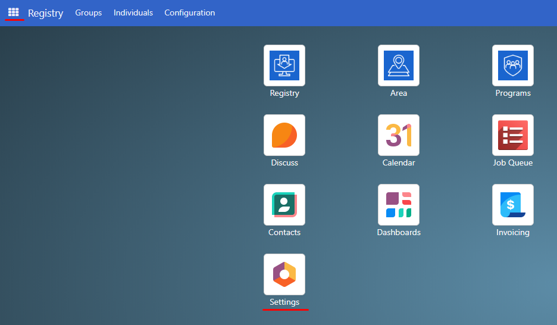

Click on **Users & Companies** and you will see the **Users, Companies**, and **Roles** options.


### Creating user account

User roles can only be assigned to existing user accounts. To create user accounts, click on the menu icon in the top-left corner, then choose **Settings**. Click on **Users & Companies** and select **Users**. Click on the **New** button, fill in the user's name and email address, and then click **Save**. The password will need to be added or changed as described in the **Change User Password** section below.

### Change user password

Click on the menu icon in the top-left corner, then select **Settings**. Click **Users & Companies** then click **Users** from the dropdown list. Click on the user account that should be modified, and then click on the **Gear** button.

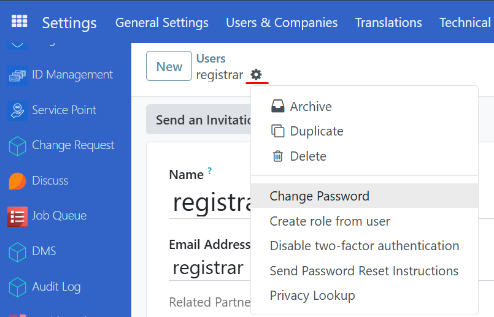

Click on **Change Password** in the dropdown list, enter the new password in the **New Password** field, and then click the **Change Password** button. The password is now successfully updated.

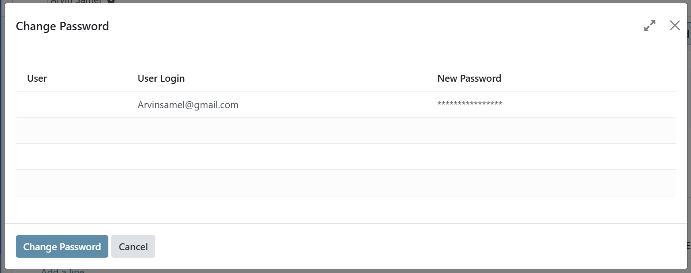

### Enabling and disabling user account

To maintain proper security, it is important to ensure that users who should no longer have access to the system are taken out of active use.

All such actions are taken from the **Users** section. Click on the menu icon in the top-left corner, then select **Settings**, click **Users & Companies**, and then click **Users**. Click on the name of the user you wish to manage, then click the **Gear** button, where you will find the different options listed below.

### Delete

To completely delete the user account from OpenSPP, click on **Delete** in the action list. A confirmation popup will appear. Click **Ok** to proceed. Note that this permanently deletes the user account and that this may also have an effect on traceability.

### Archive

To temporarily delete the user account from OpenSPP, click on **Archive** in the action list. A confirmation popup will appear. Click **Ok** to proceed. Note that this only removes the user’s access to the system, but that the account still exists in the system.

### Unarchive

To restore a temporarily archived user account to OpenSPP, it is performed in a similar way as the archive. Since the user account will no longer be displayed among the active users, additional steps need to be performed to navigate to the user.

Navigate to the **Users** page, click on the down arrow from the searchbar, then click **Filters**, then click **Inactive Users**. This displays all user accounts that have been temporarily deleted or archived. Click on the name of the user account you wish to unarchive. Click on the **Gear** button, and then click **Unarchive**.

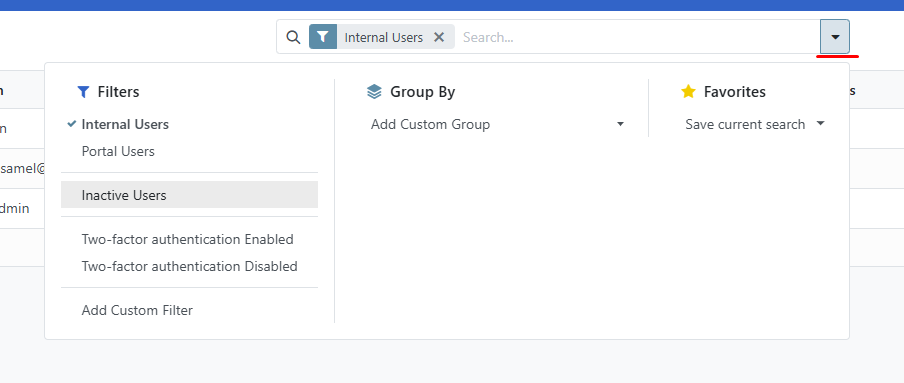

Navigate back to the **Users** page. Clear the **Inactive Users** filter by clicking the **x** icon. The unarchived user account should now be visible along with all active users accounts.

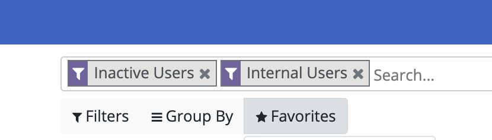

### Editing user Information

The editable user information is **Name** and **Email Address**. Click on the menu icon in the top-left corner, then click on **Settings**, navigate to **Users & Companies** and select **Users**.

Click on the name of the user you wish to edit. Click on the field to modify the name or email address fields. Click on **Save** icon to proceed with the changes.

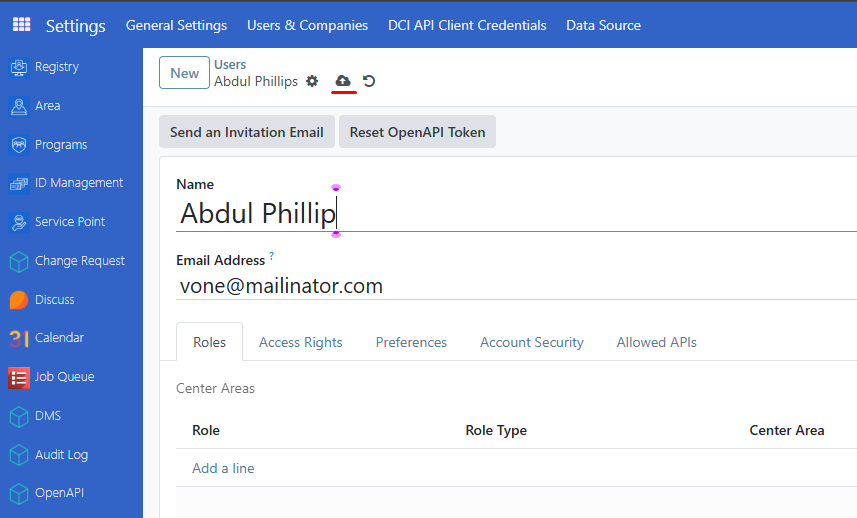

### Assigning roles to a user

Assigning a role to a user account enables them to perform a specific set of actions in OpenSPP. For instance, only a **System admin** role has the permission to import and export data in and out of OpenSPP. Therefore, it is important to assign specific roles, particularly to the user account’s purpose. This also prevents unauthorized access to sensitive data, which may be easily mishandled.

Click on the menu icon in the top-left corner then choose on **Settings**. Click **Users & Companies** and select **Users**.

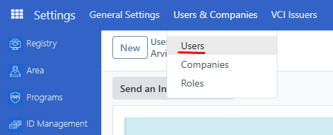

Click on the name of the user account you wish to assign roles to. In the **Roles** tab click **Add a line**. Use the dropdown menu to select the appropriate role for the user. Depending on the role selected, the behavior of the **Center area** tab will vary. Roles can be either **Global** or **Local**. A **Global** role grants access to all geographical areas, while a **Local** role allows the option to restrict which geographical areas the user can access. If the assigned role is **Local** the column **Center Area** will be enabled, allowing the selection of one center area. If left blank, the role will act as **Global**. It is possible to assign multiple roles to a user.

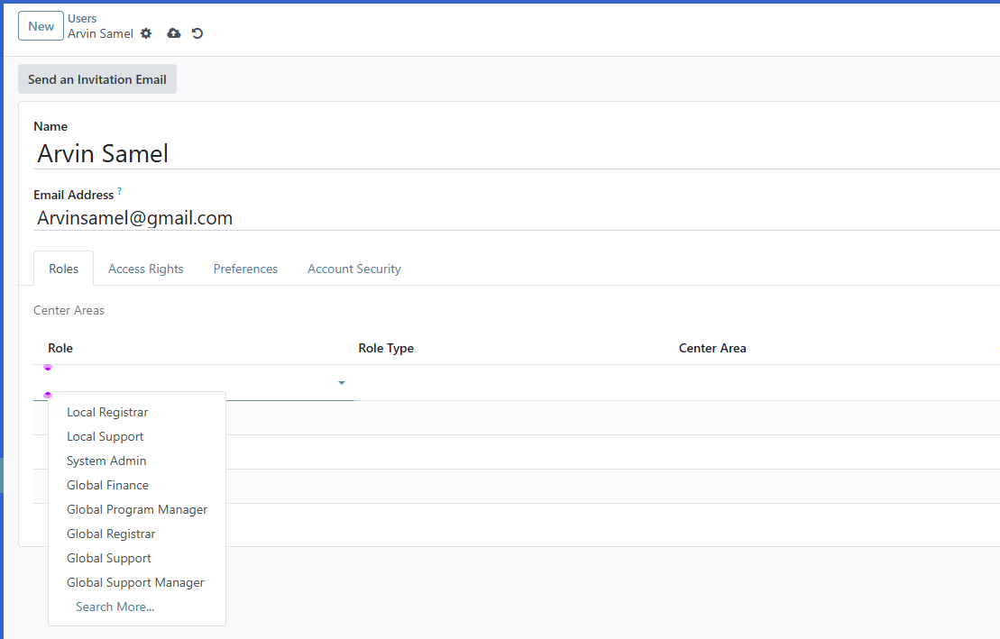

Configure the **From** and **To** columns. **From** defines when this user can start having the selected access role, while **To** defines when it will expire. To remove the role from the user, simply click on the trash icon. Click on the **Save** button once done.

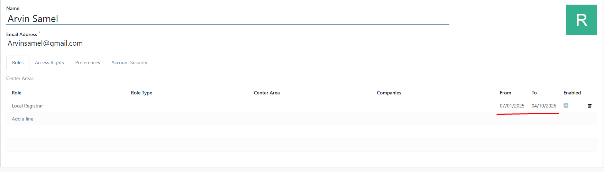

### Configuring roles

Roles are typically pre-configured and available for selection; however, you can also create and configure them yourself. To create a new role click on the menu icon in the top-left corner, click on **Settings** then select **Roles** under **Users & Companies**. A list of roles is displayed on the **Roles** page.

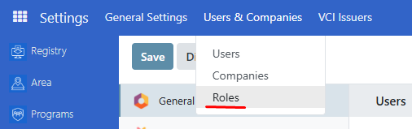

Click **New**, set a name for the role, and select a **Role Type**. **Roles Types** can be either **Global** or **Local**. A **Global** role grants access to all geographical areas, while a **Local** role allows the option to restrict which geographical areas the user can access.

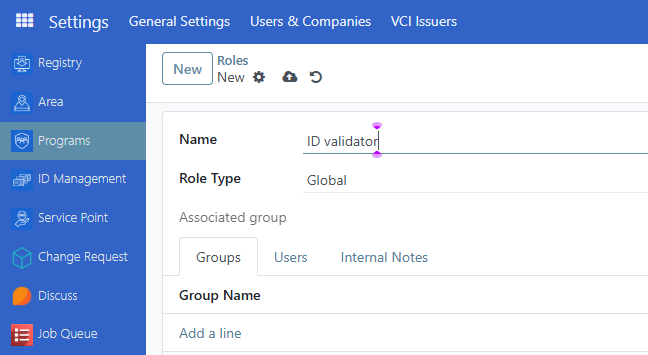

Under the **Groups** tab, click **Add a line** and tick the checkbox beside the group(s) you wish to add for this role. Click **Select** to save the selection.

Navigate back to the **Roles** page by clicking **Roles** under **Users & Companies**. The new role is displayed in the list.

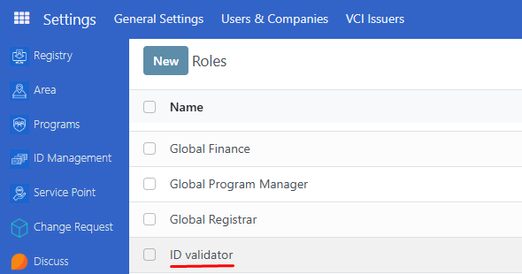

It is also possible to view all user accounts associated with a role. In the **Roles** page, click a role from the list and click on the **Users** tab.

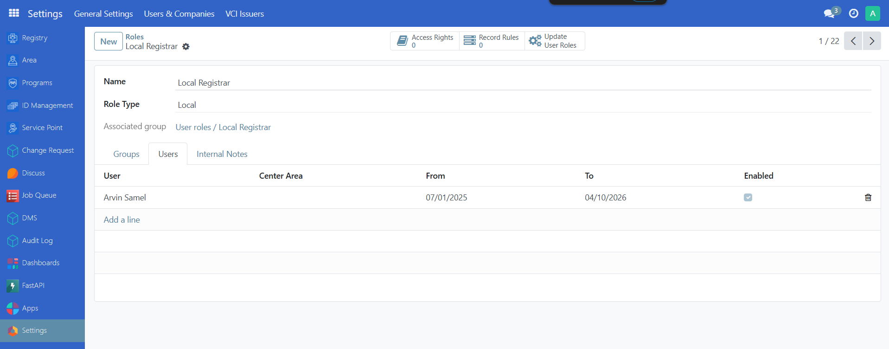

You can assign users to the selected role by clicking **Add a line** and selecting the user you wish to associate the role with. Click on the trash icon to unlink the user account from the role.

### Configuring groups

The list of access rights for a group is typically pre-configured; however, you may also modify the list of access rights associated with a group. To access the **Groups** page, the **Developer mode** must first be activated. This is done by navigating to **Settings**, scrolling down to the last part of the page, and clicking **Activate the developer mode**. You will then be automatically redirected back to the **Registry** page.

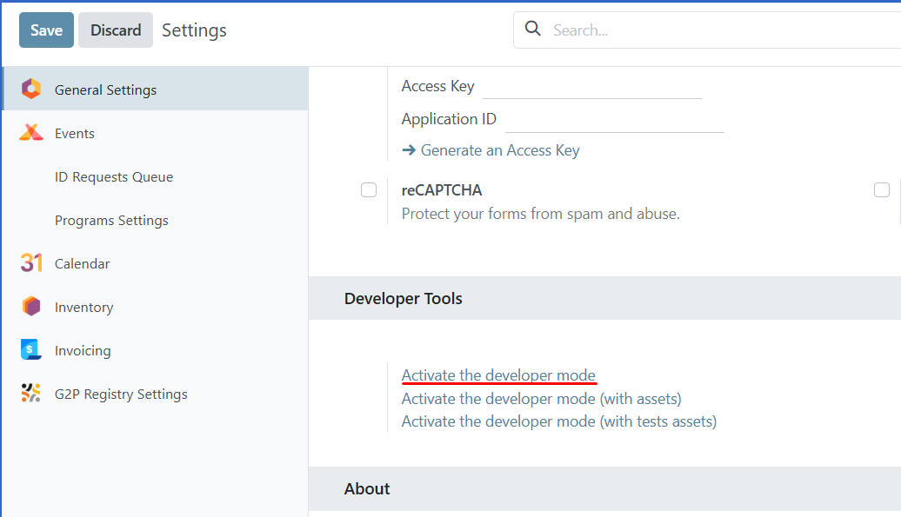

```{note}
Activating the {ref}`developer-mode` enables users to select **User Types**.
```

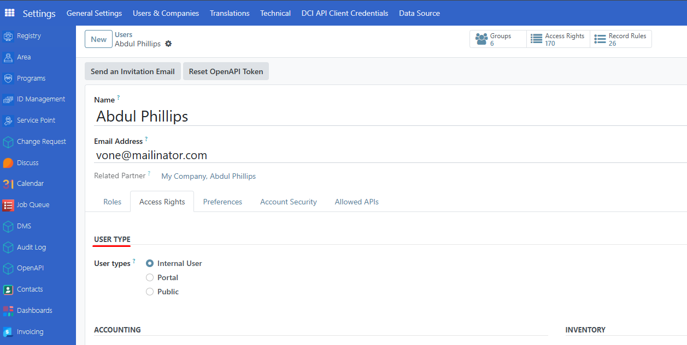

The **Portal** and **Public** options don't allow you to choose access rights. Members of these user types have specific ones (such as record rules and restricted menus) and usually don't belong to the usual OpenSPP groups.

Go back to **Settings**. Click on **Users & Companies** where the option **Groups** should now be displayed.

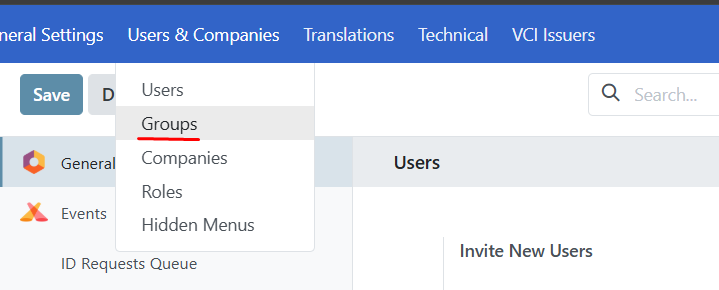

Click **Groups** to be redirected to the group's page. You may create new groups by clicking the **New** button, or you can manage existing groups by clicking the checkbox beside each group and then clicking the **Actions** button, or you can modify groups by clicking on a group’s name.

Click a group from the list to manage its permissions.

The first level of rights is under **Access Rights** tab. The _Access Rights_ comprises of the object name, which is a technical name assigned to a model. Enable or disable the following checkbox for each model:

- _Read_: The user can only view the values of that object.
- _Write_: The user can edit the values of that object.
- _Create_: The user can create values for that object.
- _Delete_: The user can delete the values of that object.

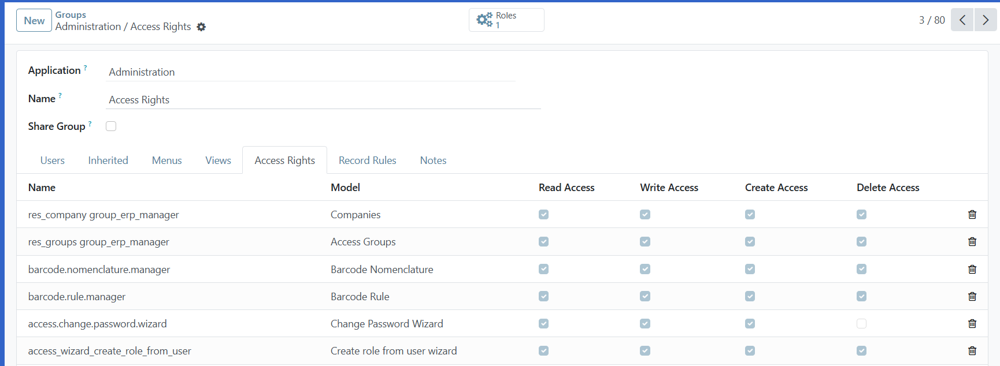

The Access Rights menu alone doesn't display details of the rules and inheritances of a group. This is where the Groups menu comes into play. Under **Users** tab, you will be able to add or remove users that belong to this group.
The current users directly associated with this group are listed under **Users** . 

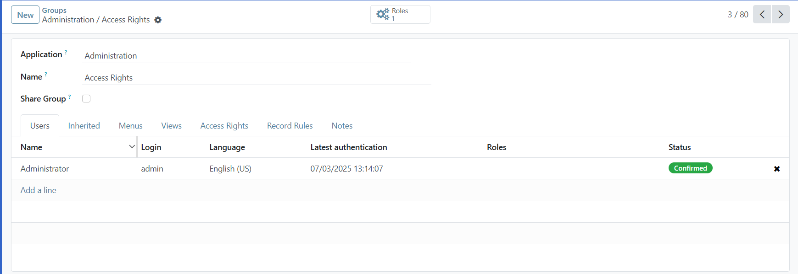

You can automatically associate users to app groups through **Inherited** tab. In the example below, users who have access to the group _Local Registrar_ also have access to the group names listed below.

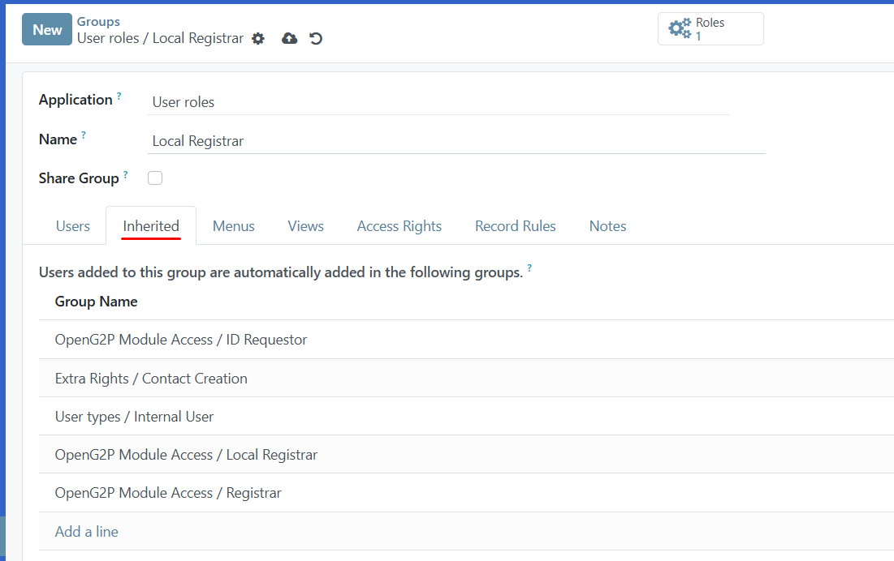

```{note}
Remember to always test the settings being changed in order to ensure that they are being applied to the needed and right users.
```

The **Menus**  tab is where you define which menus (models) the user can have access to.

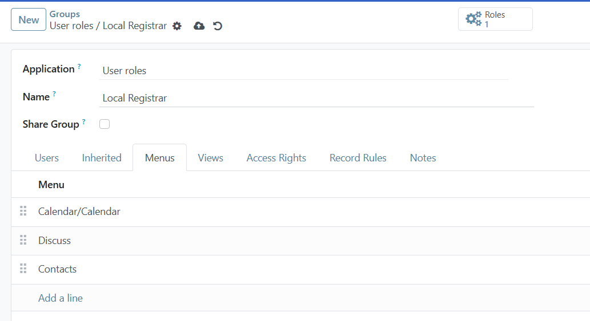

You can form _Record Rules_ as a second layer of editing and visibility rules. They overwrite, or refine, the _Access Rights_.
The user writes a record rule using a _Domain_. Domains are conditions used to filter or searching data. Therefore, a domain expression is a list of conditions. For each rule, choose among the following options: _Read_, _Write_, _Create_ and _Delete_ values.

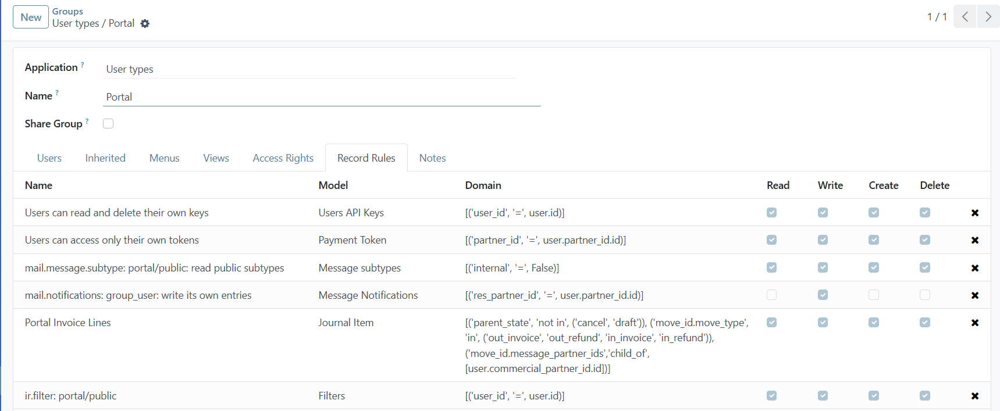

```{note}
Making changes in access rights can have a big impact on the database. For this reason, we recommend you to contact your OpenSPP Business Analyst or our Support Team, unless you have knowledge about Domains in OpenSPP.
```

Deactivate developer mode by clicking on the menu icon and then click on **Settings**, scrolling down to the last part of the page, and clicking **Deactivate the developer mode**.

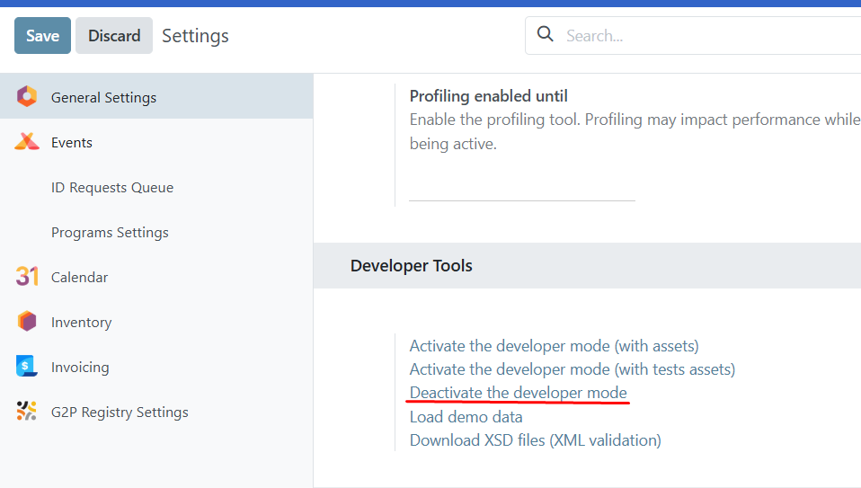