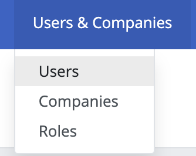
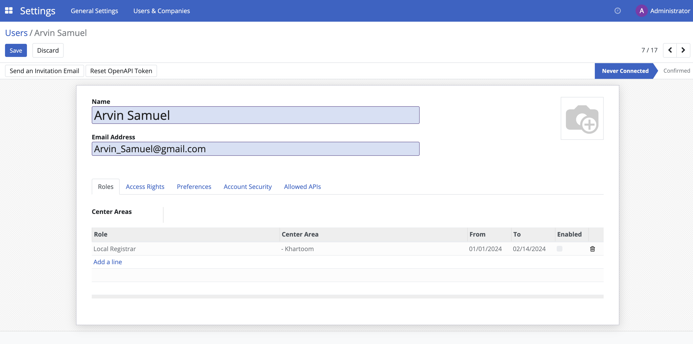

# Administrating role-based access

## Introduction

This guide details the process of administering role-based access in OpenSPP.

## Prerequisites

To grant access, you need a user account with the **System Admin** role given by the OpenSPP team.

## Objective

After completing this task, the assigned user account will be able to login and execute actions exclusive to the assigned role in openSPP.

## Step-by-step

### Creating user account

1. Login to OpenSPP as an admin user, then click on the four-square icon and click on **Settings**.


2. Click **Users & Companies** from the navigation bar, then choose **Users** from the list menu that appears.



3. Click the **Create** button. Set the values for **Name** and **Email address**, and click **Save**.


4. Once the account has been created, a password needs to be added to the user. Refer to the section **Change user password**.

### Change user password

1. Click on the four-square icon in the top-left corner, then select **Settings**. Click **Users & Companies** then select **Users** from the dropdown list.
2. Click on the user account that should be modified, and then click on the **Action** button.
3. Type in the password in the **New Password** field, then click the **Change Password** button from the popup modal.


### Enabling and disabling user account

1. Click on the four-square icon in the top-left corner. Click the **Action** icon, and from the drop-down list, you can choose the action you want to perform.
2. To delete the user account, click on **Delete** in the action list. A confirmation popup will appear. Click **OK** to proceed.
3. To temporarily delete the user account from OpenSPP, click on **Archive** in the action list. A confirmation popup will appear. Click **OK** to proceed.
4. To restore a temporarily deleted user account to OpenSPP, additional steps need to be performed to navigate to the user since the user account will no longer be displayed among the active users. Click on the four-square icon in the top-left corner then click on **Settings**. Click **Users & Companies** and select **Users**. Click on **Filters**, then select **Inactive Users**. Click on the name of the user account you wish to unarchive. Click on the **Action** button, and then click **Unarchive**.


### Editing user Information

1. Click on the four-square icon in the top-left corner, then click on **Settings**, navigate to **Users & Companies**, and select **Users**. Click on the name of the user you wish to edit. Click on **Edit** to modify the name and/or email address fields, then click **Save**.


### Assigning roles to a user

1. Click on the **Role** tab, then click **Add a line**. Use the drop-down arrow to choose the role you wish to assign to this specific user account. Select the **Center Area** for this user account by clicking the drop-down arrow under the **Center Area** column. This user account will only be able to access data related to the **Center Area** you select.



2. Set the start and end dates for the user account's validity by adjusting the **From-To** columns. These dates determine when the account will no longer be able to log in to openSPP.

3. After configuring the validity dates, click **Save**.


4. The user account setup is complete. Test the login with the email address and password you've set up for this user account.


### Configuring roles

1. Click on the four-square icon in the top-left corner, then click on **Settings**, and click **Roles** under **Users & Companies**.


2. Click **Create**, set a name for the role, and select a **Role Type**.


### Configuring groups

1. Click on the four-square icon in the top-left corner, then click on **Settings**, and click **Group** under **Users & Companies**.


2. Create new groups by clicking the **Create** button, or you can manage existing groups by clicking the checkbox beside each group and then clicking the **Action** button, or you can modify groups by clicking on a group’s name.


---

## Merged Content


### Content from docs/tutorial/access_management.md

# Access management

## Introduction

User Access Management is a key component of OpenSPP that enables program administrators to control and manage user access to the platform's features and data. With OpenSPP's role-based access control system, administrators can define different levels of access for individual users or groups, ensuring that only authorized users have access to specific data and features.

There are different dimensions to access rights in OpenSPP, including access to specific app features and access to specific data or subsets of data (for example, data related to a specific location). By defining these access rights, administrators can make sure that users are able to perform their roles and responsibilities effectively while minimizing the risk of data breaches or unauthorized access.

This user guide provides step-by-step instructions on how to manage user access in OpenSPP, including how to create and manage user accounts, assign roles and permissions, and customize user access rights. By the end of this guide, you should have a solid understanding of how to effectively manage user access in OpenSPP to make sure the security and integrity of your {term}`social protection` program data.

## User management

OpenSPP considers someone who has app access to perform daily tasks as a **user**. You can add as many users as required and enforce rules to limit their access to specific information. Adding or modifying user accounts and access rights is possible at any time.

(users/add-individual)=

### Add individual users

Go to **Settings → Manage Users** and click **Create**.

```{figure} access_management/manage-users.png
:align: center
:height: 280
:alt: View of the settings page emphasizing the manage users field in OpenSPP
```

- Fill in the form with the necessary information. Under the tab {ref}`access_rights` choose the group within each app the user can have access to.
- The list displays applications based on the installed applications in the database.

```{figure} access_management/new_user.png
:align: center
:alt: View of a user’s form emphasizing the access rights tab in OpenSPP
```

After the user edits the page and clicks **Save**, the system automatically sends an invitation email to the user, which they must click to accept. This creates their login.

```{figure} access_management/invitation-email.png
:align: center
:alt: View of a user’s form with a notification that the invitation email has been sent in OpenSPP
```

Activating the {ref}`developer-mode` enables users to select **User Types**.

```{figure} access_management/user-type.png
:align: center
:height: 300
:alt: View of a user’s form in developer mode emphasizing the user type field in OpenSPP
```

The **Portal** and **Public** options don't allow you to choose access rights. Members have specific ones (such as record rules and restricted menus) and usually don't belong to the usual OpenSPP groups.

(access-rights)=

## Access rights

Activate the {ref}`developer-mode`, then go to **Settings -> Users & Companies -> Groups**.

### Groups

The Access Rights menu doesn't display details of the rules and inheritances of a group when the user is selecting the groups they can access. This is where the Groups menu comes into play. Users create groups to define rules to models within an app.
The current users are listed under Users. The ones with administrative rights appear in black.


_Inherited_ means that users added to this app group are automatically added to the following ones. In the example below, users who have access to the group _Administrator_ of _Sales_ also have access to _Website/Restricted Editor_ and _Sales/User: All Documents_.


```{note}
Remember to always test the settings being changed in order to ensure that they are being applied to the needed and right users.
```

The _Menus_ tab is where you define which menus (models) the user can have access to.


The first level of rights is the _Access Rights_ rules. The _Access Rights_ field comprises of the object name, which is a technical name assigned to a model. Enable the following options for each model:

- _Read_: The user can only view the values of that object.
- _Write_: The user can edit the values of that object.
- _Create_: The user can create values for that object.
- _Delete_: The user can delete the values of that object.


You can form _Record Rules_ as a second layer of editing and visibility rules. They overwrite, or refine, the _Access Rights_.
The user writes a record rule using a _Domain_. Domains are conditions used to filter or searching data. Therefore, a domain expression is a list of conditions. For each rule, choose among the following options: _Read_, _Write_, _Create_ and _Delete_ values.


```{note}
Making changes in access rights can have a big impact on the database. For this reason, we recommend you to contact your OpenSPP Business Analyst or our Support Team, unless you have knowledge about Domains in OpenSPP.
```

```{note}
This page is adapted from the Odoo documentation.
```

### OpenSPP groups

```{note}
TODO
```


### Content from docs/tutorial/user_guides/administrating_role_based_access.md

# Administrating role-based access

## Introduction

This tutorial explains how to configure role-based access in OpenSPP so that users have the required permissions to perform their tasks. As the system or requirements change, it is essential to update roles and permissions systematically. Additionally, ongoing training and support are vital to ensure users understand their roles and responsibilities for secure and efficient operation.

## Prerequisites

To grant access, you need a user account with the **System Admin** role given by the OpenSPP team.

## Objective

After completing this tutorial, you will gain an understanding of how to manage role-based access in OpenSPP and learn the necessary steps to assign, update, or revoke user permissions.

## Process

All user-related tasks, such as creating new users, modifying existing users, configuring their information, passwords, and user roles, are performed on the **User** page.

The **Users** page is accessed by clicking on the four-square icon in the top-left corner and select **Settings**.


Click on **Users & Companies** and you will see the **Users, Companies**, and **Roles** options.


### Creating user account

User roles can only be assigned to existing user accounts. To create user accounts, click on the four-square icon in the top-left corner, then choose **Settings**. Click on **Users & Companies** and select **Users**. Click on the **Create** button, fill in the user's name and email address, and then click **Save**. The password will need to be added or changed as described in the **Change User Password** section below.

### Change user password

Click on the four-square icon in the top-left corner, then select **Settings**. Click **Users & Companies** then click **Users** from the dropdown list. Click on the user account that should be modified, and then click on the **Action** button.


Click on **Change Password** in the action list, enter the new password in the **New Password** field, and then click the **Change Password** button. The password is now successfully updated.


### Enabling and disabling user account

To maintain proper security, it is important to ensure that users who should no longer have access to the system are taken out of active use.

All such actions are taken from the **Users** section. Click on the four-square icon in the top-left corner, then select **Settings**, click **Users & Companies**, and then click **Users**. Click on the name of the user you wish to manage, then click the **Action** button, where you will find the different options listed below.

### Delete

To completely delete the user account from OpenSPP, click on **Delete** in the action list. A confirmation popup will appear. Click **Ok** to proceed. Note that this permanently deletes the user account and that this may also have an effect on traceability.

### Archive

To temporarily delete the user account from OpenSPP, click on **Archive** in the action list. A confirmation popup will appear. Click **Ok** to proceed. Note that this only removes the user’s access to the system, but that the account still exists in the system.

### Unarchive

To restore a temporarily deleted user account to OpenSPP, it is performed in a similar way as the archive. Since the user account will no longer be displayed among the active users, additional steps need to be performed to navigate to the user.

Navigate to the **Users** page, click on **Filters**, then click **Inactive Users**. This displays all user accounts that have been temporarily deleted or archived. Click on the name of the user account you wish to unarchive. Click on the **Action** button, and then click **Unarchive**.


Navigate back to the **Users** page. Clear the **Inactive Users** filter by clicking the **x** icon. The unarchived user account should now be visible along with all users accounts.


### Editing user Information

The editable user information is **Name** and **Email Address**. Click on the four-square icon in the top-left corner, then click on **Settings**, navigate to **Users & Companies** and select **Users**.

Click on the name of the user you wish to edit. Click on **Edit** to modify the name and email address fields. Click on **Save** to proceed with the changes.


### Assigning roles to a user

Assigning a role to a user account enables them to perform a specific set of actions in OpenSPP. For instance, only a **System admin** role has the permission to import and export data in and out of OpenSPP. Therefore, it is important to assign specific roles, particularly to the user account’s purpose. This also prevents unauthorized access to sensitive data, which may be easily mishandled.

Click on the four-square icon in the top-left corner then choose on **Settings**. Click **Users & Companies** and select **Users**.


Click on the name of the user account you wish to assign roles to. In the **Roles** tab click **Add a line**. Use the dropdown menu to select the appropriate role for the user. Depending on the role selected, the behavior of the **Center area** tab will vary. Roles can be either **Global** or **Local**. A **Global** role grants access to all geographical areas, while a **Local** role allows the option to restrict which geographical areas the user can access. If the assigned role is **Local** the column **Center Area** will be enabled, allowing the selection of one center area. If left blank, the role will act as **Global**. It is possible to assign multiple roles to a user.


Configure the **From** and **To** columns. **From** defines when this user can start having the selected access role, while **To** defines when it will expire. To remove the role from the user, simply click on the trash icon. Click on the **Save** button once done.


### Configuring roles

Roles are typically pre-configured and available for selection; however, you can also create and configure them yourself. To create a new role click on the four-square icon in the top-left corner, click on **Settings** then select **Roles** under **Users & Companies**. A list of roles is displayed on the **Roles** page.


Click **Create**, set a name for the role, and select a **Role Type**. **Roles Types** can be either **Global** or **Local**. A **Global** role grants access to all geographical areas, while a **Local** role allows the option to restrict which geographical areas the user can access.


Under the **Groups** tab, click **Add a line** and tick the checkbox beside the group(s) you wish to add for this role. Click **Select** to save the selection.

Navigate back to the **Roles** page by clicking **Roles** under **Users & Companies**. The new role is displayed in the list.


It is also possible to view all user accounts associated with a role. In the **Roles** page, click a role from the list and click on the **Users** tab.


You can assign users to the selected role by clicking **Add a line** and selecting the user you wish to associate the role with. Click on the trash icon to unlink the user account from the role.

### Configuring groups

The list of access rights for a group is typically pre-configured; however, you may also modify the list of access rights associated with a group. To access the **Groups** page, the **Developer mode** must first be activated. This is done by navigating to **Settings**, scrolling down to the last part of the page, and clicking **Activate the developer mode**. You will then be automatically redirected back to the **Registry** page.


Go back to **Settings**. Click on **Users & Companies** where the option **Groups** should now be displayed.


Click **Groups** to be redirected to the group's page. You may create new groups by clicking the **Create** button, or you can manage existing groups by clicking the checkbox beside each group and then clicking the **Action** button, or you can modify groups by clicking on a group’s name.

Access rights for each group can be modified on the **Access Rights** tab. Access rights can be modified to determine their permissions. Click **Edit** to modify checkboxes or delete access rights, then click **Save** to apply changes.


Deactivate developer mode by clicking on the four-square icon and then click on **Settings**, scrolling down to the last part of the page, and clicking **Deactivate the developer mode**.


